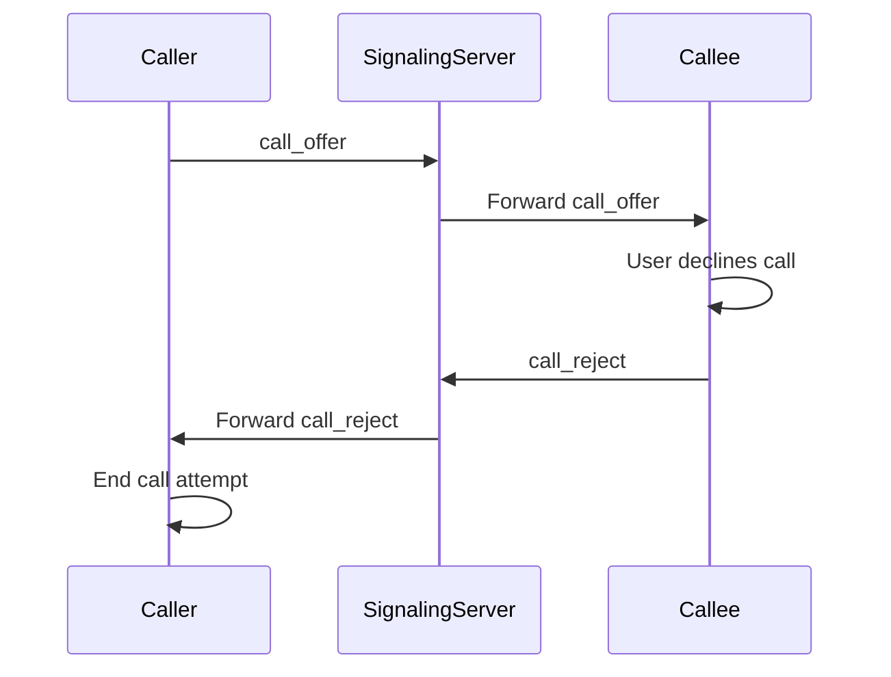

# VoIP Implementation Plan (Audio + Video)

## Status

VoIP implementation is **COMPLETE**. All planned features have been implemented and tested.

- [x] Call signaling protocol (offer, answer, reject, hangup, ICE)
- [x] Media service (Web + Flutter)
- [x] VoIP service (Web + Flutter)
- [x] Call UI components (Web + Flutter)
- [x] Integration with chat screens
- [x] Unit tests
- [x] Widget tests
- [x] Integration tests
- [x] Cross-platform testing

## Overview
Add voice and video calling to Zajel using WebRTC native media tracks with DTLS-SRTP encryption.

## Related Test Files

The VoIP implementation has comprehensive test coverage across all layers:

### Flutter Tests
- **Unit Tests:**
  - [`packages/app/test/core/network/voip_service_test.dart`](../packages/app/test/core/network/voip_service_test.dart) - VoIP service logic
  - [`packages/app/test/core/media/media_service_test.dart`](../packages/app/test/core/media/media_service_test.dart) - Media handling
- **Widget Tests:**
  - [`packages/app/test/widget/call/call_screen_test.dart`](../packages/app/test/widget/call/call_screen_test.dart) - Call screen UI
  - [`packages/app/test/widget/call/incoming_call_dialog_test.dart`](../packages/app/test/widget/call/incoming_call_dialog_test.dart) - Incoming call dialog
- **Integration Tests:**
  - [`packages/app/integration_test/voip_test.dart`](../packages/app/integration_test/voip_test.dart) - VoIP flow
  - [`packages/app/integration_test/voip_ui_e2e_test.dart`](../packages/app/integration_test/voip_ui_e2e_test.dart) - End-to-end UI

### Web Tests
- **Unit Tests:**
  - [`packages/web-client/src/lib/__tests__/voip.test.ts`](../packages/web-client/src/lib/__tests__/voip.test.ts) - VoIP service
  - [`packages/web-client/src/lib/__tests__/media.test.ts`](../packages/web-client/src/lib/__tests__/media.test.ts) - Media service
- **Component Tests:**
  - [`packages/web-client/src/components/__tests__/ChatView.call.test.tsx`](../packages/web-client/src/components/__tests__/ChatView.call.test.tsx) - Chat integration

### Server Tests
- [`packages/server-vps/tests/unit/client-handler-call-signaling.test.ts`](../packages/server-vps/tests/unit/client-handler-call-signaling.test.ts) - Call signaling relay

### Cross-Platform Tests
- [`packages/integration-tests/src/scenarios/voip-flow.test.ts`](../packages/integration-tests/src/scenarios/voip-flow.test.ts) - Multi-platform flow

## Security Model
- **Audio/Video**: WebRTC DTLS-SRTP (AES-128-GCM, ECDHE key exchange)
- **Signaling**: Existing encrypted WebSocket channel
- **Data channels**: Existing X25519 + ChaCha20-Poly1305

Both encryption layers provide forward secrecy and are industry-standard secure.

## Basic Call Flow

The following diagram shows the typical flow for a successful voice/video call:

```mermaid
sequenceDiagram
    participant Caller
    participant SignalingServer
    participant Callee

    Note over Caller,Callee: Call Initiation
    Caller->>Caller: Start call (audio/video)
    Caller->>Caller: Create RTCPeerConnection
    Caller->>Caller: Add local media tracks
    Caller->>Caller: Create SDP offer
    Caller->>SignalingServer: call_offer (with SDP)
    SignalingServer->>Callee: Forward call_offer

    Note over Caller,Callee: Ringing State
    Callee->>Callee: Show incoming call dialog
    Callee->>Caller: (Optional) call_ringing notification

    Note over Caller,Callee: Call Acceptance
    Callee->>Callee: User accepts call
    Callee->>Callee: Create RTCPeerConnection
    Callee->>Callee: Add local media tracks
    Callee->>Callee: Set remote description (offer)
    Callee->>Callee: Create SDP answer
    Callee->>SignalingServer: call_answer (with SDP)
    SignalingServer->>Caller: Forward call_answer
    Caller->>Caller: Set remote description (answer)

    Note over Caller,Callee: ICE Negotiation
    Caller->>SignalingServer: call_ice (ICE candidates)
    SignalingServer->>Callee: Forward call_ice
    Callee->>SignalingServer: call_ice (ICE candidates)
    SignalingServer->>Caller: Forward call_ice

    Note over Caller,Callee: Connected
    Caller<-->Callee: Direct P2P media flow (DTLS-SRTP)
    Note over Caller,Callee: Audio/video streaming via WebRTC

    Note over Caller,Callee: Call End
    Caller->>SignalingServer: call_hangup
    SignalingServer->>Callee: Forward call_hangup
    Callee->>Callee: Close connection
    Caller->>Caller: Close connection
```

### Alternative Flows

**Call Rejection:**


**Timeout (No Answer):**
- After 60 seconds (RINGING_TIMEOUT_MS), caller automatically hangs up
- Sends `call_hangup` message to callee

## Architecture Reminder
- `packages/server` (CF Workers) = **Bootstrap server** (server discovery registry only)
- `packages/server-vps` = **Federated signaling servers** (actual WebSocket signaling)
- VPS servers register with CF Workers and use SWIM gossip for federation

## Server Trust Model
**Servers don't need to be cryptographically trusted** because:
1. **Pairing** uses out-of-band code verification (displayed on screen, entered manually)
2. **Messages** are E2E encrypted (X25519 + ChaCha20-Poly1305)
3. **Server is just a relay** - can't read content, can't MITM (pairing code prevents it)

Risks with untrusted servers are only: availability (could drop messages), metadata exposure, spam.

## Censorship Resistance (Bootstrap Resilience)

If CF Workers bootstrap is blocked, users need alternative ways to discover VPS servers.

**Discovery Fallback Layers:**
1. **CF Workers** - Primary (current implementation)
2. **DNS-over-HTTPS** - Query TXT records via encrypted DNS (e.g., `_zajel.domain.com`)
3. **Cached servers** - Remember servers that worked before
4. **Friend referral** - Already-paired contacts share their server URL
5. **QR code sharing** - Include server URL when sharing pairing info
6. **Manual entry** - User types a URL someone gave them

**Files to modify for resilience:**
| File | Changes |
|------|---------|
| `packages/app/lib/core/network/server_discovery_service.dart` | Add fallback discovery methods |
| `packages/web-client/src/lib/discovery.ts` (new) | Web server discovery with fallbacks |

---

## Files to Modify/Create

### New Files
| File | Purpose |
|------|---------|
| `packages/web-client/src/lib/voip.ts` | Web VoIP service |
| `packages/web-client/src/lib/media.ts` | Web media (mic/camera) service |
| `packages/web-client/src/components/CallView.tsx` | Call UI component |
| `packages/web-client/src/components/IncomingCallOverlay.tsx` | Incoming call UI |
| `packages/app/lib/core/network/voip_service.dart` | Flutter VoIP service |
| `packages/app/lib/core/media/media_service.dart` | Flutter media service |
| `packages/app/lib/features/call/call_screen.dart` | Flutter call screen |
| `packages/app/lib/features/call/incoming_call_dialog.dart` | Flutter incoming call UI |

### Modify Existing
| File | Changes |
|------|---------|
| `packages/web-client/src/lib/protocol.ts` | Add call message types |
| `packages/web-client/src/lib/validation.ts` | Add call message validators |
| `packages/web-client/src/lib/signaling.ts` | Add call signaling methods |
| `packages/web-client/src/lib/constants.ts` | Add call constants |
| `packages/server-vps/src/client/handler.ts` | Forward call signaling |
| `packages/app/lib/core/network/signaling_client.dart` | Add call signaling |

---

## Implementation Steps

### Step 1: Call Signaling Protocol

**Add message types to `protocol.ts`:**
```typescript
// Call signaling
type: 'call_offer'    // Initiate call with SDP offer
type: 'call_answer'   // Accept call with SDP answer  
type: 'call_reject'   // Decline call
type: 'call_hangup'   // End call
type: 'call_ice'      // ICE candidate for call
```

**Add to server handler.ts:**
- Forward call messages between paired peers
- Same pattern as existing offer/answer/ice_candidate

### Step 2: Media Service (Web)

**Create `media.ts`:**
```typescript
export class MediaService {
  async requestMedia(video: boolean): Promise<MediaStream>;
  toggleMute(): boolean;
  toggleCamera(): boolean;
  switchCamera(): Promise<void>;
  stopAllTracks(): void;
}
```

### Step 3: VoIP Service (Web)

**Create `voip.ts`:**
```typescript
export type CallState = 'idle' | 'outgoing' | 'incoming' | 'connecting' | 'connected' | 'ended';

export class VoIPService {
  async startCall(peerId: string, withVideo: boolean): Promise<string>;
  async acceptCall(callId: string, withVideo: boolean): Promise<void>;
  rejectCall(callId: string): void;
  hangup(): void;
  toggleMute(): boolean;
  toggleVideo(): boolean;
}
```

### Step 4: Call UI (Web)

**CallView.tsx:**
- Full-screen overlay during call
- Local video preview (corner)
- Remote video (full screen)
- Controls: mute, camera, hangup, switch camera
- Duration timer

**IncomingCallOverlay.tsx:**
- Caller ID, Accept/Decline buttons

### Step 5: Flutter Implementation

Mirror web implementation:
- `voip_service.dart` - Same API as web
- `media_service.dart` - Camera/mic via flutter_webrtc
- `call_screen.dart` - RTCVideoView for video
- `incoming_call_dialog.dart` - Accept/decline UI

### Step 6: Integration

Add call buttons to chat screens (web + Flutter)

---

## Constants

```typescript
export const CALL = {
  RINGING_TIMEOUT_MS: 60000,
  ICE_GATHERING_TIMEOUT_MS: 10000,
  RECONNECT_TIMEOUT_MS: 30000,
};
```

---

## Implementation Order

1. Add call message types (protocol.ts)
2. Add validators (validation.ts)
3. Add signaling methods (signaling.ts)
4. Add server forwarding (handler.ts)
5. Create MediaService (web)
6. Create VoIPService (web)
7. Create CallView + IncomingCallOverlay (web)
8. Integrate with ChatView (web)
9. Add Flutter signaling
10. Create Flutter media/voip services
11. Create Flutter call UI
12. Integrate with Flutter chat
13. Write tests
14. Cross-platform testing
