# Zajel Mobile App - Architecture Documentation

**Version**: 1.0.0
**Last Updated**: 2026-01-22

---

## Table of Contents

1. [Executive Summary](#executive-summary)
2. [High-Level Architecture](#high-level-architecture)
3. [Technology Stack](#technology-stack)
4. [Layer Architecture](#layer-architecture)
5. [Core Services](#core-services)
6. [Network Architecture](#network-architecture)
7. [Security Architecture](#security-architecture)
8. [Data Flow Diagrams](#data-flow-diagrams)
9. [Platform-Specific Code](#platform-specific-code)
10. [State Management](#state-management)
11. [Key Design Decisions](#key-design-decisions)
12. [Performance Characteristics](#performance-characteristics)
13. [Testing Strategy](#testing-strategy)
14. [Troubleshooting Guide](#troubleshooting-guide)

---

## Executive Summary

Zajel is a privacy-focused, peer-to-peer encrypted messaging application built with Flutter. It enables secure communication between devices without central message storage or user registration.

### Key Characteristics

- **Privacy-First**: No user registration, no phone numbers, ephemeral identities
- **E2E Encrypted**: All communication encrypted with X25519 + ChaCha20-Poly1305
- **Peer-to-Peer**: Direct WebRTC connections, minimal server involvement
- **Cross-Platform**: Runs on Android, iOS, Linux, Windows, and macOS
- **Certificate Pinning**: Native platform implementations for signaling security
- **Web Client Linking**: Mobile apps can proxy web browsers for enhanced security

### Architecture Principles

1. **Zero Trust**: Treat signaling servers as untrusted relays
2. **Minimize Metadata**: Reduce identifiable information in all protocols
3. **Perfect Forward Secrecy**: Session keys never reused across restarts
4. **Fail Secure**: Connection failures don't leak plaintext
5. **User Verification**: Support out-of-band fingerprint verification

---

## High-Level Architecture

```mermaid
flowchart TB
    subgraph Infrastructure["☁️ Infrastructure"]
        direction LR
        CF[Cloudflare Workers<br/>Bootstrap Server]
        VPS[VPS Signaling Server<br/>WebSocket + Pairing]
    end

    subgraph Clients["👥 User Devices"]
        direction LR
        A[📱 Alice's App]
        B[📱 Bob's App]
        W[🌐 Web Client]
    end

    subgraph P2P["🔒 Direct P2P Connection"]
        WebRTC[⚡ WebRTC Data Channels<br/>E2E Encrypted]
    end

    %% Discovery & Signaling flow (top)
    A -->|1️⃣ Discover| CF
    B -->|1️⃣ Discover| CF
    A -->|2️⃣ Register| VPS
    B -->|2️⃣ Register| VPS
    VPS -->|3️⃣ SDP/ICE| A
    VPS -->|3️⃣ SDP/ICE| B

    %% P2P connection (bottom)
    A <-->|4️⃣ Encrypted Messages| WebRTC
    B <-->|4️⃣ Encrypted Messages| WebRTC

    %% Web proxy
    W -.->|Proxy| A

    %% Styling
    style A fill:#4a90e2,color:#fff
    style B fill:#4a90e2,color:#fff
    style W fill:#f39c12,color:#fff
    style CF fill:#e74c3c,color:#fff
    style VPS fill:#27ae60,color:#fff
    style WebRTC fill:#9b59b6,color:#fff
```



**Connection Flow:**
```
┌─────────┐    1. Discovery    ┌─────────────┐
│  Apps   │ ─────────────────► │  Bootstrap  │  (Get server list)
└─────────┘                    └─────────────┘
     │
     │ 2. Register
     ▼
┌─────────────┐
│   VPS       │  (Pairing codes + WebRTC signaling)
└─────────────┘
     │
     │ 3. SDP/ICE Exchange
     ▼
┌─────────────┐
│   WebRTC    │  (Direct P2P - server bypassed)
└─────────────┘
```

### Communication Flow

1. **Server Discovery**: Mobile app queries Cloudflare Workers bootstrap server for available VPS servers
2. **Registration**: App selects lowest-latency VPS and registers with a pairing code + public key
3. **Pairing**: Users exchange pairing codes; server matches them after mutual approval
4. **WebRTC Setup**: Apps exchange SDP offers/answers and ICE candidates via signaling server
5. **P2P Communication**: Direct encrypted data channel established, bypassing signaling server
6. **Message Exchange**: All content encrypted with session keys derived from key exchange

---

## Technology Stack

### Core Framework
- **Flutter 3.5+**: Cross-platform UI framework (Dart)
- **Riverpod 2.6**: State management with provider pattern
- **Go Router**: Declarative routing

### Networking
- **flutter_webrtc 0.12**: WebRTC data channels for P2P
- **web_socket_channel 3.0**: WebSocket signaling (standard)
- **Native WebSocket Plugins**: Certificate-pinned connections (iOS/Android/Linux/Windows)

### Cryptography
- **cryptography 2.7**: X25519 key exchange, ChaCha20-Poly1305 AEAD
- **crypto 3.0**: SHA-256 hashing for fingerprints

### Storage
- **flutter_secure_storage 9.2**: Encrypted key storage (native keystores)
- **shared_preferences 2.5**: App preferences and settings
- **sqflite 2.4**: Local database (future: message history)

### Platform Support
- **iOS**: Swift (certificate pinning via URLSession)
- **Android**: Kotlin (certificate pinning via OkHttp)
- **Linux**: C++ with libwebsockets + OpenSSL
- **Windows**: C++ with WinHTTP + Schannel
- **macOS**: Swift (same as iOS)

---

## Layer Architecture

Zajel follows a clean architecture pattern with clear separation of concerns:

```
┌─────────────────────────────────────────────────┐
│              Presentation Layer                  │
│  (UI Screens, Widgets, User Interactions)       │
│                                                  │
│  - HomeScreen                                   │
│  - ChatScreen                                   │
│  - ConnectScreen                                │
│  - SettingsScreen                               │
└────────────────┬────────────────────────────────┘
                 │
                 │ Riverpod Providers
                 ▼
┌─────────────────────────────────────────────────┐
│           Business Logic Layer                   │
│     (Services, State Management)                │
│                                                  │
│  - ConnectionManager (orchestration)            │
│  - PeerReconnectionService (meeting points)     │
│  - DeviceLinkService (web client linking)       │
│  - FileReceiveService (transfer management)     │
└────────────────┬────────────────────────────────┘
                 │
                 │ Service Interfaces
                 ▼
┌─────────────────────────────────────────────────┐
│              Core Services Layer                 │
│      (Protocol Implementation)                  │
│                                                  │
│  - CryptoService (encryption)                   │
│  - WebRTCService (P2P connections)              │
│  - SignalingClient (server communication)       │
│  - MeetingPointService (rendezvous)             │
│  - RelayClient (peer introductions)             │
└────────────────┬────────────────────────────────┘
                 │
                 │ Platform Channels
                 ▼
┌─────────────────────────────────────────────────┐
│            Platform Native Layer                 │
│    (Certificate Pinning, Native APIs)           │
│                                                  │
│  - iOS: PinnedWebSocketPlugin.swift             │
│  - Android: PinnedWebSocketPlugin.kt            │
│  - Linux: pinned_websocket_plugin.cc            │
│  - Windows: pinned_websocket_plugin.cpp         │
└─────────────────────────────────────────────────┘
```

### Dependency Flow

Dependencies flow **downward only**:
- Presentation depends on Business Logic
- Business Logic depends on Core Services
- Core Services depend on Platform Native Layer
- No upward dependencies (prevents circular dependencies)

---

## Core Services

### 1. CryptoService

**Location**: `/lib/core/crypto/crypto_service.dart`

**Purpose**: Handles all cryptographic operations for end-to-end encryption.

**Key Features**:
- **X25519 Key Exchange**: ECDH for deriving shared secrets
- **ChaCha20-Poly1305**: AEAD encryption for message confidentiality and authenticity
- **HKDF Key Derivation**: Derives session keys from shared secrets
- **Identity Keys**: Generated on first run, stored in secure storage
- **Session Keys**: Per-peer encryption keys, persisted across app restarts
- **Public Key Fingerprints**: SHA-256 fingerprints for out-of-band verification

**Security Properties**:
```dart
// Forward secrecy per session (mobile regenerates keys on restart)
await cryptoService.regenerateIdentityKeys();

// Establish session with peer
final sessionId = await cryptoService.establishSession(peerId, peerPublicKey);

// Encrypt/decrypt messages
final ciphertext = await cryptoService.encrypt(peerId, plaintext);
final plaintext = await cryptoService.decrypt(peerId, ciphertext);

// Verify identity (compare fingerprints out-of-band)
final myFingerprint = await cryptoService.getPublicKeyFingerprint();
// Example: "ABCD 1234 EF56 7890 ..."
```

**Cryptographic Primitives**:
- **X25519**: Curve25519 ECDH (32-byte keys)
- **ChaCha20-Poly1305**: 256-bit keys, 96-bit nonces, 128-bit auth tags
- **HKDF**: HMAC-SHA256 based key derivation
- **SHA-256**: Fingerprint generation

**Storage**:
- Private keys → Flutter Secure Storage (OS keychain/keystore)
- Session keys → Encrypted in secure storage
- Public keys → In-memory cache with disk persistence

---

### 2. ConnectionManager

**Location**: `/lib/core/network/connection_manager.dart`

**Purpose**: Central orchestrator for all peer connections (external and local).

**Architecture Pattern**: State Machine


**Key Responsibilities**:

1. **Signaling Connection Management**
   ```dart
   // Connect to signaling server
   final pairingCode = await connectionManager.connect(
     serverUrl: 'wss://signaling.example.com',
   );
   // Returns: "ABC123" (share this with peer)
   ```

2. **Pairing Flow**
   ```dart
   // Request pairing with peer's code
   await connectionManager.connectToPeer('DEF456');

   // Approve incoming pairing request
   connectionManager.respondToPairRequest('GHI789', accept: true);
   ```

3. **Message Routing**
   ```dart
   // Send message to peer
   await connectionManager.sendMessage(peerId, 'Hello!');

   // Receive messages
   connectionManager.messages.listen((event) {
     final (peerId, plaintext) = event;
     print('$peerId: $plaintext');
   });
   ```

4. **File Transfer**
   ```dart
   await connectionManager.sendFile(
     peerId,
     'photo.jpg',
     fileBytes,
   );
   ```

5. **Peer Blocking**
   ```dart
   // Block by public key (survives code regeneration)
   final blockedCheck = (String publicKey) =>
     blockedPeersNotifier.isBlocked(publicKey);
   connectionManager.setBlockedCheck(blockedCheck);
   ```

**Thread Safety**:
- Uses sealed classes (`SignalingState`) for null-safe state management
- Pattern matching eliminates unsafe null assertions
- Stream-based signaling events prevent race conditions

---

### 3. SignalingClient

**Location**: `/lib/core/network/signaling_client.dart`

**Purpose**: WebSocket connection to signaling server with certificate pinning.

**Dual-Mode Operation**:

| Platform | Mode | Implementation |
|----------|------|----------------|
| Android | Pinned | OkHttp CertificatePinner |
| iOS | Pinned | URLSession with TrustKit-style validation |
| macOS | Pinned | URLSession (same as iOS) |
| Linux | Pinned | libwebsockets + OpenSSL pinning |
| Windows | Pinned | WinHTTP + Schannel pinning |
| Web | Standard | Browser WebSocket (no pinning possible) |
| Desktop (fallback) | Standard | Dart WebSocket (for development) |

**Security Model**:

The signaling server is treated as an **untrusted relay**. Certificate pinning adds a layer of defense against MITM attacks during signaling, but the core security comes from E2E encryption.

```dart
// Automatic platform detection
final client = SignalingClient(
  serverUrl: 'wss://signaling.example.com',
  pairingCode: 'ABC123',
  publicKey: cryptoService.publicKeyBase64,
  // usePinnedWebSocket: auto-detected based on platform
);

await client.connect();

// Listen for signaling messages
client.messages.listen((message) {
  switch (message) {
    case SignalingPairIncoming(:final fromCode, :final fromPublicKey):
      // Incoming pairing request
      showApprovalDialog(fromCode, fromPublicKey);

    case SignalingPairMatched(:final peerCode, :final peerPublicKey, :final isInitiator):
      // Start WebRTC connection
      startWebRTC(peerCode, peerPublicKey, isInitiator);

    case SignalingOffer(:final from, :final payload):
      // Handle WebRTC offer
      handleOffer(from, payload);
  }
});
```

**Message Types**:
- `pair_request` / `pair_response`: Mutual approval pairing
- `pair_matched` / `pair_rejected` / `pair_timeout`: Pairing outcomes
- `offer` / `answer` / `ice_candidate`: WebRTC signaling
- `link_request` / `link_matched`: Web client linking
- `call_offer` / `call_answer` / `call_hangup`: VoIP signaling (future)

**Heartbeat**: Sends `ping` every 30 seconds to keep connection alive.

---

### 4. WebRTCService

**Location**: `/lib/core/network/webrtc_service.dart`

**Purpose**: Manages WebRTC peer connections and data channels.

**Data Channels**:

1. **Message Channel** (`zajel_messages`)
   - Reliable, ordered delivery
   - Carries encrypted text messages
   - Handshake protocol for key exchange

2. **File Channel** (`zajel_files`)
   - Reliable, ordered delivery
   - Chunked file transfer (64KB chunks)
   - Metadata + encrypted chunks + completion message

**Connection Lifecycle**:

```dart
// 1. Create offer (initiator)
final offer = await webrtcService.createOffer(peerId);
// Send offer via signaling server

// 2. Handle offer (non-initiator)
final answer = await webrtcService.handleOffer(peerId, offer);
// Send answer via signaling server

// 3. Handle answer (initiator)
await webrtcService.handleAnswer(peerId, answer);

// 4. Exchange ICE candidates
await webrtcService.addIceCandidate(peerId, candidate);

// 5. Perform handshake when connected
await webrtcService.performHandshake(peerId);
// Exchanges public keys over data channel

// 6. Send encrypted messages
await webrtcService.sendMessage(peerId, plaintext);
```

**ICE Configuration**:
```dart
final iceServers = [
  {'urls': 'stun:stun.l.google.com:19302'},
  {'urls': 'stun:stun1.l.google.com:19302'},
];
```

**NAT Traversal**:
- STUN for public IP discovery
- TURN servers not required (future enhancement)
- ICE trickling for faster connection establishment

**Timeouts**:
- SDP operations: 10 seconds
- ICE gathering: No explicit timeout (relies on WebRTC defaults)

---

### 5. PeerReconnectionService

**Location**: `/lib/core/network/peer_reconnection_service.dart`

**Purpose**: Enables peers to find each other after disconnection using meeting points and dead drops.

**Reconnection Strategy**:


**Meeting Points**:

Meeting points are deterministic identifiers derived from cryptographic material that both peers can independently compute. They allow peers to "find" each other without revealing their relationship to the server.

**Types of Meeting Points**:

1. **Daily Points** (Public Key Based)
   ```
   daily_point = SHA256(sorted_pk1 || sorted_pk2 || "zajel:daily:YYYY-MM-DD")
   ```
   - Derived from both peers' public keys
   - 3-day window: yesterday, today, tomorrow
   - No shared secret required (works for first reconnection)
   - Changes daily for privacy

2. **Hourly Tokens** (Shared Secret Based)
   ```
   hourly_token = HMAC-SHA256(shared_secret, "zajel:hourly:YYYY-MM-DDTHH")
   ```
   - Derived from session shared secret
   - 3-hour window: previous, current, next hour
   - More frequent rotation for better privacy
   - Only works after first successful pairing

**Dead Drops**:

When a peer is not online, they can leave an encrypted "dead drop" at the meeting point:

```dart
final connectionInfo = ConnectionInfo(
  publicKey: myPublicKey,
  relayId: currentRelayId,
  sourceId: mySourceId,
  fallbackRelays: [relay1, relay2],
  timestamp: DateTime.now().toUtc(),
);

// Encrypt with peer's session key
final encryptedDeadDrop = await cryptoService.encryptForPeer(
  peerId,
  jsonEncode(connectionInfo.toJson()),
);

// Store at meeting point
await signalingClient.send({
  'type': 'store_dead_drop',
  'meeting_point': todaysDailyPoint,
  'payload': encryptedDeadDrop,
});
```

When the other peer comes online and registers at the same meeting point, they retrieve and decrypt the dead drop to get connection information.

**Registration Flow**:

```dart
// 1. Derive meeting points for all trusted peers
for (final peer in trustedPeers) {
  final dailyPoints = meetingPointService.deriveDailyPoints(
    myPublicKey,
    peerPublicKey,
  );

  final hourlyTokens = sharedSecret != null
    ? meetingPointService.deriveHourlyTokens(sharedSecret)
    : [];

  allPoints.addAll(dailyPoints);
  allPoints.addAll(hourlyTokens);
}

// 2. Register all points with server
await signalingClient.send({
  'type': 'register_rendezvous',
  'daily_points': allDailyPoints.toSet().toList(),
  'hourly_tokens': allHourlyTokens.toSet().toList(),
  'dead_drops': {
    todayPoint: encryptedConnectionInfo,
  },
});

// 3. Server returns any matches
final result = RendezvousResult.fromJson(response);
for (final match in result.liveMatches) {
  // Peer is online now - connect via relay
  connectViaPeerIntroduction(match);
}
for (final drop in result.deadDrops) {
  // Decrypt dead drop and attempt connection
  final info = await decryptDeadDrop(drop);
  connectViaRelay(info);
}
```

**Privacy Properties**:
- Server sees meeting points but cannot correlate them to identities
- Meeting points rotate frequently (hourly/daily)
- No persistent user identifiers
- Dead drops are encrypted; server cannot read connection info

---

### 6. MeetingPointService

**Location**: `/lib/core/network/meeting_point_service.dart`

**Purpose**: Cryptographic derivation of meeting points for peer rendezvous.

**Algorithms**:

1. **Daily Point Derivation**
   ```dart
   List<String> deriveDailyPoints(
     Uint8List myPublicKey,
     Uint8List theirPublicKey,
   ) {
     // Sort keys for deterministic order
     final (key1, key2) = sortKeys(myPublicKey, theirPublicKey);

     final points = <String>[];
     for (var dayOffset = -1; dayOffset <= 1; dayOffset++) {
       final date = DateTime.now().toUtc().add(Duration(days: dayOffset));
       final dateStr = '${date.year}-${date.month}-${date.day}';

       final input = key1 + key2 + utf8.encode('zajel:daily:$dateStr');
       final hash = sha256(input);

       points.add('day_${base64Url.encode(hash).substring(0, 22)}');
     }

     return points; // [yesterday, today, tomorrow]
   }
   ```

2. **Hourly Token Derivation**
   ```dart
   List<String> deriveHourlyTokens(Uint8List sharedSecret) {
     final currentHour = DateTime.now().toUtc().hour;

     final tokens = <String>[];
     for (var hourOffset = -1; hourOffset <= 1; hourOffset++) {
       final hour = (currentHour + hourOffset) % 24;
       final hourStr = '2026-01-22T${hour.toString().padLeft(2, '0')}';

       final mac = hmacSha256(
         sharedSecret,
         utf8.encode('zajel:hourly:$hourStr'),
       );

       tokens.add('hr_${base64Url.encode(mac).substring(0, 22)}');
     }

     return tokens; // [prev_hour, current_hour, next_hour]
   }
   ```

**Key Sorting**:
```dart
// Ensures both peers compute same points regardless of order
(Uint8List, Uint8List) sortKeys(Uint8List a, Uint8List b) {
  for (var i = 0; i < min(a.length, b.length); i++) {
    if (a[i] < b[i]) return (a, b);
    if (a[i] > b[i]) return (b, a);
  }
  return a.length <= b.length ? (a, b) : (b, a);
}
```

**Window Sizes**:
- Daily points: 3-day window (handles timezone differences, clock skew)
- Hourly tokens: 3-hour window (more precise matching)

---

### 7. DeviceLinkService

**Location**: `/lib/core/network/device_link_service.dart`

**Purpose**: Links web clients to mobile app for secure signaling proxying.

**Motivation**:

Web browsers cannot implement certificate pinning for WebSocket connections. This makes web clients vulnerable to MITM attacks on the signaling channel. By linking to a mobile app, web clients gain the security of the mobile app's certificate-pinned connection.

**Linking Flow**:


**QR Code Format**:
```
zajel-link://<link_code>:<mobile_public_key>:<server_url>
```

Example:
```
zajel-link://ABC123:dGVzdHB1YmxpY2tleQ==:wss%3A%2F%2Fsignaling.example.com
```

**Link Session**:
```dart
// Mobile app creates session
final session = await deviceLinkService.createLinkSession(
  'wss://signaling.example.com',
);

print(session.qrData); // Display as QR code
print(session.linkCode); // Show to user for manual entry

// Session expires after 5 minutes
// User must approve web client before timeout
```

**Message Tunneling**:

Once linked, the mobile app acts as a proxy:

```dart
// Web → Mobile → Peer
class LinkTunnelSend {
  final String peerId;
  final String plaintext;
}

// Peer → Mobile → Web
class LinkTunnelReceive {
  final String peerId;
  final String plaintext;
}

// Peer state → Mobile → Web
class LinkTunnelPeerState {
  final String peerId;
  final PeerConnectionState state;
}
```

**Security**:
- Link session uses ephemeral key pair (not identity keys)
- QR code includes mobile's public key for TOFU (Trust On First Use)
- WebRTC tunnel between mobile and web is E2E encrypted
- Signaling to peers goes through mobile's pinned connection

---

## Network Architecture

### Signaling Server Architecture

```
┌─────────────────────────────────────────────────┐
│          Cloudflare Workers (Bootstrap)         │
│  - Serves VPS server list                       │
│  - Geographic distribution info                 │
│  - Health status                                │
└───────────────┬─────────────────────────────────┘
                │
                │ HTTPS (server discovery)
                ▼
┌─────────────────────────────────────────────────┐
│           Mobile/Desktop Apps                    │
│  - Query bootstrap for servers                  │
│  - Ping servers to measure latency              │
│  - Select lowest-latency server                 │
└───────────────┬─────────────────────────────────┘
                │
                │ WSS (WebSocket Secure)
                │ WITH certificate pinning
                ▼
┌─────────────────────────────────────────────────┐
│              VPS Signaling Servers              │
│  - Mutual approval pairing                      │
│  - WebRTC signaling (SDP + ICE)                 │
│  - Meeting point registration                   │
│  - Dead drop storage (encrypted)                │
│  - Peer introductions via relays                │
└───────────────┬─────────────────────────────────┘
                │
                │ WebRTC P2P
                │ (bypasses signaling server)
                ▼
┌─────────────────────────────────────────────────┐
│           Direct Peer Connection                 │
│  - Encrypted data channels                      │
│  - No server involvement                        │
│  - NAT traversal via STUN                       │
└─────────────────────────────────────────────────┘
```

### Server Discovery Flow

```dart
// 1. Fetch server list from bootstrap
final discoveryService = ServerDiscoveryService(
  bootstrapUrl: 'https://zajel-signaling.workers.dev',
);

final servers = await discoveryService.fetchServers();
// [
//   {region: 'us-east', endpoint: 'wss://us1.zajel.app', ...},
//   {region: 'eu-west', endpoint: 'wss://eu1.zajel.app', ...},
// ]

// 2. Ping servers to measure latency
final selected = await discoveryService.selectServer();
// Uses lowest RTT (round-trip time)

// 3. Connect to selected server
final serverUrl = discoveryService.getWebSocketUrl(selected);
await connectionManager.connect(serverUrl: serverUrl);
```

### Certificate Pinning Implementation

**Public Key Pinning** (pins the server's public key, not the certificate):

```
Server Certificate
├─ Subject: CN=signaling.zajel.app
├─ Issuer: Let's Encrypt
├─ Public Key (RSA/ECDSA) ← Pinned
└─ Signature
```

Advantages of public key pinning:
- Survives certificate rotation (same key, new cert)
- Not tied to specific CA
- Can pin intermediate CA keys as backup

**iOS/macOS Implementation** (`PinnedWebSocketPlugin.swift`):

```swift
// URLSessionDelegate method for certificate validation
func urlSession(
  _ session: URLSession,
  didReceive challenge: URLAuthenticationChallenge,
  completionHandler: @escaping (URLSession.AuthChallengeDisposition, URLCredential?) -> Void
) {
  guard let trust = challenge.protectionSpace.serverTrust,
        let certificate = SecTrustGetCertificateAtIndex(trust, 0) else {
    completionHandler(.cancelAuthenticationChallenge, nil)
    return
  }

  // Extract public key from certificate
  let publicKey = SecCertificateCopyKey(certificate)
  let publicKeyData = SecKeyCopyExternalRepresentation(publicKey, nil)

  // Compute SHA-256 hash of public key
  let hash = sha256(publicKeyData)

  // Compare against known pins
  if pins.contains(hash) {
    completionHandler(.useCredential, URLCredential(trust: trust))
  } else {
    // PINNING FAILURE
    completionHandler(.cancelAuthenticationChallenge, nil)
    sendEvent(type: .pinningFailed)
  }
}
```

**Android Implementation** (`PinnedWebSocketPlugin.kt`):

```kotlin
// OkHttp CertificatePinner
val certificatePinner = CertificatePinner.Builder()
  .add("signaling.zajel.app", "sha256/AAAA...") // Primary pin
  .add("signaling.zajel.app", "sha256/BBBB...") // Backup pin
  .build()

val client = OkHttpClient.Builder()
  .certificatePinner(certificatePinner)
  .build()

// Automatic pinning validation on connect
val webSocket = client.newWebSocket(request, listener)
```

**Linux Implementation** (`pinned_websocket_plugin.cc`):

Uses libwebsockets with OpenSSL:
```cpp
// SSL verification callback
int verify_callback(int preverify_ok, X509_STORE_CTX* ctx) {
  X509* cert = X509_STORE_CTX_get_current_cert(ctx);

  // Extract public key
  EVP_PKEY* pkey = X509_get_pubkey(cert);
  unsigned char* der = nullptr;
  int der_len = i2d_PUBKEY(pkey, &der);

  // Compute SHA-256
  unsigned char hash[SHA256_DIGEST_LENGTH];
  SHA256(der, der_len, hash);

  // Compare with pins
  bool matched = false;
  for (const auto& pin : pins) {
    if (memcmp(hash, pin.data(), SHA256_DIGEST_LENGTH) == 0) {
      matched = true;
      break;
    }
  }

  return matched ? 1 : 0;
}
```

**Windows Implementation** (`pinned_websocket_plugin.cpp`):

Uses WinHTTP with Schannel:
```cpp
// Server certificate context callback
DWORD CALLBACK ServerCertCallback(
  HINTERNET hRequest,
  DWORD_PTR dwContext,
  DWORD dwInternetStatus,
  LPVOID lpvStatusInformation,
  DWORD dwStatusInformationLength
) {
  PCCERT_CONTEXT certContext = (PCCERT_CONTEXT)lpvStatusInformation;

  // Extract public key info
  DWORD keySize = 0;
  CryptExportPublicKeyInfo(..., &keySize);
  std::vector<BYTE> keyData(keySize);
  CryptExportPublicKeyInfo(..., keyData.data());

  // Hash and compare
  BYTE hash[32];
  Hash_SHA256(keyData.data(), keyData.size(), hash);

  if (IsPinned(hash)) {
    return ERROR_SUCCESS;
  } else {
    return ERROR_INTERNET_SEC_CERT_CN_INVALID;
  }
}
```

### WebRTC Connection Details

**STUN Server Configuration**:
```dart
final configuration = {
  'iceServers': [
    {'urls': 'stun:stun.l.google.com:19302'},
    {'urls': 'stun:stun1.l.google.com:19302'},
  ],
  'iceCandidatePoolSize': 10,
};
```

**Data Channel Configuration**:
```dart
final messageChannel = await pc.createDataChannel(
  'zajel_messages',
  RTCDataChannelInit()
    ..ordered = true
    ..maxRetransmits = null // Reliable delivery
);

final fileChannel = await pc.createDataChannel(
  'zajel_files',
  RTCDataChannelInit()
    ..ordered = true
    ..maxRetransmits = null // Reliable delivery
);
```

**ICE Candidate Trickling**:

Candidates are sent as soon as they're gathered (not waiting for all):

```dart
pc.onIceCandidate = (RTCIceCandidate candidate) {
  // Send immediately via signaling
  signalingClient.sendIceCandidate(peerId, {
    'candidate': candidate.candidate,
    'sdpMid': candidate.sdpMid,
    'sdpMLineIndex': candidate.sdpMLineIndex,
  });
};
```

---

## Security Architecture

### Threat Model

**Trusted**:
- End-user devices (mobile/desktop apps)
- Open-source cryptographic libraries
- Platform secure storage (iOS Keychain, Android KeyStore)

**Untrusted**:
- Signaling servers (treated as hostile relays)
- Network infrastructure (ISPs, WiFi routers)
- Other peers (until verified via fingerprints)

**Protected Against**:
1. **Passive Eavesdropping**: All content E2E encrypted
2. **MITM on Signaling**: Certificate pinning + fingerprint verification
3. **MITM on P2P**: DTLS built into WebRTC + key fingerprint verification
4. **Server Compromise**: Server never sees plaintext or decryption keys
5. **Replay Attacks**: Nonces prevent reuse of encrypted messages
6. **User Impersonation**: Public key fingerprint verification (out-of-band)

**Not Protected Against** (Accepted Risks):
1. **Compromised Device**: If device is rooted/jailbroken, keys can be extracted
2. **Social Engineering**: Users tricked into pairing with attacker
3. **Quantum Computers**: X25519 is vulnerable to Shor's algorithm (future: post-quantum)
4. **Traffic Analysis**: Server sees when users are online (metadata leakage)

### Encryption Flow

**First Pairing**:


**Message Encryption**:

```dart
// Sender side
final plaintext = "Hello, Bob!";

// 1. Generate random nonce (96 bits)
final nonce = chacha20.newNonce();

// 2. Encrypt with session key
final ciphertext = await chacha20.encrypt(
  utf8.encode(plaintext),
  secretKey: sessionKey,
  nonce: nonce,
);

// 3. Combine nonce + ciphertext + MAC
final wire = nonce + ciphertext.cipherText + ciphertext.mac.bytes;

// 4. Base64 encode for transport
final wireEncoded = base64.encode(wire);

// Receiver side
final combined = base64.decode(wireEncoded);

// 1. Extract components
final nonce = combined.sublist(0, 12);
final ciphertext = combined.sublist(12, combined.length - 16);
final mac = combined.sublist(combined.length - 16);

// 2. Decrypt and verify MAC
final plaintext = await chacha20.decrypt(
  SecretBox(ciphertext, nonce: nonce, mac: Mac(mac)),
  secretKey: sessionKey,
);

// 3. MAC verification is automatic (throws on failure)
final message = utf8.decode(plaintext);
```

### Key Fingerprint Verification

**Fingerprint Generation**:
```dart
final publicKeyBytes = await cryptoService.getPublicKeyBytes();
final hash = sha256.convert(publicKeyBytes);

// Format as human-readable string
// "ABCD 1234 EF56 7890 FEDC BA98 7654 3210 ..."
final fingerprint = formatFingerprint(hash.toString());
```

**Out-of-Band Verification**:

Users should verify fingerprints through a trusted channel:

1. **In Person**: Read aloud or show on screen
2. **Video Call**: Display on separate device
3. **Phone Call**: Read first and last 8 characters
4. **Trusted Third Party**: Publish on verified social media

**UI Flow**:
```
Settings → Security → Key Fingerprint
┌────────────────────────────────────┐
│ Your Fingerprint:                  │
│ ABCD 1234 EF56 7890                │
│ FEDC BA98 7654 3210                │
│                                    │
│ Peer: Alice                        │
│ BCDE 2345 FG67 8901                │
│ GEDC CB87 6543 2109                │
│                                    │
│ ✓ Verified                         │
│ [ Mark as Verified ]               │
└────────────────────────────────────┘
```

### Blocking System

**Public Key Blocking** (not pairing code blocking):

```dart
// Block by public key (survives code regeneration)
await blockedPeersNotifier.block(
  peerPublicKey,
  displayName: 'Spammer',
);

// Blocked peers are auto-rejected during pairing
if (isPublicKeyBlocked(incomingPublicKey)) {
  signalingClient.respondToPairing(peerCode, accept: false);
  return; // Silent rejection, no UI notification
}
```

**Why Public Keys, Not Pairing Codes?**

Pairing codes are ephemeral (regenerated on restart). Blocking by code would be ineffective. Public keys are derived from identity keys (persisted in secure storage), providing stable blocking.

**Storage**:
```dart
// SharedPreferences (not encrypted, public keys are not secret)
blockedPublicKeys: ["dGVzdDEuLi4=", "dGVzdDIuLi4="]
blockedPeerDetails: ["dGVzdDEuLi4=::Spammer", "dGVzdDIuLi4=::Troll"]
```

---

## Data Flow Diagrams

### First Pairing Flow

```mermaid
sequenceDiagram
    participant Alice
    participant AliceApp as Alice's App
    participant Server as Signaling Server
    participant BobApp as Bob's App
    participant Bob

    Alice->>AliceApp: Open app
    AliceApp->>AliceApp: Generate keypair
    AliceApp->>Server: Connect + Register (code: ABC123)
    Server-->>AliceApp: Registered
    AliceApp->>Alice: Show code: ABC123

    Bob->>BobApp: Open app
    BobApp->>BobApp: Generate keypair
    BobApp->>Server: Connect + Register (code: DEF456)
    Server-->>BobApp: Registered
    BobApp->>Bob: Show code: DEF456

    Alice->>Bob: Share code ABC123 (voice/text)
    Bob->>BobApp: Enter code ABC123
    BobApp->>Server: Request pair with ABC123
    Server->>AliceApp: Incoming pair request from DEF456

    AliceApp->>Alice: Approve "DEF456"?
    Alice->>AliceApp: Approve
    AliceApp->>Server: Accept pairing
    Server->>AliceApp: Pairing matched (initiator)
    Server->>BobApp: Pairing matched (non-initiator)

    AliceApp->>AliceApp: Create WebRTC offer
    AliceApp->>Server: Send offer to DEF456
    Server->>BobApp: Forward offer
    BobApp->>BobApp: Create WebRTC answer
    BobApp->>Server: Send answer to ABC123
    Server->>AliceApp: Forward answer

    Note over AliceApp,BobApp: ICE candidate exchange

    AliceApp<-->BobApp: WebRTC connection established
    AliceApp->>BobApp: Handshake (public key exchange)
    BobApp->>AliceApp: Handshake (public key exchange)

    AliceApp->>AliceApp: Derive session key
    BobApp->>BobApp: Derive session key

    Note over AliceApp,BobApp: Secure channel ready

    Alice->>AliceApp: Send "Hello!"
    AliceApp->>AliceApp: Encrypt
    AliceApp->>BobApp: Encrypted message
    BobApp->>BobApp: Decrypt
    BobApp->>Bob: Display "Hello!"
```

### Reconnection Flow

```mermaid
sequenceDiagram
    participant Alice as Alice's App
    participant Server as Signaling Server
    participant Bob as Bob's App

    Note over Alice,Bob: Alice and Bob previously paired

    Alice->>Alice: App restart (new session)
    Alice->>Alice: Load trusted peers from storage
    Alice->>Alice: Derive meeting points for Bob
    Alice->>Server: Register meeting points + dead drop
    Server-->>Alice: No matches found (Bob offline)

    Note over Alice,Bob: Alice leaves encrypted dead drop

    Bob->>Bob: App comes online
    Bob->>Bob: Load trusted peers from storage
    Bob->>Bob: Derive meeting points for Alice
    Bob->>Server: Register meeting points
    Server-->>Bob: Match found! Dead drop from Alice

    Bob->>Bob: Decrypt dead drop
    Bob->>Bob: Extract relay info + connection hints
    Bob->>Server: Send introduction to Alice via relay
    Server->>Alice: Introduction from Bob (via relay)

    Note over Alice,Bob: WebRTC reconnection (same as first pairing)

    Alice<-->Bob: WebRTC connection established
    Alice->>Alice: Derive NEW session key
    Bob->>Bob: Derive NEW session key

    Note over Alice,Bob: Forward secrecy maintained
```

### Message Sending Flow


### File Transfer Flow


---

## Platform-Specific Code

### iOS/macOS

**Files**:
- `/ios/Runner/PinnedWebSocketPlugin.swift`
- `/macos/Runner/PinnedWebSocketPlugin.swift` (symlinked)

**Key Components**:

1. **URLSession with Custom Delegate**
   ```swift
   let session = URLSession(
     configuration: .default,
     delegate: self, // Custom URLSessionDelegate
     delegateQueue: nil
   )
   ```

2. **Certificate Validation**
   ```swift
   func urlSession(
     _ session: URLSession,
     didReceive challenge: URLAuthenticationChallenge
   ) {
     // Extract server certificate
     let trust = challenge.protectionSpace.serverTrust
     let certificate = SecTrustGetCertificateAtIndex(trust, 0)

     // Get public key
     let publicKey = SecCertificateCopyKey(certificate)
     let publicKeyData = SecKeyCopyExternalRepresentation(publicKey)

     // SHA-256 hash
     var hash = [UInt8](repeating: 0, count: Int(CC_SHA256_DIGEST_LENGTH))
     CC_SHA256(publicKeyData.bytes, CC_LONG(publicKeyData.count), &hash)

     // Compare with pins
     if pins.contains(Data(hash).base64EncodedString()) {
       // Success
       completionHandler(.useCredential, URLCredential(trust: trust))
     } else {
       // Pinning failed
       completionHandler(.cancelAuthenticationChallenge, nil)
     }
   }
   ```

3. **WebSocket Message Handling**
   ```swift
   task.receive { result in
     switch result {
     case .success(.string(let message)):
       self.onMessage(message)
     case .success(.data(let data)):
       self.onMessage(String(data: data, encoding: .utf8))
     case .failure(let error):
       self.onError(error)
     }
     // Continue receiving
     task.receive(completionHandler)
   }
   ```

### Android

**Files**:
- `/android/app/src/main/kotlin/com/zajel/zajel/PinnedWebSocketPlugin.kt`

**Key Components**:

1. **OkHttp with CertificatePinner**
   ```kotlin
   val pinner = CertificatePinner.Builder()
     .add(hostname, "sha256/$pin1")
     .add(hostname, "sha256/$pin2") // Backup
     .build()

   val client = OkHttpClient.Builder()
     .certificatePinner(pinner)
     .connectTimeout(timeoutMs.toLong(), TimeUnit.MILLISECONDS)
     .build()
   ```

2. **WebSocket Listener**
   ```kotlin
   object : WebSocketListener() {
     override fun onOpen(ws: WebSocket, response: Response) {
       sendEvent(mapOf("type" to "connected"))
     }

     override fun onMessage(ws: WebSocket, text: String) {
       sendEvent(mapOf("type" to "message", "data" to text))
     }

     override fun onFailure(ws: WebSocket, t: Throwable, response: Response?) {
       val errorType = when (t) {
         is SSLPeerUnverifiedException -> "pinning_failed"
         else -> "error"
       }
       sendEvent(mapOf("type" to errorType))
     }
   }
   ```

### Linux

**Files**:
- `/linux/plugins/pinned_websocket/pinned_websocket_plugin.cc`
- `/linux/plugins/pinned_websocket/websocket_connection.h/cc`

**Key Components**:

1. **libwebsockets Integration**
   ```cpp
   struct lws_context_creation_info info{};
   info.port = CONTEXT_PORT_NO_LISTEN;
   info.protocols = protocols;
   info.options = LWS_SERVER_OPTION_DO_SSL_GLOBAL_INIT;

   context = lws_create_context(&info);
   ```

2. **OpenSSL Certificate Pinning**
   ```cpp
   int VerifyCertificate(int preverify_ok, X509_STORE_CTX* ctx) {
     X509* cert = X509_STORE_CTX_get_current_cert(ctx);
     EVP_PKEY* pkey = X509_get_pubkey(cert);

     // DER encode public key
     unsigned char* der = nullptr;
     int der_len = i2d_PUBKEY(pkey, &der);

     // SHA-256 hash
     unsigned char hash[SHA256_DIGEST_LENGTH];
     SHA256(der, der_len, hash);

     // Check pins
     for (const auto& pin : pins_) {
       if (memcmp(hash, pin.data(), SHA256_DIGEST_LENGTH) == 0) {
         return 1; // Success
       }
     }

     return 0; // Pinning failed
   }
   ```

3. **GTK Main Loop Integration**
   ```cpp
   static gboolean LibwebsocketsService(gpointer user_data) {
     auto* manager = static_cast<ConnectionManager*>(user_data);
     lws_service(manager->context_, 0);
     return G_SOURCE_CONTINUE;
   }

   // Add to GTK main loop (non-blocking)
   g_timeout_add(10, LibwebsocketsService, manager);
   ```

### Windows

**Files**:
- `/windows/plugins/pinned_websocket/pinned_websocket_plugin.cpp`
- `/windows/plugins/pinned_websocket/websocket_connection.h/cpp`

**Key Components**:

1. **WinHTTP API**
   ```cpp
   HINTERNET hSession = WinHttpOpen(
     L"Zajel/1.0",
     WINHTTP_ACCESS_TYPE_DEFAULT_PROXY,
     WINHTTP_NO_PROXY_NAME,
     WINHTTP_NO_PROXY_BYPASS,
     0
   );

   HINTERNET hConnect = WinHttpConnect(
     hSession,
     hostname,
     port,
     0
   );
   ```

2. **Schannel Certificate Pinning**
   ```cpp
   // Set certificate callback
   WinHttpSetOption(
     hRequest,
     WINHTTP_OPTION_SERVER_CERT_CONTEXT,
     &CertCallback,
     sizeof(CertCallback)
   );

   DWORD CertCallback(PCCERT_CONTEXT certContext) {
     // Extract public key
     DWORD keySize = 0;
     CryptExportPublicKeyInfoEx(..., &keySize);
     std::vector<BYTE> keyData(keySize);
     CryptExportPublicKeyInfoEx(..., keyData.data(), &keySize);

     // SHA-256
     BCRYPT_HASH_HANDLE hash;
     BCryptCreateHash(..., &hash, ...);
     BCryptHashData(hash, keyData.data(), keyData.size(), 0);

     BYTE hashValue[32];
     BCryptFinishHash(hash, hashValue, sizeof(hashValue), 0);

     // Check pins
     if (IsPinned(hashValue)) {
       return ERROR_SUCCESS;
     } else {
       return ERROR_WINHTTP_SECURE_FAILURE;
     }
   }
   ```

3. **Windows Message Loop Integration**
   ```cpp
   // Custom window message for callbacks
   #define WM_FLUTTER_CALLBACK (WM_USER + 1)

   void PostToMainThread(std::function<void()> callback) {
     {
       std::lock_guard lock(callback_mutex_);
       pending_callbacks_.push(std::move(callback));
     }
     PostMessage(window_handle_, WM_FLUTTER_CALLBACK, 0, 0);
   }

   // Window procedure
   LRESULT CALLBACK WndProc(HWND hwnd, UINT msg, WPARAM wp, LPARAM lp) {
     if (msg == WM_FLUTTER_CALLBACK) {
       ProcessPendingCallbacks();
       return 0;
     }
     return DefWindowProc(hwnd, msg, wp, lp);
   }
   ```

---

## State Management

### Riverpod Architecture

Zajel uses Riverpod for reactive state management with a clear provider hierarchy:

```
Global Providers (Singleton Services)
├─ cryptoServiceProvider
├─ webrtcServiceProvider
├─ deviceLinkServiceProvider
├─ connectionManagerProvider
└─ trustedPeersStorageProvider

Configuration Providers
├─ sharedPreferencesProvider
├─ usernameProvider
├─ userIdentityProvider
├─ bootstrapServerUrlProvider
└─ selectedServerProvider

Network State Providers
├─ signalingClientProvider (nullable)
├─ signalingConnectedProvider
├─ pairingCodeProvider
└─ discoveredServersProvider

Peer State Providers
├─ peersProvider (stream)
├─ visiblePeersProvider (filtered)
├─ selectedPeerProvider
└─ blockedPeersProvider

Messaging Providers
├─ messagesStreamProvider
├─ chatMessagesProvider.family<String> (per-peer)
└─ fileTransfersStreamProvider

Device Linking Providers
├─ linkedDevicesProvider (stream)
└─ linkSessionStateProvider
```

### State Flow Example

```dart
// User selects peer from list
ref.read(selectedPeerProvider.notifier).state = peer;

// Navigate to chat screen
context.push('/chat/${peer.id}');

// Chat screen watches messages for this peer
final messages = ref.watch(chatMessagesProvider(peer.id));

// Send message updates state
ref.read(chatMessagesProvider(peer.id).notifier).addMessage(
  Message(
    localId: uuid.v4(),
    peerId: peer.id,
    content: 'Hello!',
    timestamp: DateTime.now(),
    isOutgoing: true,
    status: MessageStatus.sending,
  ),
);

// ConnectionManager sends via WebRTC
await ref.read(connectionManagerProvider).sendMessage(peer.id, 'Hello!');

// Update message status to sent
ref.read(chatMessagesProvider(peer.id).notifier).updateMessageStatus(
  localId,
  MessageStatus.sent,
);
```

### Provider Lifecycle


---

## Key Design Decisions

### 1. Why X25519 Instead of RSA?

**Decision**: Use X25519 for key exchange instead of RSA.

**Rationale**:
- **Smaller Keys**: 32 bytes vs 256+ bytes (RSA-2048)
- **Faster**: ECDH is faster than RSA key exchange
- **Modern**: Curve25519 is a modern, well-vetted curve
- **Security**: Equivalent to RSA-3072 in terms of security strength

### 2. Why ChaCha20-Poly1305 Instead of AES-GCM?

**Decision**: Use ChaCha20-Poly1305 for AEAD encryption.

**Rationale**:
- **Constant-Time**: Resistant to timing attacks on software implementations
- **Fast on Mobile**: Faster than AES on devices without AES-NI
- **No Side Channels**: ChaCha20 has no cache-timing vulnerabilities
- **TLS 1.3 Standard**: Used by modern TLS, battle-tested

### 3. Why Certificate Pinning Instead of CA Trust?

**Decision**: Implement certificate pinning on native platforms.

**Rationale**:
- **Reduce Trust Surface**: Don't trust all 100+ CAs in system store
- **MITM Protection**: Protects against compromised CAs
- **Government Interception**: Prevents state-level attacks
- **Defense in Depth**: Adds layer even though E2E encryption is primary

**Tradeoffs**:
- **Maintenance**: Pins must be updated when rotating keys
- **Complexity**: Platform-specific native code required

### 4. Why Pairing Codes Instead of QR-Only?

**Decision**: Support both pairing codes and QR codes.

**Rationale**:
- **Accessibility**: Not all users can scan QR codes
- **Voice Channel**: Codes can be read aloud over phone
- **Low-Tech Devices**: Works on basic phones via voice
- **User Choice**: Different users prefer different methods

### 5. Why Ephemeral Keys on Mobile?

**Decision**: Regenerate identity keys on app restart (mobile only).

**Rationale**:
- **Perfect Forward Secrecy**: Each session uses fresh keys
- **Key Compromise**: Limits impact of key extraction
- **Privacy**: Past sessions not decryptable with current keys

**Tradeoff**: Reconnection requires meeting points instead of direct connection.

### 6. Why Meeting Points for Reconnection?

**Decision**: Use cryptographically-derived meeting points instead of persistent IDs.

**Rationale**:
- **Privacy**: No persistent user identifiers on server
- **Metadata Resistance**: Server can't track users across sessions
- **Deterministic**: Both peers independently derive same points
- **Rotating**: Points change hourly/daily for privacy

**Tradeoff**: More complex than simple "friend list" on server.

### 7. Why Proxy Web Clients Through Mobile?

**Decision**: Web browsers connect via mobile app proxy instead of direct signaling.

**Rationale**:
- **No Pinning in Browsers**: Web APIs don't support certificate pinning
- **MITM Vulnerability**: Web clients vulnerable to HTTPS MITM
- **Leverage Mobile Security**: Mobile's pinned connection protects web client
- **User Choice**: Users opt-in to linking (transparency)

**Tradeoff**: Requires mobile app to be online for web client to work.

### 8. Why Block by Public Key, Not Pairing Code?

**Decision**: Blocking system uses public keys, not pairing codes.

**Rationale**:
- **Persistent Blocking**: Pairing codes regenerate, public keys don't (on mobile)
- **Identity-Based**: Public key is the cryptographic identity
- **No Workarounds**: Can't bypass by regenerating code

**Tradeoff**: Identity keys must be persisted (reduces forward secrecy slightly).

---

## Performance Characteristics

### Cryptographic Operations

| Operation | Time (Mobile) | Time (Desktop) |
|-----------|---------------|----------------|
| Key Pair Generation | ~5ms | ~2ms |
| ECDH Key Exchange | ~2ms | ~1ms |
| ChaCha20 Encryption (1KB) | <1ms | <0.5ms |
| ChaCha20 Encryption (1MB) | ~50ms | ~20ms |
| SHA-256 Hash (1KB) | <1ms | <0.5ms |

### Network Operations

| Operation | Latency | Notes |
|-----------|---------|-------|
| Signaling Connect | 200-500ms | Includes certificate pinning validation |
| Pairing Match | <100ms | Server-side matching |
| WebRTC Setup | 1-3s | Includes ICE gathering |
| Message Send (E2E) | 10-50ms | After connection established |
| File Transfer (1MB) | ~2-5s | Depends on connection quality |

### Memory Usage

| Component | Heap | Notes |
|-----------|------|-------|
| CryptoService | ~50KB | Identity keys + session keys |
| WebRTCService (per peer) | ~2MB | WebRTC stack overhead |
| Message History (100 msgs) | ~50KB | Text only, no media |
| File Transfer (buffer) | 64KB | Per active transfer |

### Bottlenecks

1. **WebRTC Connection Setup**: 1-3 seconds (ICE gathering)
   - Mitigation: Show progress indicator
   - Future: Pre-gather ICE candidates

2. **File Encryption (Large Files)**: CPU-bound
   - Mitigation: Chunk encryption, show progress
   - Future: Hardware-accelerated encryption

3. **Meeting Point Derivation**: Scales with number of trusted peers
   - Current: O(n) where n = trusted peer count
   - Mitigation: Batch registration, cache points

---

## Testing Strategy

### Unit Tests

**Core Services**:
- `/test/unit/crypto/crypto_service_test.dart`
- `/test/unit/network/meeting_point_service_test.dart`

**Example**:
```dart
test('CryptoService encrypts and decrypts', () async {
  final service = CryptoService();
  await service.initialize();

  final peerId = 'test_peer';
  final peerPublicKey = 'base64_encoded_key';

  await service.establishSession(peerId, peerPublicKey);

  final plaintext = 'Hello, World!';
  final ciphertext = await service.encrypt(peerId, plaintext);
  final decrypted = await service.decrypt(peerId, ciphertext);

  expect(decrypted, equals(plaintext));
  expect(ciphertext, isNot(contains(plaintext))); // No plaintext leakage
});
```

### Integration Tests

**Full Pairing Flow**:
- `/integration_test/pairing_test.dart`

Simulates two app instances pairing:
```dart
testWidgets('Two peers can pair and exchange messages', (tester) async {
  // Start two app instances
  final app1 = await startApp();
  final app2 = await startApp();

  // Get pairing codes
  final code1 = await app1.getPairingCode();
  final code2 = await app2.getPairingCode();

  // Request pairing
  await app1.connectToPeer(code2);
  await app2.approvePairing(code1);

  // Wait for connection
  await tester.pumpAndSettle();

  // Send message
  await app1.sendMessage('Hello from App 1');
  await tester.pumpAndSettle();

  // Verify received
  expect(app2.receivedMessages, contains('Hello from App 1'));
});
```

### Platform-Specific Tests

**iOS Certificate Pinning**:
- `/ios/RunnerTests/RunnerTests.swift`

```swift
func testCertificatePinningSuccess() {
  let plugin = PinnedWebSocketPlugin()
  let pins = ["AAAA...", "BBBB..."] // Valid pins

  let expectation = XCTestExpectation(description: "Connection succeeds")

  plugin.connect(url: validUrl, pins: pins) { result in
    XCTAssertTrue(result.success)
    expectation.fulfill()
  }

  wait(for: [expectation], timeout: 5.0)
}

func testCertificatePinningFailure() {
  let plugin = PinnedWebSocketPlugin()
  let pins = ["ZZZZ..."] // Invalid pin

  let expectation = XCTestExpectation(description: "Connection fails")

  plugin.connect(url: validUrl, pins: pins) { result in
    XCTAssertFalse(result.success)
    XCTAssertTrue(result.error.contains("pinning"))
    expectation.fulfill()
  }

  wait(for: [expectation], timeout: 5.0)
}
```

---

## Troubleshooting Guide

### Common Issues

#### 1. Certificate Pinning Failures

**Symptoms**:
- "PINNING_FAILED" error on connection
- WebSocket immediately disconnects

**Causes**:
- Server certificate rotated (new key)
- Incorrect pins in configuration
- MITM proxy (corporate network)

**Debug Steps**:
```bash
# Extract server certificate public key
openssl s_client -connect signaling.zajel.app:443 < /dev/null 2>/dev/null | \
  openssl x509 -pubkey -noout | \
  openssl pkey -pubin -outform DER | \
  openssl dgst -sha256 -binary | \
  base64

# Compare with pinned value in code
```

**Fix**:
Update pins in `/lib/core/network/pinned_websocket.dart`:
```dart
static const serverPins = [
  'NEW_PIN_HERE',
  'BACKUP_PIN_HERE',
];
```

#### 2. WebRTC Connection Fails

**Symptoms**:
- "Failed to establish connection" after pairing
- Connection state stuck in "connecting"

**Causes**:
- Symmetric NAT (both peers behind restrictive NAT)
- No STUN servers reachable
- Firewall blocking UDP

**Debug Steps**:
```dart
// Enable WebRTC logs
await WebRTC.enableLogging();

// Check ICE candidate gathering
webrtcService.onIceCandidate = (candidate) {
  logger.debug('ICE candidate: ${candidate.candidate}');
};

// Look for "srflx" (server reflexive) candidates
// If only "host" candidates, STUN is blocked
```

**Fix**:
- Add TURN server for relay (future feature)
- Try different network (mobile data vs WiFi)

#### 3. Messages Not Decrypting

**Symptoms**:
- "CryptoException: Invalid ciphertext" error
- Messages appear garbled

**Causes**:
- Session keys out of sync
- Peer regenerated keys (mobile restart)
- Corrupted secure storage

**Debug Steps**:
```dart
// Check if session exists
final sessionKey = await cryptoService.getSessionKeyBytes(peerId);
if (sessionKey == null) {
  logger.error('No session key for peer $peerId');
}

// Verify public key matches
final storedPubKey = cryptoService.getPeerPublicKey(peerId);
final currentPubKey = peer.publicKey;
if (storedPubKey != currentPubKey) {
  logger.warning('Public key mismatch - peer regenerated keys');
}
```

**Fix**:
- Re-pair with peer (establish new session)
- Clear secure storage (logout and re-login)

#### 4. File Transfer Stalls

**Symptoms**:
- File transfer progress stops at X%
- "Transfer timeout" error

**Causes**:
- Data channel buffer overflow
- Network interruption
- App backgrounded (mobile)

**Debug Steps**:
```dart
// Check file channel state
final channel = webrtcService.getFileChannel(peerId);
logger.debug('Channel state: ${channel.state}');
logger.debug('Buffered amount: ${channel.bufferedAmount}');

// If bufferedAmount is high, sender is too fast
```

**Fix**:
- Implement backpressure (check bufferedAmount before sending)
- Reduce chunk size from 64KB to 32KB
- Re-send failed transfer

---

## Appendix A: Constants Reference

**File**: `/lib/core/constants.dart`

```dart
/// Crypto constants
class CryptoConstants {
  static const int x25519KeySize = 32;  // bytes
  static const int nonceSize = 12;      // ChaCha20-Poly1305 nonce
  static const int macSize = 16;        // Poly1305 MAC
  static const int hkdfOutputLength = 32; // Session key size
}

/// WebRTC constants
class WebRTCConstants {
  static const String messageChannelLabel = 'zajel_messages';
  static const String fileChannelLabel = 'zajel_files';
  static const Duration operationTimeout = Duration(seconds: 10);
}

/// File transfer constants
class FileTransferConstants {
  static const int chunkSize = 64 * 1024; // 64 KB
  static const Duration transferTimeout = Duration(minutes: 5);
}

/// Signaling constants
class SignalingConstants {
  static const Duration heartbeatInterval = Duration(seconds: 30);
  static const Duration pairingTimeout = Duration(minutes: 2);
  static const Duration reconnectDelay = Duration(seconds: 5);
}
```

---

## Appendix B: Mermaid Diagram Source

**Overall System Architecture**:


---

**Document End**

For questions or clarifications about this architecture, please see:
- Main README: `/README.md`
- Security Documentation: `/SECURITY.md`
- Deployment Guide: `/DEPLOYMENT.md`
- API Documentation: Generated via `dartdoc`
