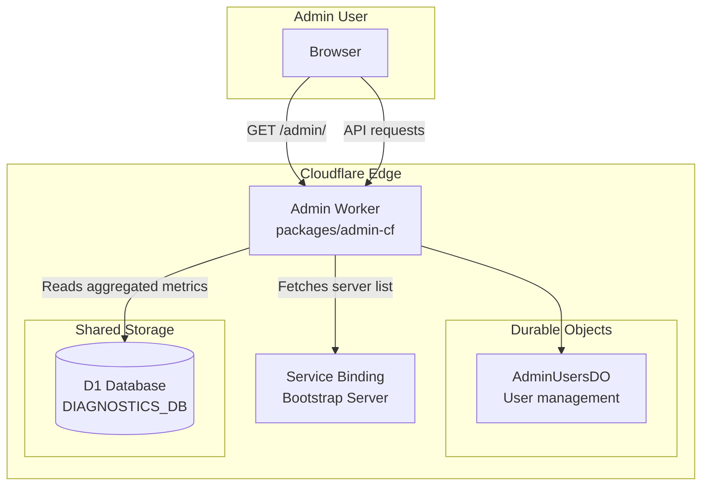

# Admin Dashboard

The admin dashboard is a Cloudflare Worker (`packages/admin-cf/`) that provides a web-based interface for monitoring errors, performance, network health, server metrics, and federation status. It serves an inline HTML dashboard (vanilla JavaScript, no framework) and exposes authenticated REST API endpoints that query the shared diagnostics D1 database.

---

## System Overview



---

## Architecture

### Inline Dashboard

The admin dashboard HTML is served inline from the worker's `index.ts` file. This approach avoids the need for a separate static asset pipeline:

- **No framework**: Vanilla HTML, CSS, and JavaScript
- **No external libraries**: SVG-based charts rendered inline
- **Single endpoint**: `GET /admin/` serves the complete SPA
- **SPA routing**: All `/admin/*` paths fall back to the dashboard HTML

### Authentication

All API endpoints under `/admin/api/` (except `/admin/api/auth/init` and `/admin/api/auth/login`) require JWT authentication. Tokens are accepted via:

1. `Authorization: Bearer <token>` header
2. `zajel_admin_token` cookie (HttpOnly, Secure, SameSite=Strict)

JWTs are signed with `ZAJEL_ADMIN_JWT_SECRET` and contain:

```json
{
  "sub": "<user-id>",
  "username": "<username>",
  "role": "admin | super-admin",
  "iat": 1709500000,
  "exp": 1709586400
}
```

### User Management

User accounts are stored in the `AdminUsersDO` Durable Object with PBKDF2-hashed passwords. Two roles exist:

| Role | Permissions |
|------|------------|
| `admin` | Read access to all dashboards and metrics |
| `super-admin` | Full access including user management (create, delete) |

Login attempts are rate-limited to **5 per minute per IP address** (in-memory tracking on the worker instance).

---

## Worker Bindings

| Binding | Type | Purpose |
|---------|------|---------|
| `ADMIN_USERS` | Durable Object | Admin user management (passwords, roles) |
| `ZAJEL_ADMIN_JWT_SECRET` | Secret | JWT signing key |
| `DIAGNOSTICS_DB` | D1 Database | Shared diagnostics database (reads error, performance, network, server metrics) |
| `BOOTSTRAP_SERVICE` | Service Binding | Internal binding to `zajel-signaling` worker for server list |
| `ZAJEL_BOOTSTRAP_URL` | Variable | Fallback URL for bootstrap server |
| `APP_VERSION` | Variable | Application version for health endpoint |

---

## API Endpoints

### Authentication Endpoints

| Method | Path | Auth | Description |
|--------|------|------|-------------|
| `POST` | `/admin/api/auth/init` | None | Initialize first super-admin account |
| `POST` | `/admin/api/auth/login` | None | Login with username/password, returns JWT |
| `POST` | `/admin/api/auth/logout` | None | Clear auth cookie |
| `GET` | `/admin/api/auth/verify` | JWT | Verify token validity |

### User Management Endpoints

| Method | Path | Auth | Description |
|--------|------|------|-------------|
| `GET` | `/admin/api/users` | JWT (super-admin) | List all admin users |
| `POST` | `/admin/api/users` | JWT (super-admin) | Create a new admin user |
| `DELETE` | `/admin/api/users/:id` | JWT (super-admin) | Delete an admin user |

### Server Endpoints

| Method | Path | Auth | Description |
|--------|------|------|-------------|
| `GET` | `/admin/api/servers` | JWT | List VPS servers from bootstrap registry |

### Error Dashboard Endpoints (Epic 2)

| Method | Path | Auth | Description |
|--------|------|------|-------------|
| `GET` | `/admin/api/errors` | JWT | Error summary list with filtering |
| `GET` | `/admin/api/errors/trends` | JWT | Time-bucketed error counts for chart rendering |
| `GET` | `/admin/api/errors/:signature` | JWT | Error detail with version/platform distribution |
| `GET` | `/admin/api/errors/regressions` | JWT | Regression detection across versions |

### Metrics Dashboard Endpoints (Epic 3)

| Method | Path | Auth | Description |
|--------|------|------|-------------|
| `GET` | `/admin/api/metrics/app` | JWT | App performance percentiles (startup, frame rate, memory) |
| `GET` | `/admin/api/metrics/network` | JWT | Network success rates and latency |
| `GET` | `/admin/api/metrics/server` | JWT | All servers with latest metrics |
| `GET` | `/admin/api/metrics/server/:id` | JWT | Historical metrics for a specific server |
| `GET` | `/admin/api/metrics/federation` | JWT | Federation health, gossip latency, sync completeness |

### Client Analytics Endpoints (Epic 4)

| Method | Path | Auth | Description |
|--------|------|------|-------------|
| `GET` | `/admin/api/clients/active` | JWT | Active client count with sparkline data |
| `GET` | `/admin/api/clients/platforms` | JWT | Platform breakdown (donut chart data) |
| `GET` | `/admin/api/clients/versions` | JWT | Version adoption curves (stacked area chart) |
| `GET` | `/admin/api/clients/connections` | JWT | Connection type distribution and trend |

### Server Infrastructure Endpoints (Epic 5)

| Method | Path | Auth | Description |
|--------|------|------|-------------|
| `GET` | `/admin/api/servers/health` | JWT | Per-server health cards with computed health scores |
| `GET` | `/admin/api/servers/logs` | JWT | Server log viewer with filtering and pagination |
| `GET` | `/admin/api/federation/topology` | JWT | Federation topology graph (nodes, edges, latency) |
| `GET` | `/admin/api/servers/heartbeat-timeline` | JWT | Per-server heartbeat timeline with gap detection |

### AI-Powered Issue Lifecycle Endpoints (Epic 6)

| Method | Path | Auth | Description |
|--------|------|------|-------------|
| `GET` | `/admin/api/issues` | JWT | Issue lifecycle dashboard with filtering and aggregate metrics |
| `GET` | `/admin/api/issues/:id` | JWT | Single issue detail with full AI analysis |
| `POST` | `/admin/api/issues/:id/acknowledge` | JWT | Acknowledge an open issue |
| `GET` | `/admin/api/ai/costs` | JWT | AI processing cost monitoring across processing runs |

### Security Monitoring Endpoints (Epic 7)

| Method | Path | Auth | Description |
|--------|------|------|-------------|
| `GET` | `/admin/api/security/rate-limits` | JWT | Rate limit violation dashboard with timeline, top endpoints, and regional breakdown |
| `GET` | `/admin/api/security/bad-clients` | JWT | Bad client detection with violation categorization and severity ranking |
| `GET` | `/admin/api/security/attacks` | JWT | DDoS indicators with connection rate anomaly detection and active alerts |
| `GET` | `/admin/api/security/pairing-abuse` | JWT | Pairing code brute force detection with timeline and top offenders |

### Notifications & Alerting Endpoints (Epic 8)

| Method | Path | Auth | Description |
|--------|------|------|-------------|
| `GET` | `/admin/api/alerts/rules` | JWT | List all alert rules with optional enabled filter |
| `GET` | `/admin/api/alerts/rules/:id` | JWT | Get a single alert rule by ID |
| `POST` | `/admin/api/alerts/rules` | JWT (super-admin) | Create a new alert rule |
| `PUT` | `/admin/api/alerts/rules/:id` | JWT (super-admin) | Update an existing alert rule |
| `DELETE` | `/admin/api/alerts/rules/:id` | JWT (super-admin) | Delete an alert rule (cascades to history) |
| `GET` | `/admin/api/alerts/history` | JWT | List alert history entries with pagination |
| `POST` | `/admin/api/alerts/history/:id/acknowledge` | JWT | Acknowledge an alert history entry |
| `GET` | `/admin/api/notifications` | JWT | List notifications with filtering and pagination |
| `GET` | `/admin/api/notifications/unread-count` | JWT | Get count of unread notifications |
| `POST` | `/admin/api/notifications/:id/read` | JWT | Mark a notification as read (idempotent) |
| `POST` | `/admin/api/notifications/read-all` | JWT | Mark all unread notifications as read |
| `GET` | `/admin/api/notifications/config` | JWT | Get all notification channel configurations |
| `POST` | `/admin/api/notifications/config` | JWT (super-admin) | Create or update a notification channel config |
| `POST` | `/admin/api/notifications/test` | JWT (super-admin) | Send a test notification to a channel |

### Log-Diagnostic Correlation Endpoint (Epic 9)

| Method | Path | Auth | Description |
|--------|------|------|-------------|
| `GET` | `/admin/api/logs/correlation` | JWT | Correlated view of server logs and client errors in a time window |

---

## Error Dashboard API Details

### GET /admin/api/errors

Returns a paginated error summary list with aggregated counts, severity classification, and rate change calculation.

**Query parameters**:

| Parameter | Type | Default | Description |
|-----------|------|---------|-------------|
| `range` | string | `24h` | Time range: `1h`, `24h`, `7d` |
| `category` | string | (none) | Filter by category: `crash`, `network`, `crypto`, `storage`, `ui`, `protocol`, `other` |
| `limit` | number | 50 | Maximum results (1-200) |

**Response shape**:

```json
{
  "success": true,
  "data": {
    "summary": {
      "totalErrors": 1234,
      "rateChangePercent": 15.5,
      "regressionAlerts": 2,
      "highestSeverity": "critical"
    },
    "errors": [
      {
        "errorSignature": "abc123...",
        "category": "crash",
        "totalCount": 500,
        "versions": ["1.2.3", "1.2.4"],
        "platforms": ["android", "ios"],
        "firstSeen": 1709400000000,
        "lastSeen": 1709500000000,
        "sampleMessage": "NullPointerException in ..."
      }
    ],
    "range": "24h"
  }
}
```

**Severity classification**:

| Category | Severity |
|----------|----------|
| `crash` | critical |
| `network`, `crypto` | high |
| `storage`, `protocol` | medium |
| `ui`, `other` | low |
| (no errors) | none |

**Rate change calculation**: Compares total error count in the current period against the same-length previous period. For example, with `range=24h`, the current 24 hours are compared against the prior 24 hours.

### GET /admin/api/errors/trends

Returns time-bucketed error counts suitable for chart rendering, grouped by error category.

**Query parameters**:

| Parameter | Type | Default | Description |
|-----------|------|---------|-------------|
| `range` | string | `24h` | Time range: `1h`, `24h`, `7d` |
| `category` | string | (none) | Optional category filter |

**Bucket granularity**:

| Range | Bucket Size |
|-------|------------|
| `1h` | 1 minute (native hourly buckets) |
| `24h` | 1 hour |
| `7d` | 6 hours |

**Response shape**:

```json
{
  "success": true,
  "data": {
    "timestamps": [1709400000, 1709403600, ...],
    "series": {
      "crash": [5, 3, ...],
      "network": [10, 8, ...]
    },
    "deployments": [
      { "version": "1.2.4", "timestamp": 1709450000000 }
    ],
    "range": "24h",
    "bucketSize": "1h"
  }
}
```

Deployment markers are derived from the earliest `first_seen` timestamp for each `app_version` within the queried range.

### GET /admin/api/errors/:signature

Returns detailed information for a specific error signature, including version distribution, platform distribution, occurrence timeline, and stack trace.

**Response includes**:
- Total count across all time
- First and last seen timestamps
- Version distribution (name, count, percentage)
- Platform distribution (name, count, percentage)
- Occurrence timeline (time-bucketed counts)
- Sample message and stack trace

### GET /admin/api/errors/regressions

Compares error rates across the two most recent app versions to detect regressions.

**Query parameters**:

| Parameter | Type | Default | Description |
|-----------|------|---------|-------------|
| `window` | string | `24h` | Comparison window: `6h`, `24h`, `48h` |
| `threshold` | number | `3.0` | Minimum rate multiplier to flag as regression (>= 1.0) |

**Detection algorithm**:

1. Identify the two most recent semver-sorted versions within the window
2. For each error signature in the current version, compute `errorsPerHour`
3. Compare against the same signature's rate in the previous version
4. Flag as regression if `currentRate / previousRate >= threshold`
5. New errors (only in current version) with >= 10 occurrences are flagged with `multiplier: 999.9`

Results are sorted by multiplier descending (worst regressions first).

---

## Metrics Dashboard API Details

### GET /admin/api/metrics/app

Returns app performance percentiles for startup time, frame rate, and memory usage.

**Query parameters**:

| Parameter | Type | Default | Description |
|-----------|------|---------|-------------|
| `range` | string | `24h` | Time range: `1h`, `6h`, `24h`, `7d` |
| `platform` | string | (none) | Filter by platform |
| `version` | string | (none) | Filter by app version |
| `metric` | string | (none) | Filter to single metric: `startup_time`, `frame_rate`, `memory` |

**Metric classifications**:

| Metric | Green | Yellow | Red |
|--------|-------|--------|-----|
| Startup time (p95) | < 3000ms | 3000-5000ms | > 5000ms |
| Frame rate (p50) | > 55fps | 45-55fps | < 45fps |
| Memory (p95) | < 200MB | 200-400MB | > 400MB |

### GET /admin/api/metrics/network

Returns network success rates, relay/direct distribution, latency stats, and per-platform breakdowns.

**Query parameters**:

| Parameter | Type | Default | Description |
|-----------|------|---------|-------------|
| `range` | string | `24h` | Time range: `1h`, `6h`, `24h`, `7d` |
| `platform` | string | (none) | Filter by platform |
| `version` | string | (none) | Filter by app version |

**Response includes**:
- Current aggregate success rates (signaling, WebRTC)
- Relay vs. direct P2P distribution
- Average latency
- Time-bucketed trend data for success rates and latency
- Per-platform breakdown

### GET /admin/api/metrics/server

Returns the latest metrics for all known VPS servers, with health status determination.

**Health status thresholds**:

| Metric | Healthy | Degraded | Offline |
|--------|---------|----------|---------|
| CPU | < 70% | 70-90% | N/A |
| Connections | < 1000 | 1000-5000 | N/A |
| Last seen | < 5 min | N/A | > 5 min |

**Response includes**:
- Per-server metrics (CPU, memory, connections, message rate, entropy, federation, uptime)
- Aggregate stats (total/healthy/degraded/offline servers, total connections, total throughput)

### GET /admin/api/metrics/server/:id

Returns historical metrics for a specific server over a configurable time range.

**Query parameters**:

| Parameter | Type | Default | Description |
|-----------|------|---------|-------------|
| `range` | string | `1h` | Time range: `1h`, `6h`, `24h`, `7d` |

### GET /admin/api/metrics/federation

Returns federation health across all VPS servers, including SWIM gossip latency, node availability, and sync completeness.

**Query parameters**:

| Parameter | Type | Default | Description |
|-----------|------|---------|-------------|
| `range` | string | `1h` | Time range: `1h`, `6h`, `24h` |

**Federation health classification**:

| Status | Condition |
|--------|-----------|
| `healthy` | All nodes alive, RTT within thresholds |
| `degraded` | Suspect nodes, stale data (> 5 min), or gossip RTT p95 > 500ms |
| `critical` | Failed nodes, < 50% alive members, or gossip RTT p95 > 2000ms |

**Response includes**:
- Overall health status
- Summary (total/alive/suspect/failed nodes, region breakdown)
- Gossip latency aggregation (p50/p95/p99 across all servers, total ping count)
- Sync completeness (minimum alive/total ratio as a percentage)
- Per-server federation view
- Availability history timeline per server

---

## Client Analytics API Details (Epic 4)

The client analytics endpoints read from the `client_heartbeats`, `version_history`, and `connection_type_history` D1 tables populated by the diagnostics worker. All four handlers live in `packages/admin-cf/src/routes/clients.ts`.

### GET /admin/api/clients/active

Returns the real-time active client count and a sparkline of session activity over a configurable historical window.

A client is counted as "active" if its `last_seen` timestamp in `client_heartbeats` is within the last 10 minutes (600,000 ms). The sparkline counts distinct `session_hash` values per 5-minute bucket over the requested window.

**Query parameters**:

| Parameter | Type | Default | Description |
|-----------|------|---------|-------------|
| `hours` | number | `24` | Sparkline window in hours (1–168) |

**Response shape**:

```json
{
  "success": true,
  "data": {
    "activeCount": 42,
    "sparkline": [
      { "timestamp": 1709499000000, "count": 10 },
      { "timestamp": 1709499300000, "count": 15 }
    ],
    "lastUpdated": 1709500000000
  }
}
```

**Field notes**:

- `activeCount`: total distinct sessions seen in the last 10 minutes (point-in-time query)
- `sparkline`: array of `{ timestamp, count }` entries ordered ascending; each bucket is 5 minutes wide; `count` is `COUNT(DISTINCT session_hash)` in that bucket
- `hours` parameter controls how far back the sparkline reaches; values outside 1–168 return HTTP 400

### GET /admin/api/clients/platforms

Returns the platform breakdown of currently-active clients (those seen in the last 10 minutes), suitable for rendering as a donut or pie chart.

**No query parameters.**

**Response shape**:

```json
{
  "success": true,
  "data": {
    "platforms": [
      { "platform": "android", "count": 50, "percentage": 62.5 },
      { "platform": "ios", "count": 30, "percentage": 37.5 }
    ],
    "totalActive": 80,
    "lastUpdated": 1709500000000
  }
}
```

**Field notes**:

- `platforms` is sorted by `count` descending (most-used platform first)
- `percentage` is rounded to one decimal place using `Math.round(ratio * 1000) / 10`
- Platforms with `count == 0` are filtered out before the response is built
- The `platform` string value comes directly from the `client_heartbeats.platform` column and is not normalized — unexpected platform strings are included as-is

### GET /admin/api/clients/versions

Returns version adoption data over a configurable time range. The response is structured for rendering as a stacked area chart where each version is a series and each time bucket is a data point.

**Query parameters**:

| Parameter | Type | Default | Description |
|-----------|------|---------|-------------|
| `range` | string | `7d` | Time window: `24h`, `7d`, or `30d` |

**Time bucket resolution**:

| Range | Bucket Size | Source |
|-------|-------------|--------|
| `24h` | 5 minutes (native) | `version_history.time_bucket` raw |
| `7d` | 1 hour | Aggregated with `(time_bucket / 3600000) * 3600000` |
| `30d` | 6 hours | Aggregated with `(time_bucket / 21600000) * 21600000` |

**Response shape**:

```json
{
  "success": true,
  "data": {
    "range": "7d",
    "versions": ["2.1.0", "2.0.0", "1.5.0", "other"],
    "buckets": [
      {
        "timestamp": 1709496000000,
        "counts": { "2.1.0": 12, "2.0.0": 5, "other": 3 }
      }
    ],
    "lastUpdated": 1709500000000
  }
}
```

**Field notes**:

- `versions` is sorted by semver descending (newest version first), using a component-wise numeric comparison
- At most 8 named versions are returned; if more than 8 distinct versions exist in the queried window, the oldest versions are aggregated into a synthetic `"other"` entry appended at the end of `versions`
- `buckets[].counts` is a sparse object — versions with zero count in a bucket are omitted
- Invalid `range` values return HTTP 400 with `{ success: false, error: "Invalid range: ..." }`

### GET /admin/api/clients/connections

Returns the current connection type distribution and a historical trend, suitable for rendering as both a donut chart (current snapshot) and a stacked line chart (trend over time).

**Query parameters**:

| Parameter | Type | Default | Description |
|-----------|------|---------|-------------|
| `trendHours` | number | `24` | Trend window in hours (1–168) |

**Response shape**:

```json
{
  "success": true,
  "data": {
    "current": [
      { "connectionType": "direct_p2p", "count": 50, "percentage": 50.0 },
      { "connectionType": "relay", "count": 30, "percentage": 30.0 },
      { "connectionType": "none", "count": 20, "percentage": 20.0 }
    ],
    "trend": [
      { "timestamp": 1709499000000, "direct_p2p": 48, "relay": 28, "none": 18 },
      { "timestamp": 1709499300000, "direct_p2p": 50, "relay": 30, "none": 20 }
    ],
    "totalActive": 100,
    "lastUpdated": 1709500000000
  }
}
```

**Field notes**:

- `current` reflects clients with `last_seen` within the last 10 minutes; `NULL` connection types are coalesced to `"none"` by the query
- `percentage` is rounded to two decimal places using `Math.round(ratio * 10000) / 100`
- `trend` entries are read from the `connection_type_history` table and pivoted in-memory; each entry always contains `direct_p2p`, `relay`, and `none` fields, defaulting missing types to `0`
- `trendHours` values outside 1–168 return HTTP 400

---

## Server Infrastructure Monitoring API Details (Epic 5)

The server infrastructure endpoints read from the `server_metrics` and `server_logs` D1 tables. The four handlers live in `packages/admin-cf/src/routes/servers-health.ts`, `logs.ts`, `federation-topology.ts`, and `heartbeat-timeline.ts`.

### GET /admin/api/servers/health

Returns per-server health cards with the most recent metrics and a computed health score. Only servers that have submitted a metrics snapshot within the last 10 minutes are included. Results are ordered by `(region, server_id)`.

**No query parameters.**

**Response shape**:

```json
{
  "success": true,
  "data": {
    "servers": [
      {
        "serverId": "vps-us-east-1",
        "region": "us-east",
        "endpoint": "",
        "status": "healthy",
        "lastSeen": 1709499970000,
        "cpuPercent": 25.0,
        "memoryMb": 512,
        "connectionsTotal": 42,
        "uptimeSeconds": 86400,
        "healthScore": 82
      }
    ],
    "lastUpdated": 1709500000000
  }
}
```

**Status classification**:

| Status | Condition |
|--------|-----------|
| `healthy` | `lastSeen` within the last 2 minutes |
| `degraded` | `lastSeen` between 2 and 5 minutes ago |
| `offline` | `lastSeen` more than 5 minutes ago |

**Health score formula** (0–100):

The health score is computed from three weighted components:

| Component | Weight | Formula |
|-----------|--------|---------|
| CPU | 40 pts | `40 × (1 − min(cpuPercent, 100) / 100)` — lower CPU is better |
| Memory | 30 pts | `30 × (1 − min(memoryMb, 2048) / 2048)` — lower memory is better |
| Connectivity | 30 pts | 30 if `connectionsTotal > 0`, else 15 — idle servers are not penalized fully |

Reference scores: idle server with 0% CPU and 0 MB memory = 85; ideal active server (0% CPU, 0 MB, >0 connections) = 100; worst case (100% CPU, 2048+ MB, 0 connections) = 15.

**Field notes**:

- `endpoint` is always an empty string — endpoint addresses are served by the bootstrap registry, not stored in `server_metrics`
- `null` DB values for `cpu_percent`, `memory_mb`, `connections_total`, `uptime_seconds`, and `region` default to `0`, `0`, `0`, `0`, and `"unknown"` respectively
- The query uses an `INNER JOIN` with a subquery on `MAX(timestamp)` to fetch only the single most-recent row per server

### GET /admin/api/servers/logs

Returns paginated, filtered server log entries from the `server_logs` D1 table. Results are always ordered by `timestamp DESC` (most recent first).

**Query parameters**:

| Parameter | Type | Default | Description |
|-----------|------|---------|-------------|
| `range` | string | `24h` | Time window: `1h`, `6h`, `24h`, `7d` |
| `severity` | string | (none) | Filter by severity: `error`, `warn`, `info`, `debug` |
| `serverId` | string | (none) | Filter by server ID (exact match) |
| `search` | string | (none) | Keyword search on `message` field (LIKE `%term%`) |
| `limit` | number | `100` | Max results per page (1–500; values above 500 are silently capped at 500) |
| `offset` | number | `0` | Result offset for pagination (must be non-negative) |

**Response shape**:

```json
{
  "success": true,
  "data": {
    "logs": [
      {
        "id": 42,
        "serverId": "vps-us-east-1",
        "timestamp": 1709499970000,
        "severity": "error",
        "category": "network",
        "message": "Connection refused on port 443",
        "metadata": { "port": 443, "retries": 3 }
      }
    ],
    "total": 1,
    "limit": 100,
    "offset": 0,
    "lastUpdated": 1709500000000
  }
}
```

**Field notes**:

- `total` is the count of all rows matching the filters, not just the current page — use this with `limit` and `offset` to build pagination controls
- `metadata` is parsed from a JSON string stored in the `server_logs.metadata` column; it is `null` when the column is `NULL`
- The `search` parameter uses a parameterized `LIKE '%term%'` clause — the value is never interpolated directly into SQL, preventing injection
- `severity` values outside `error | warn | info | debug` return HTTP 400; there is no `critical` severity at the server log level

### GET /admin/api/federation/topology

Returns the full federation topology as a graph structure suitable for rendering with a force-directed or node-link diagram. The endpoint queries the latest `server_metrics` row per server (within the last 10 minutes) and derives edges from SWIM gossip RTT data.

**No query parameters.**

**Response shape**:

```json
{
  "success": true,
  "data": {
    "nodes": [
      {
        "serverId": "srv-01",
        "region": "us-east",
        "endpoint": "",
        "status": "alive",
        "aliveMembers": 3,
        "totalMembers": 3,
        "cpuPercent": 25.5,
        "connectionsTotal": 42,
        "lastSeen": 1709500000000
      }
    ],
    "edges": [
      {
        "source": "srv-01",
        "target": "srv-02",
        "latencyMs": 15.0,
        "lastSeen": 1709500000000
      }
    ],
    "summary": {
      "totalNodes": 3,
      "aliveNodes": 2,
      "edgeCount": 3,
      "avgLatencyMs": 18.5
    },
    "lastUpdated": 1709500000000
  }
}
```

**Node status classification**:

| Status | Condition |
|--------|-----------|
| `offline` | `lastSeen` more than 5 minutes ago (takes precedence over all other conditions) |
| `failed` | `federation_alive_members == 0` (or null) while `federation_total_members > 0` |
| `suspect` | `lastSeen` between 2 and 5 minutes ago, or `aliveMembers < totalMembers` |
| `alive` | All other cases, including servers not in a federation (`totalMembers == 0`) |

**Edge derivation rules**:

- An edge is created between two nodes only when both report being part of a multi-member federation (`totalMembers > 1` and `aliveMembers > 0`)
- Edge latency (`latencyMs`) is the average of the `gossip_rtt_p50_ms` values reported by both nodes; if only one side has gossip data, that single value is used; if neither side has gossip data, `latencyMs` is `0`
- Edges are deduplicated using a canonical key of `[sourceId, targetId]` sorted alphabetically — the graph always has at most `n * (n-1) / 2` edges for `n` nodes
- `edge.lastSeen` is `max(node_a.timestamp, node_b.timestamp)`

**Summary notes**:

- `aliveNodes` counts only nodes with `status == "alive"` (not `suspect`, `failed`, or `offline`)
- `avgLatencyMs` is the mean of all edge `latencyMs` values greater than 0; it is `null` when no edges exist or all latencies are 0
- `endpoint` on nodes is always an empty string (same reason as `/admin/api/servers/health`)

### GET /admin/api/servers/heartbeat-timeline

Returns a per-server heartbeat timeline chart showing when each server was online, when there were gaps, and when it was offline. Data is sourced from `server_metrics` timestamps.

**Query parameters**:

| Parameter | Type | Default | Description |
|-----------|------|---------|-------------|
| `range` | string | `24h` | Time window: `1h`, `6h`, `24h`, `7d` |
| `serverId` | string | (none) | Optional filter to a single server |

**Response shape**:

```json
{
  "success": true,
  "data": {
    "servers": [
      {
        "serverId": "vps-us-east-1",
        "region": "us-east",
        "segments": [
          { "startTime": 1709499000000, "endTime": 1709499300000, "status": "ok" },
          { "startTime": 1709499300000, "endTime": 1709499900000, "status": "gap" },
          { "startTime": 1709499900000, "endTime": 1709500200000, "status": "ok" }
        ],
        "uptimePercent": 66.67,
        "gapCount": 1,
        "longestGapMs": 600000
      }
    ],
    "range": "24h",
    "lastUpdated": 1709500000000
  }
}
```

**Segment status thresholds**:

| Status | Condition |
|--------|-----------|
| `ok` | Gap between consecutive heartbeats is <= 5 minutes |
| `gap` | Gap is > 5 minutes and <= 30 minutes |
| `offline` | Gap is > 30 minutes |

**Segment construction**:

Segments are derived from consecutive pairs of timestamps in `server_metrics`. Each consecutive pair `(t[i], t[i+1])` produces one segment with `startTime = t[i]`, `endTime = t[i+1]`, and `status` determined by `t[i+1] - t[i]`. A server with fewer than 2 heartbeat records in the range produces an empty `segments` array.

**Summary fields per server**:

- `uptimePercent`: `(total milliseconds in 'ok' segments) / (total span milliseconds) × 100`, rounded to two decimal places; returns `100` for empty segments
- `gapCount`: count of segments with status `gap` or `offline` (both are counted as gaps)
- `longestGapMs`: duration of the longest non-`ok` segment in milliseconds

**Query limits**:

The underlying query is bounded with `LIMIT 50000` to prevent runaway results in the `7d` range with many servers. The `serverId` filter adds a `server_id = ?` clause and is an exact-match filter, not a prefix search. Servers are sorted alphabetically by `serverId` in the response for stable output.

---

## AI Issue Lifecycle API Details (Epic 6)

The issue lifecycle and AI cost endpoints read from the `issue_tracking` and `processing_runs` D1 tables. These tables are written by the `log-processor-cf` cron worker (see [Log Processor Architecture](Log-Processor-Architecture)). The three issue handlers live in `packages/admin-cf/src/routes/issues.ts` and the cost handler in `packages/admin-cf/src/routes/ai-costs.ts`.

### GET /admin/api/issues

Returns a paginated list of AI-detected issues with status and severity filtering, plus aggregate metrics for the last 90 days.

**Query parameters**:

| Parameter | Type | Default | Description |
|-----------|------|---------|-------------|
| `status` | string | `all` | Filter by status: `open`, `closed`, `acknowledged`, `pending`, `all` |
| `severity` | string | (none) | Filter by severity: `critical`, `high`, `medium`, `low` |
| `limit` | number | `50` | Maximum results (1–200) |
| `offset` | number | `0` | Result offset for pagination (non-negative) |

**Response shape**:

```json
{
  "success": true,
  "data": {
    "issues": [
      {
        "id": 1,
        "errorSignature": "abc123...",
        "githubIssueNumber": 42,
        "githubIssueUrl": "https://github.com/owner/repo/issues/42",
        "severity": "high",
        "component": "network",
        "status": "open",
        "firstDetected": 1709400000000,
        "lastDetected": 1709500000000,
        "totalOccurrences": 87,
        "createdAt": 1709401000000,
        "updatedAt": 1709501000000
      }
    ],
    "total": 1,
    "limit": 50,
    "offset": 0,
    "metrics": {
      "avgTimeToDetectionMs": 45000,
      "avgTimeToFixMs": 86400000,
      "openCount": 3,
      "closedCount": 12
    },
    "lastUpdated": 1709500000000
  }
}
```

**Field notes**:

- Results are ordered by `updated_at DESC` (most recently updated first)
- `total` is the count of all rows matching the active filters, not just the current page
- `metrics` is computed over the last 90 days regardless of the active status/severity filters
- `metrics.avgTimeToDetectionMs` is `AVG(created_at - first_detected)` — measures lag between first error occurrence and when the AI created the tracking record
- `metrics.avgTimeToFixMs` is `AVG(updated_at - first_detected)` restricted to issues with `status = 'closed'`
- `githubIssueNumber` and `githubIssueUrl` are `null` for issues in `pending` status (GitHub creation failed but the record was still persisted)
- Invalid `status` or `severity` values return HTTP 400

**Issue status values**:

| Status | Meaning |
|--------|---------|
| `open` | AI-detected issue with a GitHub issue created and awaiting attention |
| `pending` | AI analysis completed but GitHub issue creation failed |
| `acknowledged` | Admin has acknowledged the issue via the dashboard |
| `closed` | GitHub issue has been closed (updated by a future pipeline run if it reopens) |

### GET /admin/api/issues/:id

Returns full detail for a single issue by its D1 record ID, including the complete AI analysis JSON.

**Path parameter**: `:id` — integer D1 record ID. Returns HTTP 400 for non-numeric values and HTTP 404 if the record does not exist.

**Response shape**:

```json
{
  "success": true,
  "data": {
    "issue": {
      "id": 1,
      "errorSignature": "abc123...",
      "githubIssueNumber": 42,
      "githubIssueUrl": "https://github.com/owner/repo/issues/42",
      "severity": "high",
      "component": "network",
      "status": "open",
      "firstDetected": 1709400000000,
      "lastDetected": 1709500000000,
      "totalOccurrences": 87,
      "createdAt": 1709401000000,
      "updatedAt": 1709501000000,
      "aiAnalysis": {
        "title": "WebRTC data channel fails on Android 14 after background/foreground",
        "severity": "high",
        "component": "network",
        "description": "The data channel closes without a proper handshake when...",
        "reproductionHints": "Run on Android 14, background the app for 30s, then foreground it",
        "suggestedFix": "Re-establish the PeerConnection on app resume instead of reusing stale connections",
        "isRegression": true,
        "affectedUsersEstimate": "many"
      }
    },
    "lastUpdated": 1709500000000
  }
}
```

**`aiAnalysis` field notes**:

- `aiAnalysis` is `null` when the AI call failed or returned unparseable output — the issue was still created with a fallback title and body
- `severity` is one of: `critical`, `high`, `medium`, `low`
- `component` is one of: `crypto`, `network`, `ui`, `storage`, `protocol`, `signaling`, `relay`, `webrtc`, `other`
- `affectedUsersEstimate` is one of: `few`, `some`, `many`, `most`
- `isRegression` indicates whether the AI judged the error as a regression introduced in a recent version

### POST /admin/api/issues/:id/acknowledge

Transitions an issue from `open` (or `pending`) status to `acknowledged`. This is a one-way transition — already-acknowledged or closed issues cannot be re-acknowledged.

**Path parameter**: `:id` — integer D1 record ID.

**Request body**: Empty (no body required).

**Response**: Same shape as `GET /admin/api/issues/:id` — returns the full updated issue detail.

**Error cases**:

| HTTP Status | Condition |
|-------------|-----------|
| 400 | Non-numeric `:id` |
| 404 | Issue record not found |
| 409 | Issue is already `acknowledged` or `closed` |

**Implementation note**: The endpoint performs a `SELECT` to read the current status before writing. If the status is already `acknowledged` or `closed`, a 409 Conflict is returned immediately without touching the database. This makes the endpoint safe to call multiple times but not idempotent — the second call returns an error rather than silently succeeding.

### GET /admin/api/ai/costs

Returns AI processing cost metrics aggregated from the `processing_runs` table. Three parallel D1 queries are executed: a summary aggregate, a daily breakdown, and a recent-runs list.

**Query parameters**:

| Parameter | Type | Default | Description |
|-----------|------|---------|-------------|
| `range` | string | `7d` | Time range: `24h`, `7d`, `30d` |

**Response shape**:

```json
{
  "success": true,
  "data": {
    "range": "7d",
    "summary": {
      "totalRuns": 672,
      "successfulRuns": 668,
      "failedRuns": 4,
      "totalErrorsProcessed": 1340,
      "totalIssuesCreated": 23,
      "totalIssuesUpdated": 87,
      "totalAiCalls": 1280,
      "totalTokensUsed": 655360,
      "estimatedCostUsd": 0.007209
    },
    "dailyBreakdown": [
      {
        "date": "2026-03-01",
        "runs": 96,
        "errorsProcessed": 192,
        "issuesCreated": 4,
        "aiCalls": 183,
        "tokensUsed": 93696,
        "estimatedCostUsd": 0.001031
      }
    ],
    "recentRuns": [
      {
        "id": 672,
        "runStart": 1709499000000,
        "runEnd": 1709499012000,
        "durationMs": 12000,
        "errorsProcessed": 2,
        "issuesCreated": 0,
        "issuesUpdated": 2,
        "aiCalls": 2,
        "tokensUsed": 1024,
        "status": "success"
      }
    ],
    "lastUpdated": 1709500000000
  }
}
```

**Field notes**:

- `summary` is an aggregate of all `processing_runs` rows with `run_start` within the requested range
- `estimatedCostUsd` uses a blended rate of **$0.011 per 1,000 tokens** (Workers AI Llama 3.1 8B estimate), rounded to 6 decimal places
- `dailyBreakdown` groups runs by UTC day (`(run_start / 86400000) * 86400000`) and is sorted ascending by date
- `recentRuns` returns at most the last **20 runs** by `run_start DESC` within the range
- `run.status` is one of: `success` (all clusters processed without error), `partial` (some clusters failed but others succeeded), `failed` (the entire pipeline threw an unhandled exception)
- `durationMs` is computed client-side as `runEnd - runStart`

---

## Security Monitoring API Details (Epic 7)

The security monitoring endpoints read from the `security_events` D1 table populated by the diagnostics worker. All four handlers live across `packages/admin-cf/src/routes/security-rate-limits.ts`, `security-attacks.ts`, and `security-clients.ts`. Each endpoint uses `batch()` to run all its D1 queries in a single roundtrip with snapshot isolation.

### GET /admin/api/security/rate-limits

Returns rate limit violation data aggregated over the requested time range, including a timeline of hourly-bucketed violation counts, the most-violated endpoints, and a regional breakdown.

**Query parameters**:

| Parameter | Type | Default | Description |
|-----------|------|---------|-------------|
| `range` | string | `7d` | Time range: `24h`, `7d`, `30d` |

**Response shape**:

```json
{
  "success": true,
  "data": {
    "range": "7d",
    "summary": {
      "totalViolations": 1500,
      "uniqueEndpoints": 5,
      "uniqueRegions": 8,
      "peakHourlyRate": 120
    },
    "timeline": [
      { "timestamp": 1709496000000, "count": 45 },
      { "timestamp": 1709499600000, "count": 62 }
    ],
    "topEndpoints": [
      { "endpoint": "/diagnostics/report", "count": 800, "percentage": 53.33 },
      { "endpoint": "/pair", "count": 400, "percentage": 26.67 }
    ],
    "regionalBreakdown": [
      { "region": "us-east", "count": 600, "percentage": 40.0 },
      { "region": "eu-west", "count": 450, "percentage": 30.0 }
    ],
    "lastUpdated": 1709500000000
  }
}
```

**Field notes**:

- All four D1 queries (summary, timeline, top endpoints, regional breakdown) are executed in a single `batch()` call for performance
- `timeline` uses hourly buckets computed as `(timestamp / 3600000) * 3600000`; the timeline is capped at 720 buckets (30 days of hourly data) and sorted ascending by timestamp
- `peakHourlyRate` is the maximum `count` value found across all timeline buckets
- `topEndpoints` returns at most 20 entries, sorted by `count` descending; `percentage` is rounded to two decimal places using `Math.round(count / totalViolations * 10000) / 100`
- `regionalBreakdown` returns at most 50 entries, sorted by `count` descending; uses the same percentage formula as `topEndpoints`
- Null `endpoint` values in the database are coalesced to `"unknown"`; null `region` values are also coalesced to `"unknown"`
- Only events with `event_type = 'rate_limit_violation'` are included in all four queries

### GET /admin/api/security/bad-clients

Returns a paginated list of anomalous clients grouped by `source_ip`, with violation categorization and severity ranking. Clients are identified from events with `event_type = 'bad_client'` in the `security_events` table.

**Query parameters**:

| Parameter | Type | Default | Description |
|-----------|------|---------|-------------|
| `range` | string | `7d` | Time range: `24h`, `7d`, `30d` |
| `limit` | number | `50` | Maximum results per page (1-200) |
| `offset` | number | `0` | Result offset for pagination (non-negative) |

**Response shape**:

```json
{
  "success": true,
  "data": {
    "range": "7d",
    "summary": {
      "totalBadClients": 12,
      "totalViolations": 345,
      "quarantinedCount": 2
    },
    "clients": [
      {
        "sourceIp": "a1b2c3...",
        "violationCount": 87,
        "lastSeen": 1709499000000,
        "firstSeen": 1709400000000,
        "violations": {
          "malformedMessages": 40,
          "signatureFailures": 30,
          "protocolViolations": 10,
          "other": 7
        },
        "severity": "high"
      }
    ],
    "total": 12,
    "limit": 50,
    "offset": 0,
    "lastUpdated": 1709500000000
  }
}
```

**Severity classification**:

Severity is determined using a numeric ranking system rather than lexicographic string comparison. Each event's `severity` column is mapped to a numeric rank, and the maximum rank per `source_ip` group determines the client's severity:

| Severity String | Numeric Rank |
|----------------|-------------|
| `critical` | 4 |
| `high` | 3 |
| `medium` | 2 |
| `low` | 1 |

If a client's highest severity rank does not match any known rank, it defaults to `"medium"`.

**Quarantine logic**: `quarantinedCount` is the number of distinct `source_ip` entries whose maximum severity rank is >= 4 (i.e., at least one `critical` event).

**Violation type parsing**: The `details` column for each `bad_client` event is expected to be a JSON blob containing a `violation_type` field. Multiple detail blobs per client are concatenated with `||` via `GROUP_CONCAT` and parsed in-memory. Recognized violation types:

| `violation_type` value | Mapped field |
|-----------------------|-------------|
| `malformed_message` | `violations.malformedMessages` |
| `signature_failure` | `violations.signatureFailures` |
| `protocol_violation` | `violations.protocolViolations` |
| (anything else or parse failure) | `violations.other` |

**Field notes**:

- All four D1 queries (distinct client count, total violations, quarantined count, paginated client list) are executed in a single `batch()` call
- `total` is the count of all distinct `source_ip` values matching the filters, not just the current page -- use this with `limit` and `offset` for pagination controls
- Clients are sorted by `violation_count DESC` (highest violators first)
- `source_ip` values are hashed or anonymized by the diagnostics worker before storage

### GET /admin/api/security/attacks

Returns DDoS indicator data including a connection rate timeline with anomaly highlighting, active alerts when spikes exceed 5x the normal rate, and a summary of spike events.

**Query parameters**:

| Parameter | Type | Default | Description |
|-----------|------|---------|-------------|
| `range` | string | `24h` | Time range: `24h`, `7d`, `30d` |

**Response shape**:

```json
{
  "success": true,
  "data": {
    "range": "24h",
    "summary": {
      "totalSpikes": 3,
      "activeAlerts": 1,
      "highestMultiplier": 8.5,
      "currentConnectionRate": 250
    },
    "connectionRateTimeline": [
      {
        "timestamp": 1709496000000,
        "rate": 45,
        "isAnomaly": false,
        "normalRate": 30.0
      },
      {
        "timestamp": 1709499600000,
        "rate": 180,
        "isAnomaly": true,
        "normalRate": 30.0
      }
    ],
    "activeAlerts": [
      {
        "id": 42,
        "timestamp": 1709499800000,
        "serverId": "vps-us-east-1",
        "region": "us-east",
        "currentRate": 180,
        "normalRate": 30.0,
        "multiplier": 6.0,
        "severity": "high"
      }
    ],
    "lastUpdated": 1709500000000
  }
}
```

**Anomaly detection algorithm**:

A timeline bucket is flagged as an anomaly (`isAnomaly: true`) when its `rate` is >= 5x the `normalRate`. The normal rate is computed as the average hourly event count over a rolling 24-hour window (separate query with `LIMIT 24` on hourly buckets). The current connection rate is the sum of events in the last hour only.

The two rates are computed from separate queries:
- **`avgRate` (normalRate)**: `AVG(hourly_count)` from hourly buckets within the last 24 hours, regardless of the `range` parameter
- **`currentRate` (currentConnectionRate)**: `SUM(count)` from all events in the last 1 hour only

Both queries include events with `event_type IN ('connection_spike', 'rate_limit_violation')`.

**Active alerts**:

Active alerts are `connection_spike` events from the last **1 hour** (the active alert window). Each alert's `details` JSON blob is parsed for `multiplier`, `currentRate`, and `normalRate` fields. If the JSON is missing or unparseable, `currentRate` falls back to the event's `count`, `normalRate` falls back to the computed average, and `multiplier` is derived as `count / normalRate`.

**Field notes**:

- Five D1 queries are executed in a single `batch()` call: spike summary, connection rate timeline, active alerts, normal rate average, and current rate
- `connectionRateTimeline` uses hourly buckets (`(timestamp / 3600000) * 3600000`), capped at 720 entries, sorted ascending
- `summary.totalSpikes` counts only `connection_spike` events, while the timeline includes both `connection_spike` and `rate_limit_violation` events
- `summary.highestMultiplier` is extracted via `json_extract(details, '$.multiplier')` and rounded to two decimal places
- `summary.currentConnectionRate` is rounded to the nearest integer
- `summary.activeAlerts` is the count of alert rows returned (up to 50)
- Null `server_id` and `region` on alert rows are coalesced to `"unknown"`

### GET /admin/api/security/pairing-abuse

Returns pairing code brute force detection data with a timeline of failed pairing attempts, summary statistics, and a ranked list of top offenders. Events are sourced from `event_type = 'brute_force_attempt'` in the `security_events` table.

**Query parameters**:

| Parameter | Type | Default | Description |
|-----------|------|---------|-------------|
| `range` | string | `24h` | Time range: `24h`, `7d`, `30d` |

The brute force alert threshold is a server-side constant of **20 failed attempts** per `source_ip`. It is not configurable via query parameter.

**Response shape**:

```json
{
  "success": true,
  "data": {
    "range": "24h",
    "summary": {
      "totalFailedAttempts": 450,
      "uniqueSessions": 15,
      "alertCount": 3,
      "threshold": 20
    },
    "timeline": [
      {
        "timestamp": 1709496000000,
        "failedAttempts": 25,
        "uniqueSessions": 4
      },
      {
        "timestamp": 1709499600000,
        "failedAttempts": 60,
        "uniqueSessions": 8
      }
    ],
    "topOffenders": [
      {
        "sourceIp": "d4e5f6...",
        "failedAttempts": 120,
        "firstSeen": 1709400000000,
        "lastSeen": 1709499000000
      }
    ],
    "lastUpdated": 1709500000000
  }
}
```

**Field notes**:

- All four D1 queries (summary, alert count, timeline, top offenders) are executed in a single `batch()` call
- `summary.totalFailedAttempts` is `SUM(count)` across all `brute_force_attempt` events in the range
- `summary.uniqueSessions` is `COUNT(DISTINCT source_ip)` across all events in the range
- `summary.alertCount` is the number of distinct `source_ip` entries whose total failed attempts (`SUM(count)`) meets or exceeds the threshold of 20
- `summary.threshold` always returns the constant value `20`
- `timeline` uses hourly buckets (`(timestamp / HOUR_MS) * HOUR_MS`), capped at 720 entries, sorted ascending; each bucket includes both `failedAttempts` (sum of counts) and `uniqueSessions` (distinct source IPs in that hour)
- `topOffenders` returns at most 50 entries, sorted by `failedAttempts DESC` (highest offenders first); includes `firstSeen` and `lastSeen` timestamps for each offender's activity window

**Offender ranking**: Offenders are ranked purely by total `failedAttempts` descending. There is no severity classification on offenders -- all offenders above the threshold contribute to `alertCount`, but the full `topOffenders` list includes all source IPs regardless of whether they exceed the threshold.

---

## Notifications & Alerting API Details (Epic 8)

Epic 8 adds a complete alerting pipeline: configurable alert rules that trigger notifications, which are dispatched to dashboard, email, and webhook channels. The system uses two D1 tables for rules/history (migration 0009) and two more for notifications/config (migration 0010).

### Database Schema

**`alert_rules`** — Configurable conditions that trigger alerts:

| Column | Type | Description |
|--------|------|-------------|
| `id` | INTEGER PK | Auto-incrementing ID |
| `name` | TEXT | Human-readable rule name |
| `condition_type` | TEXT | One of: `error_rate`, `server_offline`, `attack_detected`, `ai_issue`, `error_spike`, `rate_limit_violations` |
| `threshold_value` | REAL | Numeric threshold (nullable for boolean conditions) |
| `threshold_unit` | TEXT | One of: `per_hour`, `minutes`, `multiplier` |
| `severity` | TEXT | One of: `info`, `warning`, `critical` |
| `channels` | TEXT | JSON array of channels: `["dashboard", "email", "webhook"]` |
| `enabled` | INTEGER | 1 = enabled, 0 = disabled |
| `cooldown_minutes` | INTEGER | Minimum interval between re-triggers (default 60) |
| `created_by` | TEXT | Username who created the rule |
| `created_at` | INTEGER | Unix timestamp (ms) |
| `last_triggered_at` | INTEGER | Last trigger timestamp (nullable) |

**`alert_history`** — Record of triggered alerts:

| Column | Type | Description |
|--------|------|-------------|
| `id` | INTEGER PK | Auto-incrementing ID |
| `rule_id` | INTEGER | FK to `alert_rules(id)` with `ON DELETE CASCADE` |
| `triggered_at` | INTEGER | Unix timestamp (ms) |
| `message` | TEXT | Alert message |
| `channels_notified` | TEXT | JSON array of channels notified |
| `acknowledged_at` | INTEGER | When acknowledged (nullable) |
| `acknowledged_by` | TEXT | Who acknowledged (nullable) |

**`notifications`** — Notification records for dashboard display:

| Column | Type | Description |
|--------|------|-------------|
| `id` | INTEGER PK | Auto-incrementing ID |
| `rule_id` | INTEGER | FK to `alert_rules(id)` with `ON DELETE SET NULL` (nullable for manual notifications) |
| `severity` | TEXT | One of: `info`, `warning`, `critical` |
| `title` | TEXT | Notification title |
| `message` | TEXT | Notification body |
| `source` | TEXT | Origin type (e.g., `error_rate`, `server_offline`) |
| `channels_notified` | TEXT | JSON array of channels notified |
| `created_at` | INTEGER | Unix timestamp (ms) |
| `read_at` | INTEGER | When read (nullable = unread) |
| `read_by` | TEXT | Username who read it |
| `acknowledged_at` | INTEGER | When acknowledged (nullable) |
| `acknowledged_by` | TEXT | Who acknowledged (nullable) |

**`notification_config`** — Per-channel settings:

| Column | Type | Description |
|--------|------|-------------|
| `id` | INTEGER PK | Auto-incrementing ID |
| `channel_type` | TEXT | UNIQUE — `email`, `webhook`, or `dashboard` |
| `enabled` | INTEGER | 1 = enabled, 0 = disabled |
| `config` | TEXT | JSON blob with channel-specific settings |
| `updated_at` | INTEGER | Unix timestamp (ms) |
| `updated_by` | TEXT | Username who last updated |

**Indexes**:
- `idx_alert_rules_enabled(enabled, created_at DESC)` — Fast filtered listing
- `idx_alert_history_rule(rule_id, triggered_at DESC)` — Fast per-rule history lookup
- `idx_notifications_created(created_at DESC)` — Paginated listing
- `idx_notifications_unread(read_at, created_at DESC)` — Unread filtering

**Foreign key relationships**:
- `alert_history.rule_id → alert_rules.id ON DELETE CASCADE` — Deleting a rule removes all its history
- `notifications.rule_id → alert_rules.id ON DELETE SET NULL` — Deleting a rule preserves notification records

### GET /admin/api/alerts/rules

Lists all alert rules. Supports filtering by enabled status.

**Query parameters**:

| Parameter | Type | Default | Description |
|-----------|------|---------|-------------|
| `enabled` | `0` \| `1` | (none) | Filter by enabled/disabled status |

**Response shape**:

```json
{
  "success": true,
  "data": {
    "rules": [
      {
        "id": 1,
        "name": "High Error Rate",
        "conditionType": "error_rate",
        "thresholdValue": 100,
        "thresholdUnit": "per_hour",
        "severity": "critical",
        "channels": ["dashboard", "email"],
        "enabled": true,
        "cooldownMinutes": 60,
        "createdBy": "admin",
        "createdAt": 1709500000000,
        "lastTriggeredAt": null
      }
    ],
    "total": 1
  }
}
```

**Implementation notes**:
- Uses `batch()` for data + count queries in a single D1 roundtrip
- `channels` is stored as JSON string in D1, parsed to `AlertChannel[]` on read
- `enabled` is stored as INTEGER (0/1), returned as boolean

### POST /admin/api/alerts/rules

Creates a new alert rule. Requires `super-admin` role.

**Request body**:

```json
{
  "name": "Server Offline Alert",
  "conditionType": "server_offline",
  "thresholdValue": 5,
  "thresholdUnit": "minutes",
  "severity": "critical",
  "channels": ["dashboard", "webhook"],
  "enabled": true,
  "cooldownMinutes": 30
}
```

**Validation**:
- `name`: Required, non-empty string
- `conditionType`: Must be one of the valid condition types
- `severity`: Must be `info`, `warning`, or `critical`
- `channels`: Non-empty array of `dashboard`, `email`, `webhook`
- `thresholdUnit`: If provided, must be `per_hour`, `minutes`, or `multiplier`
- `cooldownMinutes`: If provided, must be a positive number (defaults to 60)
- `enabled`: Defaults to `true` if not specified

Returns `201` with the created rule data.

### PUT /admin/api/alerts/rules/:id

Updates an existing alert rule. Requires `super-admin` role. Supports partial updates — only specified fields are changed.

**Implementation notes**:
- Verifies rule exists before updating (returns 404 if not found)
- Validates all provided fields against the same rules as create
- Returns 400 if no fields are provided
- Uses `batch()` for UPDATE + SELECT in a single roundtrip

### DELETE /admin/api/alerts/rules/:id

Deletes an alert rule. Requires `super-admin` role.

**Implementation notes**:
- Uses single DELETE + `meta.changes` check — no prior SELECT needed
- Returns 404 if `meta.changes === 0` (rule didn't exist)
- CASCADE deletes associated `alert_history` records automatically

### GET /admin/api/alerts/history

Lists alert history entries with pagination and optional rule filtering.

**Query parameters**:

| Parameter | Type | Default | Description |
|-----------|------|---------|-------------|
| `ruleId` | number | (none) | Filter by alert rule ID |
| `limit` | number | 50 | Results per page (1-200) |
| `offset` | number | 0 | Pagination offset |

**Response shape**:

```json
{
  "success": true,
  "data": {
    "entries": [
      {
        "id": 1,
        "ruleId": 1,
        "triggeredAt": 1709500000000,
        "message": "Error rate exceeded 100/hour",
        "channelsNotified": ["dashboard", "email"],
        "acknowledgedAt": null,
        "acknowledgedBy": null
      }
    ],
    "total": 1
  }
}
```

**Implementation notes**:
- Uses `batch()` for data + count queries in a single roundtrip
- `channelsNotified` parsed from JSON string; malformed JSON defaults to empty array

### POST /admin/api/alerts/history/:id/acknowledge

Acknowledges an alert history entry. Any authenticated user can acknowledge.

**Behavior**:
- Returns 404 if entry not found
- Returns 409 if already acknowledged (idempotency)
- Sets `acknowledged_at` to current timestamp and `acknowledged_by` to the requesting user's username
- Uses `batch()` for UPDATE + SELECT in a single roundtrip

### GET /admin/api/notifications

Lists notifications with filtering and pagination.

**Query parameters**:

| Parameter | Type | Default | Description |
|-----------|------|---------|-------------|
| `severity` | string | (none) | Filter by severity: `info`, `warning`, `critical` |
| `unreadOnly` | `true` | (none) | Only return unread notifications |
| `limit` | number | 50 | Results per page (1-200) |
| `offset` | number | 0 | Pagination offset |

**Response shape**:

```json
{
  "success": true,
  "data": {
    "notifications": [
      {
        "id": 1,
        "ruleId": 1,
        "severity": "critical",
        "title": "High Error Rate",
        "message": "Error rate exceeded threshold",
        "source": "error_rate",
        "channelsNotified": ["dashboard"],
        "createdAt": 1709500000000,
        "readAt": null,
        "readBy": null,
        "acknowledgedAt": null,
        "acknowledgedBy": null
      }
    ],
    "total": 1,
    "limit": 50,
    "offset": 0,
    "lastUpdated": 1709500000000
  }
}
```

**Implementation notes**:
- Uses `batch()` for count + data queries in a single roundtrip
- WHERE clause is built dynamically from filters using parameterized bindings
- `channelsNotified` parsed from JSON; malformed JSON defaults to null

### GET /admin/api/notifications/unread-count

Returns the count of unread notifications. Lightweight endpoint for badge display.

```json
{
  "success": true,
  "data": { "count": 5 }
}
```

### POST /admin/api/notifications/:id/read

Marks a single notification as read. Idempotent — re-reading an already-read notification returns the existing state without modifying `read_at` or `read_by`.

**Implementation notes**:
- Checks existence first (returns 404 if not found)
- If `readAt` is already set, returns the notification as-is (early return)
- UPDATE uses `WHERE id = ? AND read_at IS NULL` guard to prevent overwriting concurrent reads
- Uses `batch()` for UPDATE + SELECT in a single roundtrip

### POST /admin/api/notifications/read-all

Marks all unread notifications as read. Returns the count of newly updated notifications.

```json
{
  "success": true,
  "data": { "updated": 12, "lastUpdated": 1709500000000 }
}
```

### GET /admin/api/notifications/config

Returns all notification channel configurations. Any authenticated user can read.

```json
{
  "success": true,
  "data": {
    "channels": [
      {
        "id": 1,
        "channelType": "webhook",
        "enabled": true,
        "config": {
          "url": "https://hooks.slack.com/services/...",
          "authHeader": "Bearer xoxb-...",
          "severityFilter": ["warning", "critical"]
        },
        "updatedAt": 1709500000000,
        "updatedBy": "admin"
      },
      {
        "id": 2,
        "channelType": "email",
        "enabled": false,
        "config": {
          "addresses": ["ops@example.com"],
          "severityFilter": ["critical"],
          "cooldownMinutes": 30
        },
        "updatedAt": 1709500000000,
        "updatedBy": "admin"
      }
    ],
    "lastUpdated": 1709500000000
  }
}
```

### POST /admin/api/notifications/config

Creates or updates a notification channel configuration. Requires `super-admin` role. Uses `INSERT ... ON CONFLICT(channel_type) DO UPDATE` for upsert semantics.

**Request body** (webhook example):

```json
{
  "channelType": "webhook",
  "enabled": true,
  "config": {
    "url": "https://hooks.slack.com/services/...",
    "authHeader": "Bearer xoxb-...",
    "severityFilter": ["warning", "critical"]
  }
}
```

**Config validation per channel type**:

| Channel | Required fields | Notes |
|---------|----------------|-------|
| `webhook` | `url` (HTTPS only), `severityFilter` | `authHeader` optional; URL must be valid HTTPS |
| `email` | `addresses` (non-empty string[]), `severityFilter`, `cooldownMinutes` (>= 0) | Email delivery not yet configured (logs payload) |
| `dashboard` | `soundEnabled` (boolean), `severityFilter` | Controls browser notification preferences |

**Implementation notes**:
- Webhook URLs are validated with `new URL()` and must use `https:` protocol
- Uses `batch()` for UPSERT + SELECT in a single roundtrip

### POST /admin/api/notifications/test

Sends a test notification to a configured channel. Requires `super-admin` role.

**Request body**:

```json
{
  "channelType": "webhook"
}
```

**Behavior**:
- Only `email` and `webhook` channel types are testable
- Fetches the channel config from D1; returns 404 if not configured, 400 if disabled
- **Webhook**: POSTs JSON payload to the configured URL with optional `Authorization` header
- **Email**: Formats and logs the email payload (actual delivery not yet configured — returns `sent: false`)

**Webhook dispatch payload**:

```json
{
  "severity": "info",
  "title": "Test notification",
  "message": "This is a test notification from the Zajel admin dashboard.",
  "timestamp": 1709500000000,
  "dashboardUrl": "https://admin.zajel.hamzalabs.dev/admin/"
}
```

---

## Log-Diagnostic Correlation API Details (Epic 9)

The log-diagnostic correlation endpoint provides a unified view of server-side logs and client-side error aggregates within the same time window, enabling side-by-side root-cause analysis. It joins data from two D1 tables — `server_logs` (populated by the diagnostics worker from VPS heartbeats) and `error_aggregates` (populated from Flutter client error reports) — and computes overlapping error categories to highlight correlated failures.

The handler lives in `packages/admin-cf/src/routes/log-correlation.ts` and uses a single `batch()` call to execute both queries with snapshot isolation.

### Database Tables Queried

**`server_logs`** (migration 0006):

| Column | Type | Used by correlation | Description |
|--------|------|:-------------------:|-------------|
| `id` | INTEGER PK | ✓ | Auto-incrementing ID |
| `server_id` | TEXT | ✓ | VPS server identifier |
| `timestamp` | INTEGER | ✓ | Unix timestamp in ms (indexed: `idx_server_logs_ts`) |
| `severity` | TEXT | ✓ | One of: `error`, `warn`, `info`, `debug` |
| `category` | TEXT | ✓ | Error category (e.g., `network`, `crypto`, `auth`) |
| `message` | TEXT | ✓ | Human-readable log message |
| `metadata` | TEXT | ✗ | JSON blob (excluded from correlation query for payload size) |

**`error_aggregates`** (migration 0001):

| Column | Type | Used by correlation | Description |
|--------|------|:-------------------:|-------------|
| `time_bucket` | TEXT | ✓ | ISO 8601 timestamp string (covered by UNIQUE index) |
| `error_signature` | TEXT | ✓ | Stable hash identifying the error |
| `category` | TEXT | ✓ | Error category (matches server log categories) |
| `count` | INTEGER | ✓ | Number of occurrences in this bucket |
| `app_version` | TEXT | ✓ | Flutter app version |
| `platform` | TEXT | ✓ | Client platform (`android`, `ios`, `linux`, etc.) |
| `sample_message` | TEXT | ✓ | Example error message (nullable) |

### GET /admin/api/logs/correlation

Returns server logs and client error aggregates for a specified time window, along with a summary of overlapping error categories.

**Query parameters**:

| Parameter | Type | Default | Description |
|-----------|------|---------|-------------|
| `startTime` | number | (required) | Unix timestamp in milliseconds (inclusive) |
| `endTime` | number | (required) | Unix timestamp in milliseconds (inclusive) |
| `serverId` | string | (none) | Filter server logs to a specific server |
| `limit` | number | 100 | Maximum results per query, 1-500 |

**Validation rules**:

| Condition | HTTP Status | Error message |
|-----------|-------------|---------------|
| Missing `startTime` or `endTime` | 400 | `startTime and endTime query parameters are required` |
| Non-numeric or non-finite value | 400 | `startTime and endTime must be valid numbers` |
| Negative timestamp | 400 | `startTime and endTime must be non-negative` |
| `endTime <= startTime` | 400 | `endTime must be greater than startTime` |
| Window exceeds 7 days | 400 | `Time window must not exceed 7 days` |
| `limit` not an integer 1-500 | 400 | `limit must be an integer between 1 and 500` |

**Response shape**:

```json
{
  "success": true,
  "data": {
    "timeRange": {
      "startTime": 1709400000000,
      "endTime": 1709500000000
    },
    "serverLogs": [
      {
        "id": 1,
        "serverId": "vps-1",
        "timestamp": 1709450000000,
        "severity": "error",
        "category": "network",
        "message": "Connection timeout to peer"
      }
    ],
    "clientErrors": [
      {
        "timeBucket": "2026-03-04T10:00:00.000Z",
        "errorSignature": "sig-abc123",
        "category": "network",
        "count": 15,
        "appVersion": "1.2.4",
        "platform": "android",
        "sampleMessage": "WebRTC connection failed"
      }
    ],
    "summary": {
      "serverLogCount": 1,
      "clientErrorCount": 1,
      "overlappingCategories": ["network"]
    },
    "lastUpdated": 1709500000000
  }
}
```

**Field notes**:

- `timeRange` echoes back the requested window for client convenience
- `serverLogs` are sorted by `timestamp DESC` (newest first) and capped at `limit`; the `metadata` field from the `server_logs` table is intentionally excluded to reduce payload size
- `serverLogs[].severity` is one of `error`, `warn`, `info`, `debug` — matching the `ServerLogEntry` type
- When `serverId` is provided, only server logs matching that server are returned; client errors are not filtered by server (they are client-side aggregates with no server association)
- `clientErrors` are sorted by `time_bucket DESC` and capped at the same `limit`; `sampleMessage` may be `null` if no sample was recorded
- The `limit` parameter applies independently to both queries — requesting `limit=50` returns up to 50 server logs AND up to 50 client errors

**Timestamp format difference**:

The two tables use different timestamp formats:

| Table | Column | Format | Query binding |
|-------|--------|--------|--------------|
| `server_logs` | `timestamp` | INTEGER (Unix ms) | Numeric: `WHERE timestamp >= ? AND timestamp <= ?` |
| `error_aggregates` | `time_bucket` | TEXT (ISO 8601) | ISO string: `WHERE time_bucket >= ? AND time_bucket <= ?` |

The handler converts the numeric `startTime`/`endTime` parameters to ISO strings using `new Date(ms).toISOString()` for the client errors query. ISO 8601 strings sort lexicographically in the same order as their chronological order, so string comparison (`>=`, `<=`) is correct for range filtering.

**Overlapping categories algorithm**:

1. Collect unique `category` values from all returned server logs into a Set
2. Collect unique `category` values from all returned client errors into a Set
3. Compute the intersection — categories present in both sets
4. Return as `overlappingCategories` array

This highlights error categories where both server-side logs and client-side error reports occur within the same time window. For example, if both the VPS and the Flutter app report `network` errors simultaneously, this likely indicates a systemic network issue rather than an isolated client bug.

**D1 query execution**:

Both queries are executed in a single `batch()` call, providing:
- **Single roundtrip**: One HTTP request to D1 instead of two
- **Snapshot isolation**: Both queries see the same consistent state of the database
- **Index usage**: Server logs use `idx_server_logs_ts` (on `timestamp`) or `idx_server_logs_server` (on `server_id, timestamp`) depending on whether `serverId` is provided; client errors use the implicit index from the `UNIQUE(time_bucket, error_signature, app_version, platform)` constraint

**Graceful degradation**: If `DIAGNOSTICS_DB` is not bound (e.g., in a development environment without D1 configured), the endpoint returns HTTP 200 with empty arrays and zero counts rather than an error. This allows the dashboard UI to render an empty state without error handling.

---

## Deployment

| Environment | Worker Name | Domain |
|-------------|------------|--------|
| Production | `zajel-admin` | `admin.zajel.hamzalabs.dev` |
| QA | `zajel-admin-qa` | `admin.zajel.qa.hamzalabs.dev` |

```bash
cd packages/admin-cf

# Deploy to production
npx wrangler deploy

# Deploy to QA
npx wrangler deploy --env qa

# Set JWT secret
npx wrangler secret put ZAJEL_ADMIN_JWT_SECRET
```

### Configuration (`wrangler.jsonc`)

Key bindings:
- `ADMIN_USERS` Durable Object for user management
- `BOOTSTRAP_SERVICE` service binding to `zajel-signaling` (avoids CF-to-CF 530 errors)
- `DIAGNOSTICS_DB` D1 binding pointing to the same `zajel-diagnostics` database that the diagnostics worker writes to

---

## Playwright E2E Tests

The admin dashboard has a comprehensive Playwright E2E test suite at `packages/admin-cf/tests/e2e-playwright/` covering authentication, all 9 dashboard tabs, API smoke tests, and navigation.

### Running Tests

```bash
cd packages/admin-cf

# Run against local wrangler dev server
npm run test:playwright

# Run against QA environment
npm run test:playwright:qa
```

### Environment Variables

| Variable | Default | Purpose |
|----------|---------|---------|
| `ADMIN_URL` | `http://localhost:8787` | Base URL for the admin dashboard |
| `ADMIN_USER` | `playwright-admin` | Username for test authentication |
| `ADMIN_PASS` | (hardcoded test password) | Password for test authentication |

### Test Architecture

The test suite uses a **global setup/teardown** pattern:

1. **`global-setup.ts`** -- Authenticates once before all tests, caches the JWT token to a `.auth-token` file
2. **`global-teardown.ts`** -- Cleans up the cached token file
3. **`fixtures.ts`** -- Provides custom Playwright fixtures:
   - `authedPage` -- A page with the JWT token pre-injected via `addInitScript()` (avoids hitting the login rate limiter)
   - `authToken` -- The raw JWT string for direct API calls

The `addInitScript()` approach sets `localStorage.zajel_admin_token` before any page JavaScript executes, preventing race conditions where the app's `useEffect` would fire before token injection.

### Test Coverage

| Spec File | Tests | Coverage |
|-----------|-------|---------|
| `auth.spec.ts` | 6 | Login form, invalid credentials, successful login, session persistence, logout, user badge |
| `navigation.spec.ts` | 5 + 9 per-tab | All 9 tabs render, default tab, per-tab navigation with hash routing, hash restore on load, invalid hash fallback |
| `servers-tab.spec.ts` | 2 | Server list rendering, server health indicators |
| `users-tab.spec.ts` | 4 | User list, role badges, user management UI |
| `errors-tab.spec.ts` | 4 | Error list, category filtering, severity classification, time range selection |
| `metrics-tab.spec.ts` | 4 | Performance metrics, startup time, frame rate, memory usage display |
| `active-clients-tab.spec.ts` | 3 | Active client counts, platform breakdown, version distribution |
| `server-health-tab.spec.ts` | 4 | Server health overview, CPU/memory metrics, connection counts, log severity display |
| `security-tab.spec.ts` | 5 | Security events, rate limit tracking, authentication logs, anomaly detection |
| `ai-issues-tab.spec.ts` | 3 | AI-generated issues, issue detail view, GitHub integration status |
| `notifications-tab.spec.ts` | 7 | Notification list, notification types, mark as read, notification settings, alert rules |
| `api-smoke.spec.ts` | 5 | Health endpoint, auth verify, server list API, error summary API, metrics API |

### Configuration

```typescript
// playwright.config.ts
{
  testDir: './tests/e2e-playwright',
  fullyParallel: false,        // Sequential — avoids dashboard state conflicts
  workers: 1,                  // Single worker — rate limiter safe
  retries: process.env.CI ? 1 : 0,
  timeout: 30_000,
  globalSetup: './tests/e2e-playwright/global-setup.ts',
  globalTeardown: './tests/e2e-playwright/global-teardown.ts',
  projects: [{ name: 'chromium', use: { browserName: 'chromium' } }]
}
```

Tests run sequentially with a single worker to avoid dashboard state conflicts and rate limiter triggers. Chromium is the only browser target.
