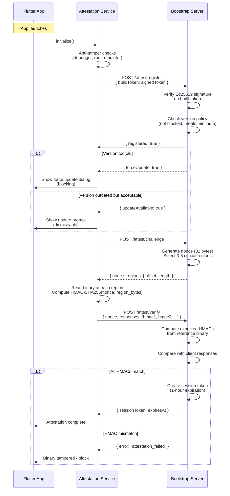

# App Attestation

Zajel includes a device attestation system that verifies app integrity and enforces version policies. This prevents modified apps from connecting to the server infrastructure.

---

## Attestation Flow



---

## Anti-Tamper Checks

Before registering with the server, the app performs local checks:

| Check | What it detects | Platform |
|-------|----------------|----------|
| Debugger detection | Attached debugger or instrumentation | Android, iOS |
| Root/jailbreak detection | Rooted Android or jailbroken iOS | Android, iOS |
| Emulator detection | Running on emulator/simulator | Android, iOS |

These checks are defense-in-depth. A sophisticated attacker could bypass them, but they raise the bar for casual tampering.

---

## Build Token

The build token is created at CI build time and embedded in the app binary:

```json
{
  "version": "1.2.3",
  "platform": "android",
  "hash": "sha256-of-binary",
  "timestamp": 1700000000000,
  "signature": "base64(Ed25519 signature)"
}
```

| Field | Purpose |
|-------|---------|
| `version` | App semantic version |
| `platform` | Target platform (android, ios, windows, macos, linux) |
| `hash` | SHA-256 hash of the release binary |
| `timestamp` | Build timestamp (milliseconds since epoch) |
| `signature` | Ed25519 signature over the payload fields |

The server verifies the signature against the known build signing public key.

---

## Binary Attestation (HMAC-SHA256)

Binary attestation verifies that the running binary matches the reference binary uploaded by CI:

### Reference Upload (CI Pipeline)

```
POST /attest/upload-reference
Authorization: CI_UPLOAD_SECRET

{
  "platform": "android",
  "version": "1.2.3",
  "criticalRegions": [
    { "offset": 1024, "length": 256, "hash": "sha256..." },
    { "offset": 8192, "length": 512, "hash": "sha256..." },
    ...
  ]
}
```

### Challenge-Response

1. **Server generates challenge**: Random 32-byte nonce + selects 3-5 critical regions
2. **Client computes responses**: For each region, reads bytes from the binary and computes `HMAC-SHA256(nonce, region_bytes)`
3. **Server verifies**: Computes the same HMACs using the reference binary data and compares

The nonce ensures each challenge is unique, preventing replay attacks. Nonces are one-time-use on the server side.

### Desktop Binary Reading

On desktop platforms (Linux, Windows, macOS), the binary is read from `Platform.resolvedExecutable`. On mobile platforms, platform-specific APIs access the installed APK or IPA.

---

## Version Policy

The server enforces a version policy:

| Policy | Effect |
|--------|--------|
| **Minimum version** | Versions below this are blocked (force update dialog) |
| **Recommended version** | Versions below this show an update prompt (dismissable) |
| **Blocked versions** | Specific versions that are explicitly blocked (e.g., known vulnerabilities) |

### Version Comparison

Versions are compared using semantic versioning (major.minor.patch):
- Compare major version first
- If equal, compare minor version
- If equal, compare patch version
- Returns -1 (less), 0 (equal), or 1 (greater)

### Update Dialogs

| Dialog | Trigger | Behavior |
|--------|---------|----------|
| Force Update | Version below minimum or in blocked list | Full-screen, cannot be dismissed |
| Update Prompt | Version below recommended | Dismissable, suggests updating |

---

## Session Token

After successful attestation, the server issues a session token:

| Property | Value |
|----------|-------|
| Format | `base64(payload).base64(signature)` |
| Expiration | 1 hour from issuance |
| Signing | Ed25519 signature over payload |
| Verification | Server verifies signature and checks expiration |

The session token is used for subsequent API calls that require verified device status.

---

## Server Identity Verification

The attestation system also verifies the server's identity:

1. The app contacts the bootstrap server (`GET /servers`)
2. The response includes an Ed25519 signature
3. The app verifies the signature against a hardcoded public key
4. The response timestamp must be within 5 minutes (replay protection)
5. Different keys are used for production and QA environments

This provides bidirectional trust: the server verifies the client, and the client verifies the server.

---

## Component Architecture

| Component | Location | Responsibility |
|-----------|----------|---------------|
| `AttestationInitializer` | `attestation_initializer.dart` | Orchestrates startup checks |
| `AttestationService` | `services/attestation_service.dart` | Build token registration, session management |
| `VersionCheckService` | `services/version_check_service.dart` | Semver comparison, policy checking |
| `AntiTamperService` | `services/anti_tamper_service.dart` | Debugger, root, emulator detection |
| `BinaryAttestationService` | `services/binary_attestation_service.dart` | HMAC-SHA256 challenge handling |
| `ServerAttestationService` | `services/server_attestation_service.dart` | Server identity verification |
| `AttestationClient` | `services/attestation_client.dart` | HTTP client for attestation API |
