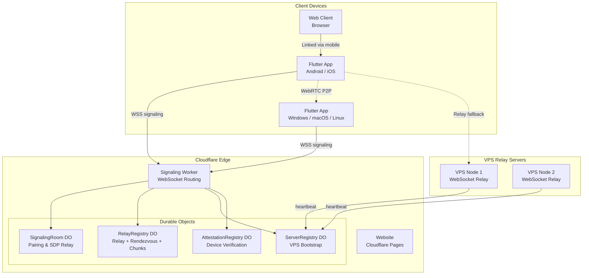
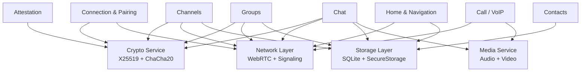

# Architecture Overview

Zajel is a peer-to-peer encrypted messaging application built as a monorepo with a Flutter cross-platform client, a Cloudflare Workers signaling server, and a static website.

---

## High-Level System Architecture



The signaling server is used only during connection setup. Once WebRTC data channels are established, all communication is direct peer-to-peer. VPS relay servers provide fallback connectivity when direct P2P is not possible.

---

## Monorepo Structure

```
zajel/
  packages/
    app/              Flutter cross-platform client (Android, iOS, Windows, macOS, Linux)
    server/           Cloudflare Workers signaling server (Durable Objects)
    server-vps/       VPS relay server for fallback connectivity
    website/          Landing page and user guide (React + Vite, Cloudflare Pages)
    web-client/       Browser-based client (linked to mobile app)
    headless-client/  Python headless client for E2E testing
    integration-tests/ Integration test suite
    admin-cf/         Admin tooling for Cloudflare
```

---

## Flutter App Module Structure



---

## Tech Stack Details

### Flutter App (`packages/app`)

| Component | Technology |
|-----------|-----------|
| Framework | Flutter 3.x (Dart) |
| State Management | Riverpod |
| P2P Communication | `flutter_webrtc` (WebRTC) |
| Cryptography | `cryptography` (X25519, Ed25519, ChaCha20-Poly1305, HKDF) |
| Local Database | `sqflite` (SQLite) |
| Secure Storage | `flutter_secure_storage` (Keychain/Keystore) |
| QR Codes | `mobile_scanner`, `qr_flutter` |
| Notifications | `flutter_local_notifications` |

### Server (`packages/server`)

| Component | Technology |
|-----------|-----------|
| Runtime | Cloudflare Workers (V8 isolates) |
| State Management | Durable Objects (in-memory + persistent) |
| Protocol | WebSocket (signaling), HTTP (bootstrap, attestation) |
| Cryptography | Web Crypto API (Ed25519, HMAC-SHA256) |

### Website (`packages/website`)

| Component | Technology |
|-----------|-----------|
| Framework | React Router v7 |
| Build Tool | Vite |
| Hosting | Cloudflare Pages |
| Styling | CSS custom properties (dark theme) |

---

## Communication Flow Summary

1. **Bootstrap**: App fetches server list from Cloudflare Worker (Ed25519-signed response)
2. **Signaling**: App connects via WSS, registers with pairing code
3. **Pairing**: Peer enters code, mutual approval, SDP exchange through signaling
4. **WebRTC**: Direct P2P data channel established (STUN for NAT traversal)
5. **Crypto Handshake**: Public key exchange over WebRTC, ECDH shared secret, HKDF session key
6. **Messaging**: All messages encrypted with ChaCha20-Poly1305 using session key
7. **Reconnection**: Trusted peers reconnect via meeting points and dead drops without new pairing
