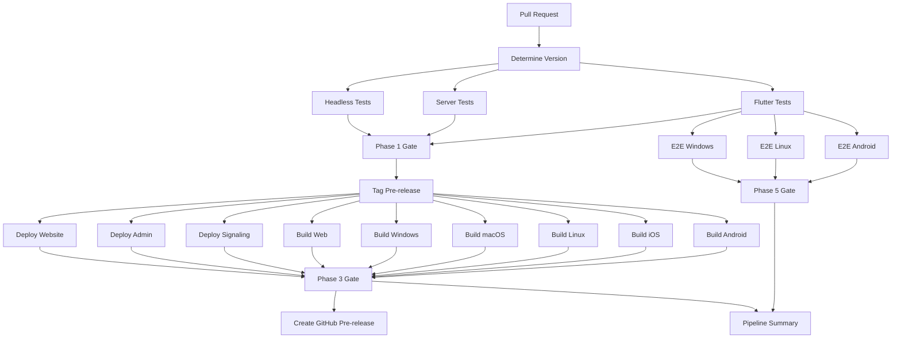

# CI Pipeline

Zajel uses GitHub Actions for continuous integration and deployment. There are 16 workflow files under `.github/workflows/`, with the **PR Pipeline** being the most critical -- it gates every pull request with a 5-phase sequence of tests, builds, deployments, releases, and E2E validation.

## PR Pipeline Flow

## All Workflows

### Testing Workflows

| Workflow | File | Trigger | Purpose |
|----------|------|---------|---------|
| CI - App | `ci.yml` | Push/PR to `main` (app paths) | Flutter analyze + test |
| Flutter Tests | `flutter-tests.yml` | Push/PR to `main`/`feature/**` (app paths) | Analyze, unit tests, build Android + iOS |
| Server Tests (CF) | `server-tests.yml` | Push/PR to `main`/`feature/**` (server paths) | CF Workers unit + E2E tests |
| VPS Server Tests | `server-vps-tests.yml` | Push/PR to `main`/`feature/**` (server-vps paths) | VPS sharded unit + integration tests |
| Web Client Tests | `web-client-tests.yml` | Push/PR to `main`/`feature/**` (web-client paths) | Unit tests, build, Playwright E2E (2 shards) |
| Integration Tests | `integration-tests.yml` | Push/PR to `main`/`feature/**` (integration paths) | Pairing flow + web-to-web tests |

### Pipeline Workflow

| Workflow | File | Trigger | Purpose |
|----------|------|---------|---------|
| PR Pipeline | `pr-pipeline.yml` | PR to `main` + workflow_dispatch | Full 5-phase gate: tests, tag, build, release, E2E |

### Deployment Workflows

| Workflow | File | Trigger | Purpose |
|----------|------|---------|---------|
| Deploy Server | `deploy-server.yml` | Push to `main` (server paths) | CF Workers production deploy |
| Deploy VPS | `deploy-vps.yml` | Push to `main` (server-vps paths) | VPS production deploy |
| Deploy VPS (reusable) | `deploy-vps-reusable.yml` | Called by other workflows | Reusable VPS deploy with lock mechanism |
| Deploy Website | `deploy-website.yml` | Push to `main` (website paths) | Cloudflare Pages deploy |

### Release Workflow

| Workflow | File | Trigger | Purpose |
|----------|------|---------|---------|
| Release | `release.yml` | Tag push `v*` | Multi-platform production release (only for `vX.Y.Z` tags, not pre-releases) |

### AI Workflows

| Workflow | File | Trigger | Purpose |
|----------|------|---------|---------|
| Claude | `claude.yml` | Issue/PR comments mentioning `@claude` | Claude Code AI assistant |
| Claude Code Review | `claude-code-review.yml` | PR opened/updated | Automated PR review |

### Validation Workflows

| Workflow | File | Trigger | Purpose |
|----------|------|---------|---------|
| CI - Server | `ci-server.yml` | Push/PR to `main` (server paths) | Wrangler dry-run validation |
| CI - Website | `ci-website.yml` | Push/PR to `main` (website paths) | TypeScript typecheck + build |

## PR Pipeline: Phase Details

### Phase 1: Tests

Three jobs run in parallel:

- **Unit Tests**: `flutter analyze --no-fatal-infos` + `flutter test test/` on the Flutter app.
- **Server Tests**: `npm test` on both the CF Workers (`zajel-signaling`) and VPS (`@zajel/server-vps`) packages.
- **Headless Client Tests**: Installs the Python headless client, runs `pytest packages/headless-client/tests/` for unit tests, then runs headless-only E2E tests (`test_channels_headless.py`, `test_groups_headless.py`).

### Phase 2: Tag Pre-release

Computes a version number from the latest GitHub release tag (`vMAJOR.MINOR.PATCH+1-build.NNNN`) and creates a Git tag. If the tag already exists (from a re-run), it is deleted and recreated.

### Phase 3: Build & Deploy (parallel)

Nine parallel jobs:

- **Build Android**: Builds a release APK with QA `dart-define` flags. Uploads as `zajel-VERSION-android.apk`.
- **Build iOS**: Builds an unsigned IPA on `macos-latest`. Uploaded as `zajel-VERSION-ios.ipa`.
- **Build Linux**: Installs GTK/clang/etc. dependencies, builds a release tarball. Uploaded as `zajel-VERSION-linux-x64.tar.gz`.
- **Build macOS**: Builds on `macos-latest`, zips the `.app` bundle.
- **Build Windows**: Installs OpenSSL, builds on `windows-latest`, zips the release.
- **Build Web**: Builds, runs a smoke test (serves `build/web` and checks for Flutter content).
- **Deploy CF Signaling**: Deploys the CF Workers signaling server to the `qa` environment via Wrangler. Runs a health check.
- **Deploy CF Admin**: Deploys the admin dashboard to CF Workers `qa`.
- **Deploy CF Website**: Deploys the project website to CF Workers `qa`.

### Phase 4: Create GitHub Pre-release

Downloads all build artifacts, generates a changelog from the PR description, creates a GitHub pre-release with all platform binaries attached. Cleans up stale draft releases and keeps only the 3 most recent pre-releases.

### Phase 5: E2E Tests (three parallel tracks)

- **Phase 5a (Android)**: Enables KVM, installs Appium + UiAutomator2, sets up coturn TURN relay with random credentials, builds a QA APK with TURN config baked in, starts an `android-31` x86_64 emulator, then runs tests in phases:
  - Phase A: Smoke test (`test_app_launches_successfully`)
  - Phase B: Single-device tests (no P2P)
  - Phase C: Signaling protocol tests (headless-to-headless)
  - Phase D: Headless-paired tests (app + HeadlessBob via TURN)
  - Phase D2: Channel & Group E2E

- **Phase 5b (Linux)**: Sets up Xvfb, PulseAudio (null sink), gnome-keyring, builds the Flutter integration test binary with the embedded Shelf HTTP server, waits for port 9000, then runs:
  - Shelf HTTP smoke test
  - Signaling protocol tests

- **Phase 5c (Windows)**: Runs on `windows-latest`, installs the headless client, runs signaling protocol tests only (no app binary launched).

## Concurrency Groups

Every workflow uses a concurrency group with `cancel-in-progress: true` to avoid wasting CI minutes on superseded commits:

| Workflow | Group Pattern |
|----------|---------------|
| PR Pipeline | `pr-${{ github.event.pull_request.number }}` |
| Flutter Tests | `flutter-${{ github.ref }}` |
| Server Tests | `server-${{ github.ref }}` |
| VPS Tests | `server-vps-${{ github.ref }}` |
| Web Client Tests | `web-client-${{ github.ref }}` |
| Integration Tests | `integration-${{ github.ref }}` |

## Environment Variables and Secrets

### Variables (non-secret)

| Variable | Used In | Purpose |
|----------|---------|---------|
| `QA_BOOTSTRAP_URL` | PR Pipeline builds | Bootstrap server URL for QA builds |
| `VPS_QA_WS_URL` | PR Pipeline E2E | WebSocket URL for the QA VPS signaling server |
| `QA_VPS_IP` | PR Pipeline E2E | IP address(es) of QA VPS (comma-separated, probed at runtime) |

### Secrets

| Secret | Used In | Purpose |
|--------|---------|---------|
| `CLOUDFLARE_API_TOKEN` | CF deploy jobs | Wrangler API authentication |
| `CLOUDFLARE_ACCOUNT_ID` | CF deploy jobs | Cloudflare account ID |
| `VPS_USER` | VPS deploy | SSH username |
| `VPS_SSH_KEY` | VPS deploy | SSH private key |
| `VPS_PORT` | VPS deploy | SSH port (default 22) |
| `ZAJEL_ADMIN_JWT_SECRET` | VPS deploy | Admin JWT signing secret |

### Computed at Runtime

| Variable | Computed In | Purpose |
|----------|-------------|---------|
| `SIGNALING_URL` | E2E steps | Resolved by probing QA VPS IP(s) for health |
| `TURN_URL` / `TURN_URL_EMU` | coturn setup | `turn:127.0.0.1:3478` for host, `turn:10.0.2.2:3478` for emulator |
| `TURN_USER` / `TURN_PASS` | coturn setup | Random per-run credentials |

## Build Artifact Retention

| Artifact | Retention |
|----------|-----------|
| Platform build artifacts (APK, IPA, etc.) | 1 day |
| Test results / reports | 3-7 days |
| E2E failure artifacts (screenshots, logs) | 3 days |
| GitHub pre-releases | Latest 3 kept, older cleaned up automatically |

## Debugging CI Failures

1. **Check the Phase gates**: The PR Pipeline uses named gate jobs (`Phase 1 Gate`, `Phase 3 Gate`, etc.) -- find the first gate that failed.

2. **E2E failure artifacts**: On Android E2E failure, screenshots and page source XML are uploaded. Check the `e2e-test-artifacts` artifact.

3. **Logcat**: For Android emulator issues, the `logcat-emu1.txt` in artifacts captures the full Android system log.

4. **coturn logs**: TURN relay logs are collected in `coturn.log` on failure.

5. **Shelf HTTP server**: For Linux E2E, if the Shelf server fails to start within 300 seconds, the Flutter build/test process likely crashed. Check the `e2e-linux-test-artifacts`.

6. **Re-run with skip_e2e**: Use `workflow_dispatch` with `skip_e2e: true` to skip E2E tests during debugging.
