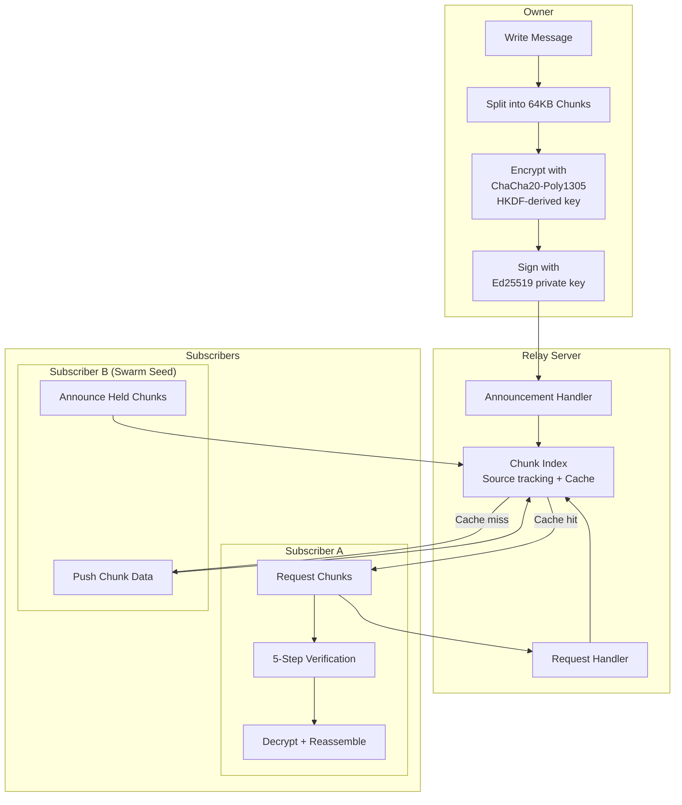

# Channels Architecture

Channels are one-to-many broadcast feeds where an owner publishes signed and encrypted content to subscribers. Content is distributed via relay servers with peer-to-peer swarm seeding.

---

## Channel Content Flow



---

## Cryptographic Architecture

### Key Types

| Key | Algorithm | Purpose | Who holds it |
|-----|-----------|---------|-------------|
| Owner signing key | Ed25519 | Sign manifests and chunks | Owner only |
| Admin signing keys | Ed25519 | Sign chunks | Each admin |
| Encryption key | X25519 | Derive content encryption key | Owner + subscribers (via invite link) |

### Channel ID Derivation

The channel ID is derived from the owner's Ed25519 public key:

```
channel_id = hex(SHA-256(owner_public_key)[0:16])
```

This produces a 32-character hex string (128 bits). The birthday-bound collision probability is ~2^-64, negligible for any realistic number of channels.

### Manifest

The channel manifest is a signed JSON document containing:

```json
{
  "channelId": "hex-encoded-128-bit-id",
  "name": "Channel Name",
  "description": "Optional description",
  "ownerKey": "base64(Ed25519 public key)",
  "adminKeys": [{"key": "base64(Ed25519 public key)", "label": "Admin Name"}],
  "encryptionKey": "base64(X25519 public key)",
  "keyEpoch": 1,
  "rules": {
    "repliesEnabled": true,
    "pollsEnabled": true,
    "maxUpstreamSize": 4096,
    "allowedContentTypes": ["text", "file", "poll"]
  },
  "signature": "base64(Ed25519 signature over canonical JSON)"
}
```

The manifest is signed using canonical JSON (sorted keys, no extra whitespace) to ensure deterministic serialization.

---

## Chunk Model

Content is split into fixed-size chunks for distribution:

```
Chunk:
  Header (plaintext):
    - routingHash: HMAC-derived hash for DHT lookup
    - channelId: 32-char hex channel identifier
    - sequence: message sequence number (auto-incrementing)
    - chunkIndex: index within a multi-chunk message
    - totalChunks: total number of chunks for this message
  Envelope (signed):
    - authorPubkey: base64(Ed25519 public key of author)
    - signature: base64(Ed25519 signature over encryptedPayload)
  Payload (encrypted):
    - encryptedPayload: nonce(12) || ciphertext || MAC(16)
      Decrypted payload contains:
        - contentType: text | file | audio | video | document | poll
        - data: raw content bytes
        - metadata: JSON map
        - author: author identifier
        - timestamp: creation time
```

### Content Splitting

1. The payload is serialized to bytes
2. Bytes are split into 64KB chunks
3. Each chunk is encrypted with the channel's content key (ChaCha20-Poly1305 with HKDF-derived key using epoch as context)
4. Each encrypted chunk is signed with the author's Ed25519 private key

### Chunk Reassembly

1. Chunks are grouped by `(channelId, sequence)`
2. Sorted by `chunkIndex`
3. Overflow protection: total size validated against limits
4. Concatenated and decrypted as a single payload

---

## Subscriber Verification (5 Steps)

When a subscriber receives a chunk:

1. **Authentic?** Verify the Ed25519 signature on the chunk's encrypted payload against `authorPubkey`
2. **Authorized?** Check that `authorPubkey` is the owner key or listed in `adminKeys` in the manifest
3. **Manifest legit?** Verify the manifest's Ed25519 signature against the `ownerKey`
4. **Trusted?** Confirm that `ownerKey` matches the key stored locally at subscription time
5. **Readable?** Decrypt the payload with the channel encryption key

If any step fails, the chunk is rejected.

---

## Synchronization

The sync service maintains channel content freshness:

### Periodic Sync (default: 5 minutes)
1. For each subscribed channel, query the relay for chunks newer than the latest local sequence
2. Download missing chunks
3. Verify and store locally

### Swarm Seeding
Subscribers announce their locally held chunks to the relay. When another subscriber requests a chunk that is not cached on the relay, the relay asks a seeding subscriber to push the data.

### Server Message Types

| Message | Direction | Purpose |
|---------|-----------|---------|
| `chunk_announce` | Client -> Server | Register as chunk source |
| `chunk_request` | Client -> Server | Request a chunk |
| `chunk_data` | Server -> Client | Deliver chunk data |
| `chunk_pull` | Server -> Client | Ask client to push a chunk |
| `chunk_available` | Server -> Client | Notify that a requested chunk is ready |
| `chunk_not_found` | Server -> Client | Chunk not available from any source |

---

## Admin Management

### Appointing Admins
1. Owner adds the admin's Ed25519 public key and label to the manifest
2. Owner re-signs the manifest
3. Updated manifest is distributed to subscribers

### Removing Admins
1. Owner removes the admin key from the manifest
2. Owner generates a new X25519 encryption keypair
3. Key epoch is incremented
4. Manifest is re-signed with the new encryption key and epoch
5. Removed admin loses access to future content (cannot derive new content key)

---

## Upstream Messaging

Subscribers can send messages back to the channel owner (if allowed by channel rules):

| Type | Purpose |
|------|---------|
| Reply | Text reply to a specific message (identified by parent sequence) |
| Vote | Vote on a poll option |
| Reaction | Emoji reaction to a message |

Upstream messages are encrypted with an ephemeral key and sent to the owner via the relay. Only the owner can decrypt them.

### Validation
Upstream messages are validated against channel rules:
- Replies must be enabled in rules
- Polls must be enabled for votes
- Message size must not exceed `maxUpstreamSize`
- Content type must be in `allowedContentTypes`

---

## Polling

Channel owners can create polls:

1. Owner creates a poll with question, options, and optional close time
2. Poll is broadcast as a chunk with content type `poll`
3. Subscribers vote via upstream messages
4. Owner tallies votes and can broadcast results

---

## Live Streaming

Channels support live video/audio streaming:

1. Owner starts a stream with a title
2. Video/audio frames are encrypted with the channel key and sent via WebSocket
3. Subscribers receive and decrypt frames in real-time
4. RTMP ingest service can convert external RTMP/FLV streams to Zajel stream frames

---

## Routing Hashes and Censorship Resistance

Routing hashes prevent network observers from persistently tracking channels:

- Hashes are derived using `HMAC(channel_key, epoch_identifier)` where epochs rotate hourly or daily
- Each epoch produces a different hash, making long-term correlation difficult
- The censorship detection service tracks fetch success rates per routing hash
- If a hash is consistently blocked, the system can detect the blocking pattern

---

## Background Sync

On mobile platforms, channels sync in the background:
- **Android**: WorkManager periodic tasks
- **iOS**: BGAppRefresh

Background sync checks all subscribed channels and downloads new chunks even when the app is not in the foreground.
