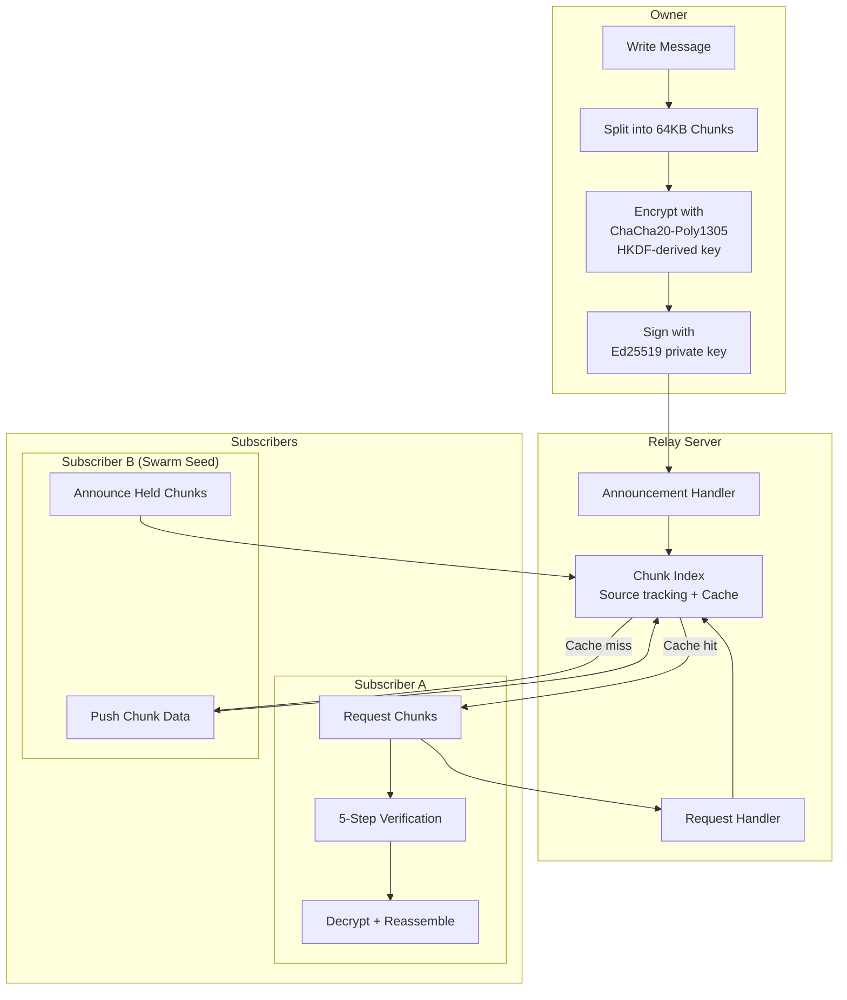

# Channels Architecture

Channels are one-to-many broadcast feeds where an owner publishes signed and encrypted content to subscribers. Content is distributed via relay servers with peer-to-peer swarm seeding.

---

## Channel Content Flow


```mermaid
graph TB
    subgraph "Owner"
        O_WRITE[Write Message] --> O_CHUNK[Split into 64KB Chunks]
        O_CHUNK --> O_ENC[Encrypt with<br/>ChaCha20-Poly1305<br/>HKDF-derived key]
        O_ENC --> O_SIGN[Sign with<br/>Ed25519 private key]
    end

    O_SIGN --> R_ANNOUNCE

    subgraph "Relay Server"
        R_ANNOUNCE[Announcement Handler] --> R_INDEX[Chunk Index<br/>Source tracking + Cache]
        R_REQUEST[Request Handler] --> R_INDEX
    end

    subgraph "Subscribers"
        subgraph "Subscriber A"
            A_REQ[Request Chunks]
            A_VERIFY[5-Step Verification]
            A_DEC[Decrypt + Reassemble]
        end
        subgraph "Subscriber B (Swarm Seed)"
            B_ANNOUNCE[Announce Held Chunks]
            B_PUSH[Push Chunk Data]
        end
    end

    A_REQ --> R_REQUEST
    R_INDEX -->|"Cache hit"| A_REQ
    R_INDEX -->|"Cache miss"| B_PUSH
    B_ANNOUNCE --> R_INDEX
    B_PUSH --> R_INDEX
    A_REQ --> A_VERIFY --> A_DEC
```

---

## Cryptographic Architecture

### Key Types

| Key | Algorithm | Purpose | Who holds it |
|-----|-----------|---------|-------------|
| Owner signing key | Ed25519 | Sign manifests and chunks | Owner only |
| Admin signing keys | Ed25519 | Sign chunks | Each admin |
| Encryption key | X25519 | Derive content encryption key | Owner + subscribers (via invite link) |

### Channel ID Derivation

The channel ID is derived from the owner's Ed25519 public key:

```
channel_id = hex(SHA-256(owner_public_key)[0:16])
```

This produces a 32-character hex string (128 bits). The birthday-bound collision probability is ~2^-64, negligible for any realistic number of channels.

### Manifest

The channel manifest is a signed JSON document containing:

```json
{
  "channelId": "hex-encoded-128-bit-id",
  "name": "Channel Name",
  "description": "Optional description",
  "ownerKey": "base64(Ed25519 public key)",
  "adminKeys": [{"key": "base64(Ed25519 public key)", "label": "Admin Name"}],
  "encryptionKey": "base64(X25519 public key)",
  "keyEpoch": 1,
  "rules": {
    "repliesEnabled": true,
    "pollsEnabled": true,
    "maxUpstreamSize": 4096,
    "allowedContentTypes": ["text", "file", "poll"]
  },
  "signature": "base64(Ed25519 signature over canonical JSON)"
}
```

The manifest is signed using canonical JSON (sorted keys, no extra whitespace) to ensure deterministic serialization.

---

## Chunk Model

Content is split into fixed-size chunks for distribution:

```
Chunk:
  Header (plaintext):
    - routingHash: HMAC-derived hash for DHT lookup
    - channelId: 32-char hex channel identifier
    - sequence: message sequence number (auto-incrementing)
    - chunkIndex: index within a multi-chunk message
    - totalChunks: total number of chunks for this message
  Envelope (signed):
    - authorPubkey: base64(Ed25519 public key of author)
    - signature: base64(Ed25519 signature over encryptedPayload)
  Payload (encrypted):
    - encryptedPayload: nonce(12) || ciphertext || MAC(16)
      Decrypted payload contains:
        - contentType: text | file | audio | video | document | poll
        - data: raw content bytes
        - metadata: JSON map
        - author: author identifier
        - timestamp: creation time (UTC; converted to local for display)
```

### Content Splitting

1. The payload is serialized to bytes
2. Bytes are split into 64KB chunks
3. Each chunk is encrypted with the channel's content key (ChaCha20-Poly1305 with HKDF-derived key using epoch as context)
4. Each encrypted chunk is signed with the author's Ed25519 private key

### Chunk Reassembly

1. Chunks are grouped by `(channelId, sequence)`
2. Sorted by `chunkIndex`
3. Overflow protection: total size validated against limits
4. Concatenated and decrypted as a single payload

---

## Subscriber Verification (5 Steps)

When a subscriber receives a chunk:

1. **Authentic?** Verify the Ed25519 signature on the chunk's encrypted payload against `authorPubkey`
2. **Authorized?** Check that `authorPubkey` is the owner key or listed in `adminKeys` in the manifest
3. **Manifest legit?** Verify the manifest's Ed25519 signature against the `ownerKey`
4. **Trusted?** Confirm that `ownerKey` matches the key stored locally at subscription time
5. **Readable?** Decrypt the payload with the channel encryption key

If any step fails, the chunk is rejected.

---

## Synchronization

The sync service maintains channel content freshness:

### Periodic Sync (default: 5 minutes)
1. For each subscribed channel, query the relay for chunks newer than the latest local sequence
2. Download missing chunks
3. Verify and store locally

### Swarm Seeding
Subscribers announce their locally held chunks to the relay. When another subscriber requests a chunk that is not cached on the relay, the relay asks a seeding subscriber to push the data.

### Server Message Types

| Message | Direction | Purpose |
|---------|-----------|---------|
| `chunk_announce` | Client -> Server | Register as chunk source |
| `chunk_request` | Client -> Server | Request a chunk |
| `chunk_data` | Server -> Client | Deliver chunk data |
| `chunk_pull` | Server -> Client | Ask client to push a chunk |
| `chunk_available` | Server -> Client | Notify that a requested chunk is ready |
| `chunk_not_found` | Server -> Client | Chunk not available from any source |

---

## Message Display and Pagination

The Flutter app uses a `ChannelMessagesNotifier` (Riverpod `StateNotifierProvider`) to load and paginate channel messages:

- **Page size**: 50 sequences per page
- **Initial load**: Decrypts the 50 most recent sequences from SQLite
- **Load more**: Fetches older sequences via `getChunksForLatestSequences(channelId, limit: 50, beforeSequence: oldestLoaded)`
- **Reload**: Called when new chunks arrive (via `onChunkReceived` callback), refreshes the latest 50 sequences
- **Decryption pipeline**: Chunks are grouped by sequence, reassembled, then decrypted with the channel's X25519 encryption key and current key epoch

All timestamps are stored in UTC (`DateTime.now().toUtc()`) and converted to local time only at display time via the shared `MessageListView<T>` widget, which provides reversed ListView, smart auto-scroll, date dividers, and a "New messages" indicator.

---

## Admin Management

### Appointing Admins
1. Owner adds the admin's Ed25519 public key and label to the manifest
2. Owner re-signs the manifest
3. Updated manifest is distributed to subscribers

### Removing Admins
1. Owner removes the admin key from the manifest
2. Owner generates a new X25519 encryption keypair
3. Key epoch is incremented
4. Manifest is re-signed with the new encryption key and epoch
5. Removed admin loses access to future content (cannot derive new content key)

---

## Upstream Messaging

Subscribers can send messages back to the channel owner (if allowed by channel rules):

| Type | Purpose |
|------|---------|
| Reply | Text reply to a specific message (identified by parent sequence) |
| Vote | Vote on a poll option |
| Reaction | Emoji reaction to a message |

Upstream messages are encrypted with an ephemeral key and sent to the owner via the relay. Only the owner can decrypt them.

### Validation
Upstream messages are validated against channel rules:
- Replies must be enabled in rules
- Polls must be enabled for votes
- Message size must not exceed `maxUpstreamSize`
- Content type must be in `allowedContentTypes`

---

## Polling

Channel owners can create polls:

1. Owner creates a poll with question, options, and optional close time
2. Poll is broadcast as a chunk with content type `poll`
3. Subscribers vote via upstream messages
4. Owner tallies votes and can broadcast results

---

## Live Streaming

Channels support live video/audio streaming:

1. Owner starts a stream with a title
2. Video/audio frames are encrypted with the channel key and sent via WebSocket
3. Subscribers receive and decrypt frames in real-time
4. RTMP ingest service can convert external RTMP/FLV streams to Zajel stream frames

---

## Routing Hashes and Censorship Resistance

Routing hashes prevent network observers from persistently tracking channels:

- Hashes are derived using `HMAC(channel_key, epoch_identifier)` where epochs rotate hourly or daily
- Each epoch produces a different hash, making long-term correlation difficult
- The censorship detection service tracks fetch success rates per routing hash
- If a hash is consistently blocked, the system can detect the blocking pattern

---

## Background Sync

On mobile platforms, channels sync in the background:
- **Android**: WorkManager periodic tasks
- **iOS**: BGAppRefresh

Background sync checks all subscribed channels and downloads new chunks even when the app is not in the foreground.

---

## Security Hardening

### Invite Link Security

The channel invite link contains the channel's **raw X25519 private encryption key** alongside the full signed manifest. This means anyone who obtains the link gains the ability to decrypt all channel content encrypted under that key epoch.

The invite link format:

1. Uses a strict `zajel://channel/` prefix requirement. Links with any other prefix or scheme are rejected during parsing
2. The payload is a base64url-encoded JSON object containing:
   - `'m'`: The full channel manifest (public keys, name, description, rules, signature)
   - `'k'`: The channel's raw X25519 private encryption key (base64-encoded)
   - Python headless client also adds `'created_at'` (ISO 8601 timestamp) and `'version': 1`
3. The Dart app (`ChannelLinkService.encode`) produces `{'m': manifest, 'k': encryptionKeyPrivate}`
4. The Python client (`encode_channel_link`) produces `{'m': manifest, 'k': encryptionKeyPrivate, 'created_at': ..., 'version': 1}`

Both clients can decode links from either format since the decoder only reads the `'m'` and `'k'` fields (additional fields are ignored by Dart; Python checks `'expires_at'` if present).

Because the raw private key is embedded, revoking access requires rotating the encryption keypair (incrementing `keyEpoch`) and redistributing a new invite link. Old links remain valid for content encrypted under the old epoch but cannot decrypt content under the new epoch.

### Chunk Sequence Validation and Replay Detection

Subscribers validate chunk sequence numbers to detect replayed or out-of-order content:

1. **Monotonic sequence enforcement**: For each channel, the subscriber tracks the highest sequence number seen. Chunks with a sequence number equal to or lower than a previously processed sequence are flagged as potential replays.
2. **Duplicate detection**: A set of recently seen `(channelId, sequence, chunkIndex)` tuples is maintained. Exact duplicates are silently dropped.
3. **Gap detection**: If a gap in sequence numbers is detected (e.g., sequence 5 arrives after sequence 3 with no sequence 4), the subscriber requests the missing chunks from the relay. Gaps are not silently ignored.

This prevents an attacker who has captured valid signed chunks from replaying old content to subscribers as if it were new.

### Bounded Chunk Storage

The Python headless client enforces a hard limit of **1,000 chunks per channel** (`MAX_CHUNKS_PER_CHANNEL = 1000` in `channels.py`). When the limit is reached, the oldest chunks (by sequence number) are evicted to make room for new ones.

| Storage layer | Bound | Eviction policy |
|--------------|-------|-----------------|
| In-memory (Python headless client) | 1,000 per channel | Oldest-sequence-first |
| SQLite (Flutter/Dart app) | **Unbounded** | No automatic eviction |
| Server chunk cache | Configurable | LRU with TTL |

**Note:** The Dart app's `ChannelStorageService.saveChunk` does NOT enforce a per-channel chunk limit. Chunks are inserted into SQLite without eviction. This means the Flutter app's database can grow without bound for channels with high publishing volume. The 1,000 chunk limit applies only to the Python headless client's in-memory storage.
