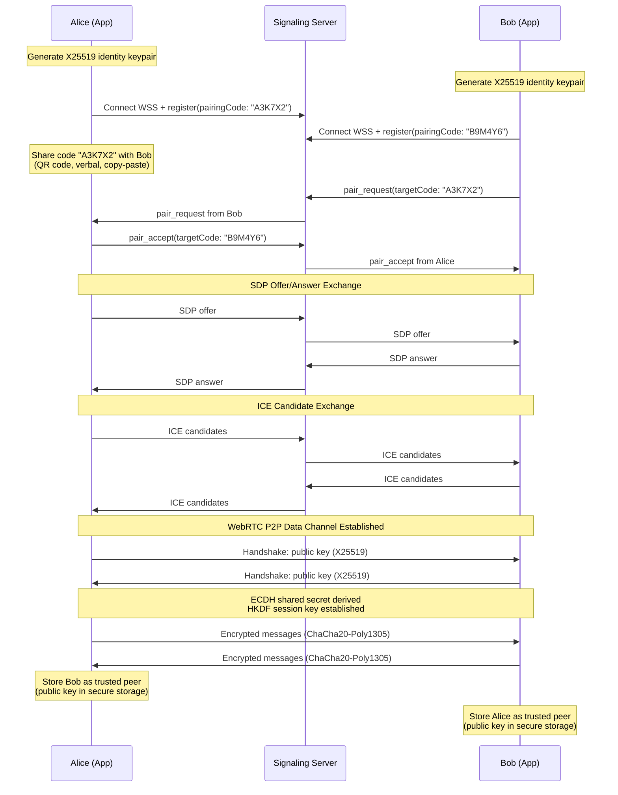
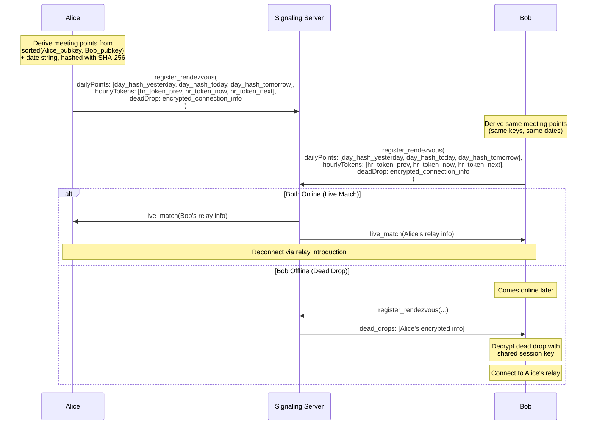
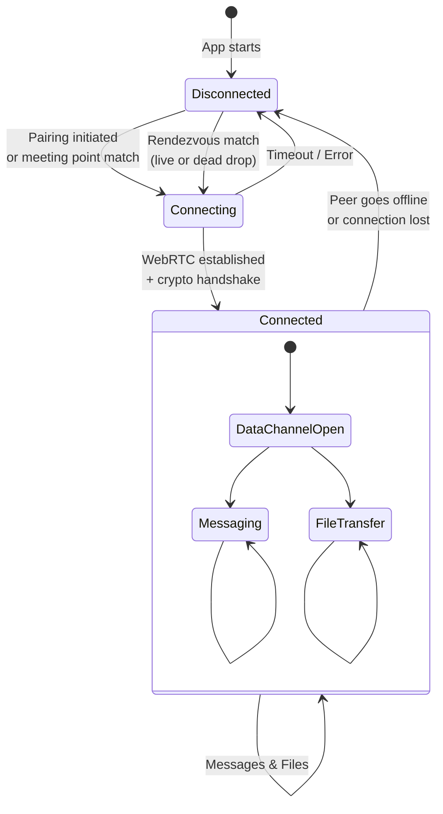

# Connection Lifecycle

This page documents the full connection lifecycle in Zajel, from initial pairing through ongoing reconnection.

---

## Initial Pairing Flow

When two users connect for the first time, they exchange pairing codes through an out-of-band channel (in person, via another messenger, etc.). The pairing code is a cryptographically secure 6-character alphanumeric string generated using rejection sampling to avoid modulo bias.



### Pairing Code Generation

Pairing codes use a 32-character alphabet (`ABCDEFGHJKLMNPQRSTUVWXYZ23456789`) that excludes ambiguous characters (0/O, 1/I). The code is 6 characters long, generated with `Random.secure()` and rejection sampling:

1. Generate a random byte (0-255)
2. If the byte value is >= 256 - (256 % 32) = 256, reject and retry
3. Since 32 divides 256 evenly, every byte maps uniformly to a character

This produces 32^6 = ~1 billion possible codes.

---

## Trusted Peer Reconnection (Rendezvous)

After the initial pairing, peers can find each other again without exchanging new codes. The rendezvous system uses two mechanisms:



### Meeting Point Derivation

- **Daily points**: `SHA-256(sorted_key_1 || sorted_key_2 || "zajel:daily:" || "YYYY-MM-DD")`, computed for yesterday/today/tomorrow (3-day window)
- **Hourly tokens**: `HMAC-SHA256(shared_secret, "zajel:hourly:" || "YYYY-MM-DDTHH")`, computed for previous/current/next hour (3-hour window)

The server sees only opaque hashes and cannot determine which peers are trying to meet.

### Dead Drops

When a peer is offline, the online peer leaves an encrypted dead drop at their meeting point. The dead drop contains connection info (relay ID, source ID, IP, public key) encrypted with the shared session key. Only the intended recipient can decrypt it. Dead drops expire after 48 hours.

---

## Peer Connection States



### State Descriptions

| State | Description |
|-------|-------------|
| **Disconnected** | No active connection. Peer may appear in contacts with last-seen timestamp. |
| **Connecting** | Signaling in progress. SDP exchange or ICE negotiation underway. |
| **Connected** | WebRTC data channel open. Crypto handshake complete. Messages flow encrypted. |

---

## Trusted Peer Migration

When a trusted peer reinstalls the app or generates a new pairing code, they still have the same X25519 public key. The system detects this during the pairing handshake:

1. New pairing code is entered
2. WebRTC connection established
3. Public key exchange reveals a known trusted peer
4. System migrates the peer record to the new pairing code
5. Message history is preserved and linked to the new peer ID

This allows peers to reconnect even after app reinstallation without losing conversation history.

---

## Web Client Linking

Web browser clients connect through a linked mobile device:

1. Mobile app generates a link code and displays it as a QR code
2. Web client scans the QR code and connects to the signaling server
3. Mobile app approves the link request (showing key fingerprint)
4. A WebRTC tunnel is established between web and mobile
5. Mobile app proxies all peer messages to/from the web client

Link sessions expire after 5 minutes if not completed. Linked devices can be revoked from the mobile app at any time.

---

## Security Hardening

### Socket Path Symlink Prevention

Before creating or connecting to a UNIX domain socket (used by the headless client daemon), the system checks for existing symlinks at the target path:

1. If the socket path already exists and is a symlink, the operation is **refused**
2. The parent directory ownership is verified to match the current user
3. The socket is created with permissions `0o600` (owner-only access)

This prevents symlink-based attacks where an attacker creates a symlink at the expected socket path pointing to a sensitive file or an attacker-controlled socket. Without this check, the daemon could unknowingly bind to (or connect to) a location controlled by a different user.

### Pending Peer State

Peers are now held in a **pending state** during the connection setup until the cryptographic key exchange completes successfully:

```
Connection States (updated):

  [*] --> Disconnected
  Disconnected --> Connecting (signaling begins)
  Connecting --> PendingKeyExchange (WebRTC established, awaiting handshake)
  PendingKeyExchange --> Connected (key exchange verified)
  PendingKeyExchange --> Disconnected (key exchange failed or timed out)
  Connected --> Disconnected (peer offline or connection lost)
```

In the pending state:
- The peer appears in the internal connection table but is **not exposed** to the application layer
- No messages can be sent to or received from the peer
- The peer's public key is not trusted until the full handshake completes
- A timeout (default: 30 seconds) automatically transitions pending peers to disconnected if the handshake does not complete

This prevents a race condition where the application layer could attempt to send messages to a peer before the encryption handshake is finalized, which would either fail or send unencrypted data.

### WebRTC Cleanup on Connection Failure

When a WebRTC connection attempt fails (ICE timeout, DTLS failure, or handshake rejection), all associated resources are cleaned up:

1. The `RTCPeerConnection` is closed
2. Data channels are closed
3. Media tracks (if any) are stopped
4. ICE candidates are discarded
5. The peer is removed from internal connection tracking
6. Signaling state for the failed peer is reset

Previously, a failed connection could leave orphaned `RTCPeerConnection` objects consuming memory and port resources. The cleanup is performed in a `finally` block to ensure it runs even if an exception occurs during the connection attempt.

### ICE Server Configuration Validation

ICE server configurations (STUN/TURN) are validated before being used:

| Check | Validation rule |
|-------|----------------|
| URL format | Must be a valid `stun:` or `turn:` URI |
| Hostname | Must resolve to a valid address (not empty, not a private IP for production) |
| Port | Must be in range 1-65535 |
| Credential | If `turn:`, username and credential must be present |
| Duplicate detection | Duplicate URLs are removed |

Invalid ICE server entries are logged and excluded from the configuration. The connection attempt proceeds with the remaining valid entries. If no valid ICE servers remain, the system falls back to direct connectivity only and logs a warning.
