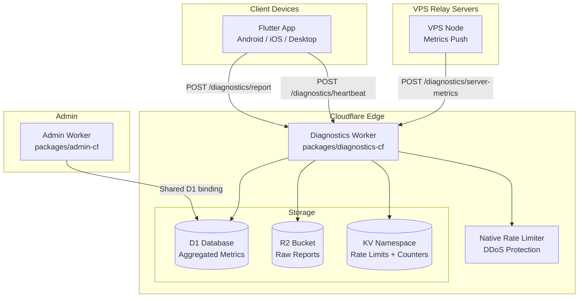

# Diagnostics Architecture

The diagnostics system collects anonymous crash reports, performance metrics, network metrics, and heartbeats from Flutter client apps. It runs as a Cloudflare Worker (`packages/diagnostics-cf/`) that ingests data over HTTPS, stores raw reports in R2 for later analysis, and writes aggregated metrics to D1 for dashboard queries.

---

## System Overview



---

## Worker Bindings

The diagnostics worker uses four Cloudflare bindings:

| Binding | Type | Purpose |
|---------|------|---------|
| `DB` | D1 Database | Aggregated error, performance, network, server, and heartbeat metrics |
| `REPORTS_BUCKET` | R2 Bucket | Raw diagnostic report JSON storage for later analysis |
| `RATE_LIMIT_KV` | KV Namespace | Per-session rate limiting state and dashboard counters |
| `GLOBAL_RATE_LIMITER` | Native Rate Limit | Global DDoS protection (167 requests per 60 seconds) |

Secrets:

| Secret | Purpose |
|--------|---------|
| `SERVER_METRICS_SECRET` | Shared secret for VPS server metrics push authentication |

---

## API Endpoints

### POST /diagnostics/report

Submits a diagnostic report from a Flutter client app. The report is validated, rate-limited, stored raw in R2, and aggregated into D1.

**Authentication**: None (anonymous). Rate-limited by `sessionHash`.

**Request body** (`application/json`, max 64 KB):

| Field | Type | Required | Description |
|-------|------|----------|-------------|
| `sessionHash` | string | Yes | SHA-256 hex string (64 chars) identifying the session |
| `appVersion` | string | Yes | Semver version (e.g., `1.2.3`) |
| `buildNumber` | string | Yes | Numeric build number |
| `platform` | string | Yes | One of: `android`, `ios`, `windows`, `macos`, `linux`, `web` |
| `platformVersion` | string | Yes | OS version string |
| `locale` | string | Yes | Locale identifier |
| `timestamp` | number | Yes | Unix timestamp in milliseconds |
| `errors` | array | No | Array of error entries (see below) |
| `performance` | object | No | Performance metrics (see below) |
| `network` | object | No | Network metrics (see below) |
| `connectionType` | string | No | One of: `direct_p2p`, `relay`, `none` |

**Error entry schema**:

| Field | Type | Required | Description |
|-------|------|----------|-------------|
| `category` | string | Yes | One of: `crash`, `network`, `crypto`, `storage`, `ui`, `protocol`, `other` |
| `message` | string | Yes | Error message text |
| `stackTrace` | string | No | Stack trace string |
| `signature` | string | Yes | Unique error signature for deduplication |
| `count` | number | Yes | Occurrence count (non-negative) |
| `firstOccurrence` | number | Yes | Unix timestamp of first occurrence |
| `lastOccurrence` | number | Yes | Unix timestamp of last occurrence |

**Performance metrics schema**:

| Field | Type | Description |
|-------|------|-------------|
| `startupTimeMs` | number | App startup time in milliseconds |
| `frameRateAvg` | number | Average frame rate (fps) |
| `frameRateP95` | number | 95th percentile frame rate |
| `memoryUsageMb` | number | Current memory usage in MB |
| `memoryPeakMb` | number | Peak memory usage in MB |

**Network metrics schema**:

| Field | Type | Description |
|-------|------|-------------|
| `signalingConnectSuccessRate` | number | Success rate (0.0 to 1.0) |
| `signalingConnectAttempts` | number | Total signaling attempts |
| `webrtcEstablishSuccessRate` | number | Success rate (0.0 to 1.0) |
| `webrtcEstablishAttempts` | number | Total WebRTC attempts |
| `relayUsageRate` | number | Relay usage rate (0.0 to 1.0) |
| `avgLatencyMs` | number | Average latency in milliseconds |

**Response**: `{ success: true, data: { reportId: "<R2 key>" } }`

### POST /diagnostics/heartbeat

Accepts anonymous heartbeats from Flutter clients for active client counting. Rate-limited to one heartbeat per session per 5 minutes.

**Authentication**: None (anonymous). Rate-limited by `sessionHash` via D1 `last_seen` timestamp.

**Request body** (`application/json`):

| Field | Type | Required | Description |
|-------|------|----------|-------------|
| `sessionHash` | string | Yes | SHA-256 hex string (64 chars) |
| `platform` | string | Yes | Platform identifier |
| `appVersion` | string | Yes | Semver version string |
| `connectionType` | string | No | Connection type |

**Response**: `{ success: true, data: { nextHeartbeatMs: 300000 } }`

### POST /diagnostics/server-metrics

Accepts periodic metrics snapshots from VPS relay servers. Authenticated via shared secret (Bearer token).

**Authentication**: `Authorization: Bearer <SERVER_METRICS_SECRET>`

**Request body** (`application/json`, max 16 KB):

| Field | Type | Required | Description |
|-------|------|----------|-------------|
| `serverId` | string | Yes | VPS server identifier |
| `region` | string | Yes | Server region |
| `timestamp` | number | Yes | Unix timestamp in milliseconds |
| `metrics.connections` | object | Yes | `{ total, relay, signaling }` |
| `metrics.entropy` | object | Yes | `{ activeCodes, collisionRisk }` |
| `metrics.federation` | object | Yes | `{ aliveMembers, totalMembers }` |
| `metrics.messageRate` | object | Yes | `{ perSecond, perMinute }` |
| `metrics.system` | object | Yes | `{ cpuPercent, memoryMb, uptimeSeconds }` |
| `metrics.gossipLatency` | object | No | `{ p50Ms, p95Ms, p99Ms, pingCount }` -- SWIM gossip RTT percentiles |

**Response**: `{ success: true, data: { received: true } }`

Old server metrics rows (older than 7 days) are cleaned up on each push.

### GET /diagnostics/health

Health check endpoint. Returns service status.

**Response**: `{ status: "ok", service: "zajel-diagnostics", timestamp: "..." }`

---

## Rate Limiting

The diagnostics worker applies two layers of rate limiting:

### Layer 1: Global Rate Limit (DDoS Protection)

Uses the native Cloudflare Rate Limiting binding (`GLOBAL_RATE_LIMITER`). Configured at **167 requests per 60 seconds** (~10,000/hour). This runs in-process with sub-millisecond latency. If the limiter fails, requests are allowed through (fail open for availability).

### Layer 2: Per-Session Rate Limit

Uses KV (`RATE_LIMIT_KV`) to enforce **10 reports per session per hour**. The KV key format is `rl:{sessionHash}` with a TTL of 3,600 seconds (1 hour). KV is eventually consistent (up to 60 seconds propagation delay), which is acceptable for session-level limits. If KV read/write fails, requests are allowed through (fail open).

### Heartbeat Rate Limit

Heartbeats use a separate rate-limiting mechanism: the D1 `client_heartbeats.last_seen` column. A heartbeat is rejected if the same `sessionHash` sent a heartbeat within the last 5 minutes (300,000 ms).

---

## R2 Storage

Raw diagnostic reports are stored in R2 for later analysis. The storage key format is:

```
diagnostics/{YYYY}/{MM}/{DD}/{HH}/{sessionHash}_{timestamp}.json
```

This partitioning by date allows efficient listing and cleanup of old reports. R2 write failure is non-fatal -- the report is still aggregated in D1 even if R2 storage fails.

---

## D1 Aggregation

When a report is submitted, the handler immediately stores the raw report in R2, then aggregates metrics into D1 in the background (via `ctx.waitUntil`). The aggregation logic uses `INSERT ... ON CONFLICT` (UPSERT) for atomic counter updates.

### Error Aggregation

Errors are bucketed by **hour** (time_bucket is truncated to the hour). Each error entry in the report produces an UPSERT keyed on `(time_bucket, error_signature, app_version, platform)`. On conflict, counts are summed and first/last seen timestamps are updated.

### Performance Aggregation

Each performance metric (startup time, frame rate, memory) is stored as a separate row in `performance_aggregates`. Values are aggregated using a weighted average approximation for percentile tracking: `new_p = (old_p * old_count + new_value) / (old_count + 1)`.

### Network Aggregation

Network success rates and attempt counts are converted to absolute success/failure counts before aggregation. This allows accurate rate computation across multiple report submissions. The UPSERT key is `(time_bucket, platform, app_version)`.

### KV Counters

Heartbeats also update KV counters for fast dashboard reads:

| Key Pattern | Description |
|-------------|-------------|
| `active_clients:total` | Total active client count |
| `active_clients:platform:{platform}` | Per-platform count |
| `active_clients:version:{version}` | Per-version count |
| `active_clients:connection:{type}` | Per-connection-type count |

KV counters have a 15-minute TTL and are best-effort (not atomic). The admin dashboard falls back to D1 queries for exact counts.

---

## D1 Schema

See the [Data Storage](Data-Storage) page for the complete D1 schema, including all five tables: `error_aggregates`, `performance_aggregates`, `network_aggregates`, `server_metrics`, and `client_heartbeats`.

---

## Deployment

| Environment | Worker Name | Domain | D1 Database |
|-------------|------------|--------|-------------|
| Production | `zajel-diagnostics` | (internal) | `zajel-diagnostics` |
| QA | `zajel-diagnostics-qa` | (internal) | `zajel-diagnostics-qa` |

```bash
cd packages/diagnostics-cf

# Deploy to production
npx wrangler deploy

# Deploy to QA
npx wrangler deploy --env qa

# Run D1 migrations
npx wrangler d1 migrations apply zajel-diagnostics

# Set server metrics secret
npx wrangler secret put SERVER_METRICS_SECRET
```

### D1 Migrations

| Migration | File | Description |
|-----------|------|-------------|
| 0001 | `0001_initial_schema.sql` | Creates `error_aggregates`, `performance_aggregates`, `network_aggregates`, `client_heartbeats` |
| 0002 | `0002_server_metrics.sql` | Creates `server_metrics` table with index on `(server_id, timestamp DESC)` |
| 0003 | `0003_gossip_latency.sql` | Adds `gossip_rtt_p50_ms`, `gossip_rtt_p95_ms`, `gossip_rtt_p99_ms`, `gossip_ping_count` columns to `server_metrics` |
| 0004 | `0004_version_history.sql` | Creates `version_history` table (`id`, `time_bucket`, `app_version`, `active_count`) with unique constraint on `(time_bucket, app_version)` and index on `time_bucket`; used by the client version adoption endpoint |
| 0005 | `0005_connection_type_history.sql` | Creates `connection_type_history` table (`id`, `time_bucket`, `connection_type`, `active_count`) with unique constraint on `(time_bucket, connection_type)` and index on `time_bucket`; used by the connection type distribution endpoint |
| 0006 | `0006_server_logs.sql` | Creates `server_logs` table (`id`, `server_id`, `timestamp`, `severity`, `category`, `message`, `metadata`) with three indexes: `idx_server_logs_ts` on `timestamp`, `idx_server_logs_server` on `(server_id, timestamp)`, and `idx_server_logs_severity` on `(severity, timestamp)` |
| 0007 | `0007_heartbeat_index.sql` | Adds `idx_heartbeats_last_seen` index on `client_heartbeats(last_seen)` to accelerate active-client and platform breakdown queries which filter on `last_seen > ?` |

The following migrations are applied via the `log-processor-cf` migrations folder but target the same `zajel-diagnostics` D1 database:

| Migration | File | Package | Description |
|-----------|------|---------|-------------|
| 0001 | `0001_issue_tracking.sql` | `log-processor-cf` | Creates `issue_tracking` table with `UNIQUE` constraint on `error_signature`, two indexes: `idx_issue_tracking_signature` on `error_signature` and `idx_issue_tracking_status` on `status` |
| 0002 | `0002_processing_runs.sql` | `log-processor-cf` | Creates `processing_runs` table with `idx_processing_runs_start` index on `run_start` |
