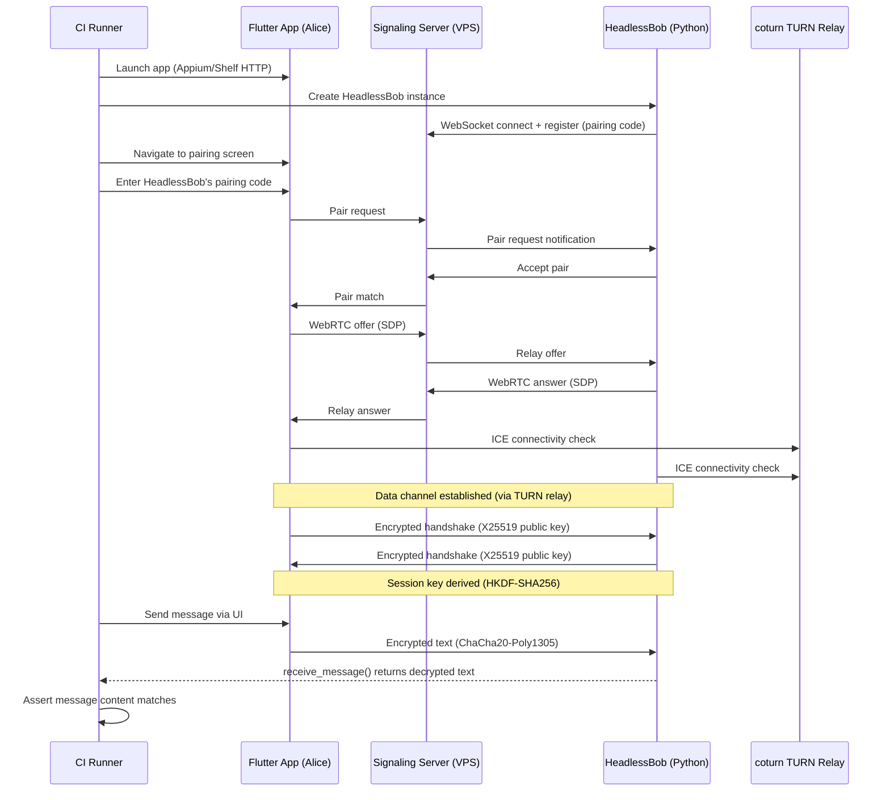

# E2E Testing

Zajel's end-to-end tests validate the full application stack -- from the Flutter UI through signaling and WebRTC to encrypted P2P communication. Tests are driven by `pytest` and support four platforms via the `ZAJEL_TEST_PLATFORM` environment variable.

## Platform Support Matrix

| Platform | Env Value | App Automation | P2P Peer | CI Status |
|----------|-----------|----------------|----------|-----------|
| Android | `android` (default) | Appium + UiAutomator2 | HeadlessBob | Running (Phase 5a) |
| Linux | `linux` | Shelf HTTP (embedded in Flutter) | HeadlessBob | Running (Phase 5b) |
| Windows | `windows` | Headless client only | HeadlessBob | Running (Phase 5c) |
| iOS | `ios` | Appium + XCUITest | HeadlessBob | Not yet in CI |

## E2E Sequence Diagram



## Directory Structure

```
e2e-tests/
  conftest.py            # Central fixtures: alice, bob, charlie, headless_bob, HeadlessBob class
  config.py              # Platform-dispatched config re-export
  pytest.ini             # Test markers, timeout (300s default)
  requirements.txt       # Python dependencies (Appium, pytest, etc.)
  platforms/
    __init__.py          # get_platform(), get_config(), create_helper()
    android_config.py    # APK_PATH, APPIUM server URLs, device config
    android_helper.py    # AppHelper (952 lines) - full UI automation via Appium
    linux_config.py      # APP_PATH, DATA_DIR_1/2, SIGNALING_URL
    linux_helper.py      # LinuxAppHelper - Shelf HTTP based automation
    shelf_client.py      # HTTP client for embedded Shelf server
    windows_config.py    # Windows-specific config
    windows_helper.py    # WindowsAppHelper
    ios_config.py        # iOS simulator config
    ios_helper.py        # IosAppHelper
  tests/
    test_smoke.py              # App launch smoke test
    test_pairing.py            # Pairing flow tests
    test_messaging.py          # Direct messaging tests
    test_calls.py              # Voice/video call tests
    test_file_transfer.py      # File transfer tests
    test_channels.py           # Channel tests (app-only)
    test_groups.py             # Group tests (app-only)
    test_settings.py           # Settings screen tests
    test_contacts.py           # Contact management
    test_emoji_picker.py       # Emoji picker UI
    test_notifications.py      # Notification settings
    test_media_settings.py     # Media device settings
    test_offline_peers.py      # Offline peer visibility
    test_peer_management.py    # Block/unblock
    test_blocked_enhanced.py   # Enhanced blocked list
    test_reconnection.py       # Meeting point reconnection
    test_connection_states.py  # Connection edge cases
    test_headless_pairing.py   # Headless client pairing
    test_headless_messaging.py # Headless client messaging
    test_headless_file_transfer.py     # Headless file transfer
    test_headless_notifications.py     # Headless notifications
    test_headless_channel_e2e.py       # Headless channel E2E
    test_channels_headless.py          # Channel protocol tests (headless-only)
    test_channels_headless_e2e.py      # Channel E2E (app + headless)
    test_groups_headless.py            # Group protocol tests (headless-only)
    test_groups_headless_e2e.py        # Group E2E (app + headless)
    test_signaling_headless.py         # Signaling protocol validation
    test_protocol_headless.py          # Protocol-level tests
```

## Fixtures

The central fixtures are defined in `e2e-tests/conftest.py`:

### Device Fixtures

| Fixture | Scope | Description |
|---------|-------|-------------|
| `alice` | function | First device/app instance. Returns Appium driver (Android), LinuxAppHelper (Linux), or WindowsAppHelper (Windows). |
| `bob` | function | Second device/app instance. Requires 2 Appium servers on Android. Not supported on Windows. |
| `charlie` | function | Third device. Android only, requires 3 Appium servers. |
| `device_pair` | function | Tuple of `(alice, bob)` for P2P testing. |
| `all_devices` | function | All available devices. Android only. |
| `app_helper` | function | Factory fixture. On Android, wraps a driver in `AppHelper`. On desktop, pass-through (alice/bob are already helpers). |

### Headless Client Fixture

| Fixture | Scope | Description |
|---------|-------|-------------|
| `headless_bob` | function | A `HeadlessBob` instance connected to the signaling server with `auto_accept_pairs=True`. Provides the pairing code for the app to connect to. |

`HeadlessBob` is a synchronous wrapper around `ZajelHeadlessClient` that runs the async event loop in a background thread. It exposes methods like `connect()`, `pair_with()`, `send_text()`, `receive_message()`, `create_channel()`, `create_group()`, etc.

## Platform Helpers

### Android (`AppHelper`)

- Uses Appium + UiAutomator2 for element finding and interaction
- Connects to emulators via ADB (`emulator-5554`, `emulator-5556`, etc.)
- Clears app data and grants permissions before each test
- Captures screenshots and page source XML on failure
- Supports up to 3 simultaneous emulators (alice, bob, charlie)

### Linux (`LinuxAppHelper`)

- Communicates with the Flutter app's embedded Shelf HTTP server (port 9000-9020)
- Shelf server is started by `integration_test/appium_test.dart` entry point
- Bypasses AT-SPI entirely -- works in headless Xvfb environments
- Supports two instances via separate data directories (`DATA_DIR_1`, `DATA_DIR_2`)
- Three launch modes: pre-launched (env `ZAJEL_SHELF_PORT`), binary (pre-built executable), flutter-test (fallback)

### Windows (`WindowsAppHelper`)

- Currently limited to headless client tests (signaling protocol)
- No app automation in CI yet

### iOS (`IosAppHelper`)

- Appium + XCUITest based
- Not yet integrated into CI pipeline

## CI E2E Execution Phases

The PR Pipeline runs E2E tests in carefully ordered phases:

### Android Track (Phase 5a)

1. **Phase A - Smoke**: `test_pairing.py::TestPairing::test_app_launches_successfully` -- validates that the APK installs and launches on the emulator. Fails fast if the app cannot start.
2. **Phase B - Single-device**: All tests marked `single_device and not headless and not windows and not linux`. These test UI navigation, settings, toggles -- no P2P pairing needed.
3. **Phase C - Signaling protocol**: `test_signaling_headless.py` -- two headless clients validate the signaling server protocol (registration, pairing, rejection, signal relay). Requires `SIGNALING_URL`.
4. **Phase D - Headless-paired**: Tests marked `headless and single_device`. The Flutter app pairs with HeadlessBob through the signaling server and TURN relay.
5. **Phase D2 - Channel & Group E2E**: `test_channels_headless_e2e.py` + `test_groups_headless_e2e.py`. Channel creation/sharing and group invitation/messaging with HeadlessBob.

### Linux Track (Phase 5b)

1. **Shelf HTTP smoke test**: Same smoke test as Android, but automated via the Shelf HTTP API instead of Appium.
2. **Signaling protocol tests**: Same `test_signaling_headless.py` as Android.

### Windows Track (Phase 5c)

1. **Signaling protocol tests**: Same `test_signaling_headless.py`.

## TURN Relay in CI

CI sets up a local coturn TURN relay for WebRTC connectivity:

- Random credentials generated per CI run (`ci-XXXX` / random hex)
- Listens on port 3478 (UDP)
- Android emulator reaches the host via `10.0.2.2` (SLiRP gateway)
- HeadlessBob (running on the host) uses `127.0.0.1:3478`
- ICE servers include both Google's public STUN and the local TURN

## Writing New E2E Tests

### Basic Pattern

```python
import pytest

@pytest.mark.smoke
@pytest.mark.single_device
class TestMyFeature:
    def test_feature_works(self, alice, app_helper):
        helper = app_helper(alice)
        # Navigate and interact with the app
        helper.navigate_to_screen("my_feature")
        helper.tap_button("do_something")
        assert helper.get_text("result_label") == "expected"
```

### Headless Peer Pattern

```python
import pytest

@pytest.mark.headless
@pytest.mark.single_device
class TestWithHeadless:
    def test_messaging(self, alice, headless_bob, app_helper):
        helper = app_helper(alice)

        # Pair alice with headless bob
        helper.enter_pairing_code(headless_bob.pairing_code)
        headless_bob.wait_for_pair(timeout=30)

        # Send message from app, verify receipt
        helper.send_message("Hello from app!")
        msg = headless_bob.receive_message(timeout=15)
        assert msg.text == "Hello from app!"
```

### Protocol-Only Pattern (No App)

```python
import pytest
from zajel.client import ZajelHeadlessClient

@pytest.mark.protocol
class TestProtocol:
    def test_signaling_registration(self):
        client = ZajelHeadlessClient(signaling_url="ws://localhost:8080")
        code = asyncio.run(client.connect())
        assert len(code) == 6
        asyncio.run(client.disconnect())
```

## Failure Diagnostics

On Android E2E failure, the following artifacts are collected:

- **Screenshots**: `fail_<test_name>_<device>.png` for each active Appium driver
- **Page source**: `fail_<test_name>_<device>_source.xml` (UiAutomator2 widget tree)
- **Logcat**: `logcat-emu1.txt` (full Android system log)
- **Appium logs**: `/tmp/appium*.log`
- **coturn logs**: `coturn.log`

All artifacts are uploaded as `e2e-test-artifacts` with 3-day retention.
