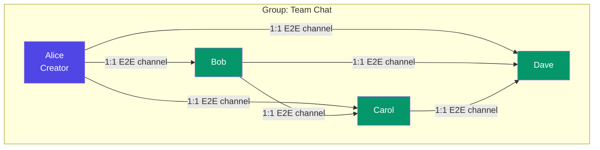
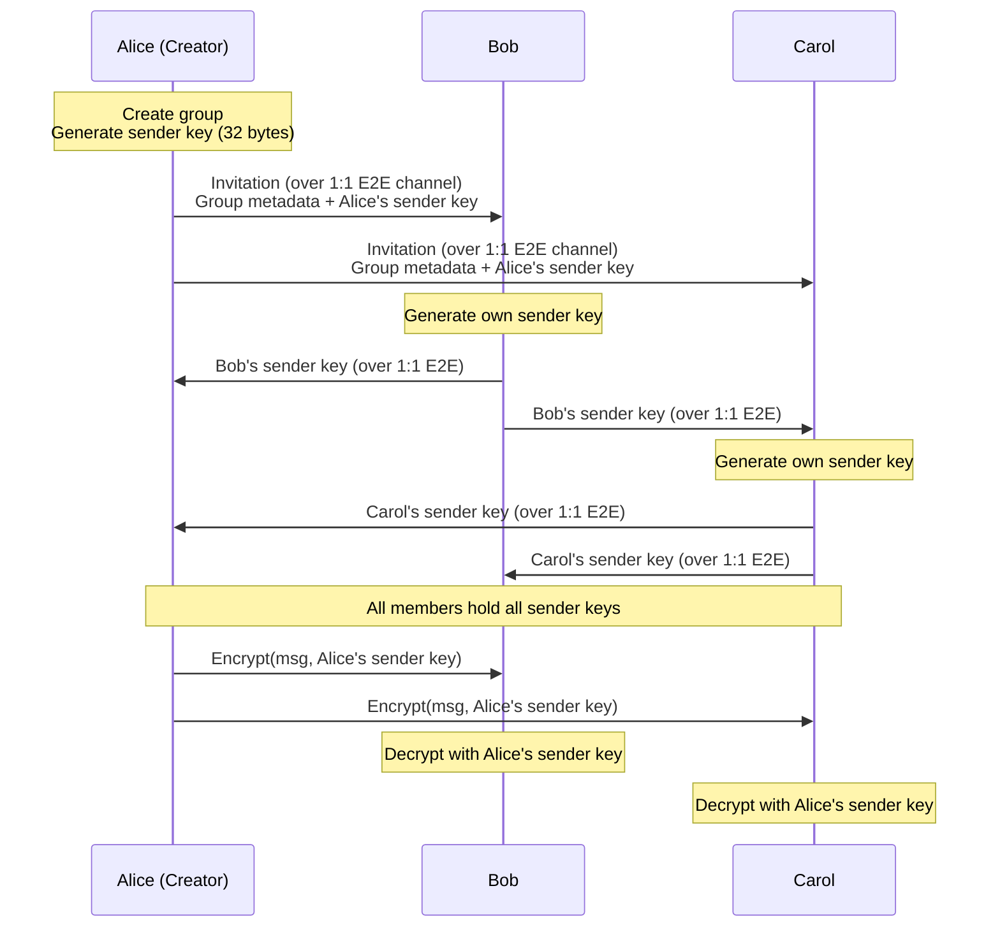
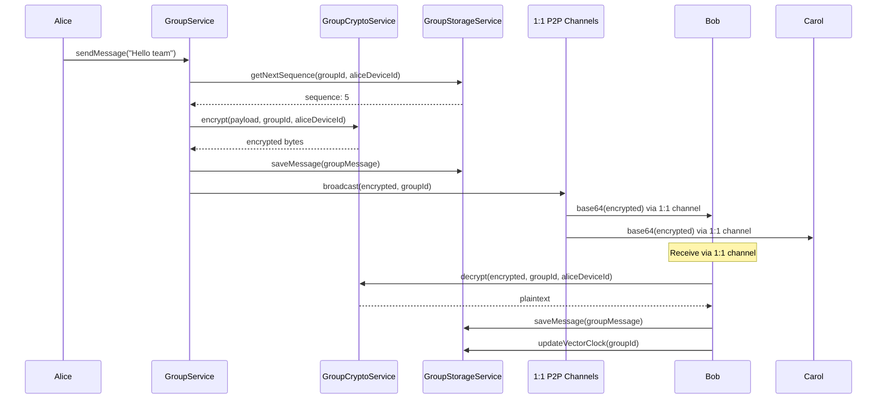
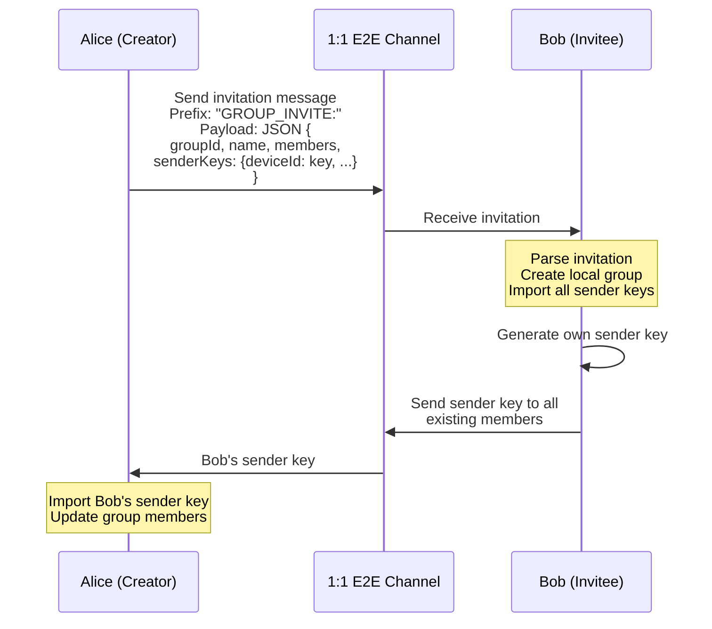

# Groups Architecture

Groups provide multi-party encrypted chat using sender key encryption and vector clock-based causal ordering. Group communication is relayed over existing 1:1 peer-to-peer connections.

---

## Group Mesh Topology



Groups form a full mesh of N*(N-1)/2 pairwise connections. Each edge is an existing 1:1 encrypted WebRTC data channel. Group messages are broadcast to all connected members over these channels.

---

## Sender Key Encryption

Groups use a sender key scheme for efficient encryption:



### Why Sender Keys?

- **O(1) encrypt**: The sender encrypts once with their own key
- **O(1) decrypt**: Each recipient decrypts with the sender's key (already cached)
- **No N-way encryption**: Unlike pairwise encryption which requires O(N) encryptions per message

### Key Properties

| Property | Value |
|----------|-------|
| Key size | 32 bytes (256-bit) |
| Algorithm | ChaCha20-Poly1305 AEAD |
| Nonce | 12 bytes, random per message |
| Output format | nonce (12) + ciphertext + MAC (16) |
| Key storage | FlutterSecureStorage with group/device namespacing |
| In-memory cache | `{groupId: {deviceId: SecretKey}}` |

---

## Group Message Flow



---

## Vector Clock-Based Causal Ordering

Each group maintains a vector clock tracking per-device sequence numbers. This enables:

- **Causal ordering**: Messages are displayed in the order they were sent
- **Gap detection**: Missing messages are identified for sync
- **Deduplication**: Duplicate messages (from retransmission) are detected and ignored

### Vector Clock Structure

```
VectorClock: {
  "alice_device_id": 5,
  "bob_device_id": 3,
  "carol_device_id": 7
}
```

### Operations

| Operation | Description |
|-----------|-------------|
| `increment(deviceId)` | Increment the counter for a device when it sends a message |
| `merge(otherClock)` | Take the element-wise maximum of two clocks |
| `compare(otherClock)` | Returns: before, after, concurrent, or equal |
| `gaps(otherClock)` | List devices with missing sequence ranges |

### Sync Algorithm

1. Exchange vector clocks between peers
2. Compute missing messages by comparing clocks
3. Fetch missing messages from storage
4. Apply messages in causal order with deduplication

---

## Group Invitation Flow



### Invitation Payload

The invitation contains:
- Group ID (UUID)
- Group name
- Members list (device IDs, display names, public keys)
- All current sender keys `{deviceId: base64Key}`
- Creator info

---

## Key Rotation on Member Departure

When a member leaves (or is removed):

1. The departed member's sender key is removed from all remaining members
2. Each remaining member generates a new sender key
3. New sender keys are distributed to all remaining members via 1:1 channels
4. The old sender keys are invalidated

This ensures:
- The departed member cannot decrypt future messages
- Forward secrecy is maintained for new conversations

---

## Group Connection Service

The `GroupConnectionService` manages the WebRTC mesh:

### Activation
When a user opens a group, the service:
1. Looks up all group members
2. Establishes WebRTC data channels to each member (via existing 1:1 connections)
3. Tracks connection state per member

### Broadcasting
When sending a group message:
1. The encrypted message is base64-encoded
2. Sent to all connected members via their 1:1 data channels
3. Members who are offline will sync later via vector clock comparison

### State Tracking

| Query | Description |
|-------|-------------|
| `getConnectionState(memberId)` | Connection state for a specific member |
| `getConnectedCount(groupId)` | Number of currently connected members |
| `isFullyConnected(groupId)` | Whether all members are connected |
| `getGroupConnections(groupId)` | Map of all member connection states |

---

## Data Model

### Group

| Field | Type | Description |
|-------|------|-------------|
| id | String (UUID) | Unique group identifier |
| name | String | Display name |
| members | List\<GroupMember\> | All group members |
| creatorDeviceId | String | Device ID of the creator |
| createdAt | DateTime | Creation timestamp |
| updatedAt | DateTime | Last modification timestamp |

### GroupMessage

| Field | Type | Description |
|-------|------|-------------|
| id | String (UUID) | Unique message identifier |
| groupId | String | Parent group ID |
| authorDeviceId | String | Sender's device ID |
| sequenceNumber | int | Per-device sequence number |
| type | Enum | text, file, image, system |
| content | String | Message text or file path |
| status | Enum | pending, sent, delivered, failed |
| timestamp | DateTime | Send timestamp |

### Storage

Messages are stored in SQLite with a composite key of `(group_id, author_device_id, sequence_number)` for deduplication. Vector clocks are persisted per group. Sender keys are stored in FlutterSecureStorage with `group_{groupId}_device_{deviceId}` namespacing.

---

## Security Hardening

### Invitation Verification

Group invitations are no longer auto-accepted without verification. The invitation flow now includes:

1. **Sender verification**: The invitation must arrive over an established 1:1 encrypted channel with a known, paired peer. Invitations from unknown peers are rejected.
2. **Payload validation**: The invitation JSON payload is validated against a strict schema (required fields: `groupId`, `name`, `members`, `senderKeys`). Malformed invitations are rejected with a descriptive error.
3. **Member cross-check**: The inviting peer's device ID must appear in the `members` list. An invitation from a peer who is not listed as a member is rejected.

This prevents an attacker who compromises a single 1:1 channel from injecting the victim into a malicious group.

### Message Sequence Validation and Duplicate Detection

Group message processing includes sequence validation to prevent replay and injection attacks:

1. **Per-device sequence tracking**: Each group maintains the expected next sequence number for every member device. Messages with a sequence number that does not match the expected value trigger a gap-fill or rejection.
2. **O(1) duplicate detection**: A hash set of `(authorDeviceId, sequenceNumber)` pairs is maintained per group. Duplicate messages are detected in constant time and silently dropped. This replaces any linear-scan approaches.
3. **Sequence gap handling**: When a gap is detected, the receiver requests the missing messages from connected group members via vector clock comparison. Messages are buffered until gaps are filled, preserving causal order.

### Sender Key Zeroization on Leave

When a member leaves or is removed from a group:

1. The departed member's sender key is **overwritten with zeros** in memory before being dereferenced
2. The key is deleted from secure storage (FlutterSecureStorage or the headless client's key store)
3. All remaining members generate and distribute new sender keys
4. The old sender key material is not retained in any cache or log

This limits the window during which a departed member's key material persists in process memory. Combined with key rotation (already described in the Key Rotation section above), this ensures forward secrecy for conversations after a member departs.

### JSON Schema Validation for Group Messages

All group messages (including invitations, sender key distributions, and chat messages) are validated against a strict JSON schema before processing:

| Message type | Required fields | Validation rules |
|-------------|----------------|-----------------|
| `GROUP_INVITE:` | groupId, name, members, senderKeys | groupId must be UUID, members must be non-empty array, senderKeys must be object with base64 values |
| `grp:` (chat) | id, groupId, authorDeviceId, sequenceNumber, content | sequenceNumber must be positive integer, content must be string |
| Sender key distribution | groupId, deviceId, senderKey | senderKey must be 32-byte base64-encoded value |

Messages that fail schema validation are rejected and logged (without content) for debugging.

### Bounded Message Storage

In-memory and persistent group message storage is bounded to **5,000 messages per group**. When the limit is reached, the oldest messages (by timestamp) are evicted:

| Storage layer | Bound | Eviction policy |
|--------------|-------|-----------------|
| In-memory (headless client) | 5,000 per group | Oldest-first |
| SQLite (Flutter app) | Configurable | Oldest-first with vacuum |

This prevents unbounded storage growth for active groups with high message volume. The eviction threshold is intentionally generous to retain sufficient history for vector clock sync and gap-fill operations.
