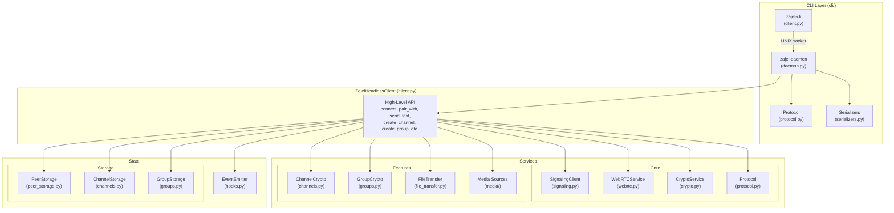

# Headless Client

The Zajel headless client is a pure-Python implementation of the Zajel P2P protocol. It is used for E2E testing (as `HeadlessBob`), protocol validation, and as a reference implementation. It lives at `packages/headless-client/`.

## Architecture



## Module Reference

### `cli/` - CLI Layer

Daemon + client CLI for driving the headless client from shell scripts and CI:

- `daemon.py` -- Starts `ZajelHeadlessClient`, opens UNIX socket, dispatches 24 commands
- `client.py` -- argparse CLI with subcommands, sends JSON to daemon, prints JSON results
- `protocol.py` -- JSON-line framing, socket path helper, `serialize_result()`
- `serializers.py` -- Converts `ConnectedPeer`, `OwnedChannel`, `Group`, etc. to JSON-safe dicts
- `__main__.py` -- Entry point for `python -m zajel.cli`

See [CLI (Daemon + Client)](#cli-daemon--client) below for full usage.

### `client.py` - ZajelHeadlessClient (1435 lines)

The main orchestrator. Provides the high-level async API:

```python
client = ZajelHeadlessClient(
    signaling_url="wss://signal.example.com",
    name="MyClient",
    auto_accept_pairs=True,
    log_level="DEBUG",
    ice_servers=[...],  # STUN/TURN configuration
)

# Connect and get pairing code
code = await client.connect()

# Pair with another peer
peer = await client.pair_with("ABC123")

# Messaging
await client.send_text(peer.peer_id, "Hello!")
msg = await client.receive_message(timeout=30)

# Channels
channel = await client.create_channel("My Channel", "Description")
invite_link = client.get_channel_invite_link(channel.id)
await client.publish_channel_message(channel.id, "Hello subscribers!")

# Groups
group = await client.create_group("My Group")
await client.send_group_message(group.id, "Hello group!")

# Files
await client.send_file(peer.peer_id, "/path/to/file.pdf")
received = await client.receive_file(timeout=60)

# Calls
call = await client.start_call(peer.peer_id, with_video=False)
await call.record_audio(duration=5.0)
await call.hangup()

# Disconnect
await client.disconnect()
```

Key data classes:

- `ConnectedPeer` -- peer_id, public_key, display_name, is_initiator
- `ActiveCall` -- call_id, peer_id, with_video, is_outgoing, recorder
- `ReceivedMessage` -- text content from a peer

### `signaling.py` - SignalingClient (527 lines)

WebSocket client for the Zajel signaling protocol:

- Connection registration (sends pairing code + public key)
- Pairing flow: request, accept/reject, match
- WebRTC signaling relay: offer, answer, ICE candidates
- Call signaling: offer, answer, reject, hangup, ICE
- Rendezvous registration for trusted peer reconnection
- Heartbeat keepalive (30-second interval)

Key data classes:

- `PairRequest` -- from_code, from_public_key, proposed_name
- `PairMatch` -- peer_code, peer_public_key, is_initiator
- `WebRTCSignal` -- signal_type, from_code, payload
- `CallSignal` -- type, from_code, payload

Pairing code format: 6 characters from `ABCDEFGHJKLMNPQRSTUVWXYZ23456789` (same as the Dart app).

### `crypto.py` - CryptoService

Implements cryptographic operations compatible with the Flutter app:

- **X25519 key exchange (ECDH)**: Generates ephemeral key pairs, performs Diffie-Hellman
- **HKDF-SHA256 key derivation**: Derives 32-byte session keys with info `zajel_session`
- **ChaCha20-Poly1305 AEAD**: Encrypts/decrypts messages with 12-byte nonces
- **Meeting point derivation**: Computes daily and hourly meeting points from shared secrets (for trusted peer reconnection)

Constants (matching the Dart app):

| Constant | Value |
|----------|-------|
| `NONCE_SIZE` | 12 |
| `MAC_SIZE` | 16 |
| `HKDF_INFO` | `b"zajel_session"` |
| `DAILY_PREFIX` | `"day_"` |
| `HOURLY_PREFIX` | `"hr_"` |

### `protocol.py` - Message Protocol (138 lines)

Message framing for WebRTC data channel communication:

- **Data channel labels**: `messages` (text), `files` (file transfer) -- matching `lib/core/constants.dart`
- **Message types**: `handshake`, `text`, `file_start`, `file_chunk`, `file_complete`
- **Parse logic**: JSON control messages vs. encrypted text (base64 ciphertext)

### `channels.py` - Channel Support (656 lines)

Full channel implementation:

- **Key generation**: Ed25519 signing keypair + X25519 encryption keypair
- **Invite links**: `zajel://channel/` prefix, base64-encoded manifest + decryption key
- **Manifest model**: Matches the Dart `ChannelManifest` (name, description, admins, rules)
- **Chunk model**: 64 KB chunks with Ed25519 signatures
- **Encryption**: HKDF-derived key from X25519 secret + ChaCha20-Poly1305 AEAD
- **Channel rules**: replies_enabled, polls_enabled, max_upstream_size, allowed_types

Key classes:

- `ChannelManifest` -- id, name, description, signing_public_key, encryption_public_key, admins, rules
- `ChannelRules` -- replies_enabled, polls_enabled, max_upstream_size, allowed_types
- `OwnedChannel` -- manifest + private keys (for publishing)
- `SubscribedChannel` -- manifest + decryption key (for subscribing)
- `Chunk` / `ChunkPayload` -- content delivery units
- `ChannelCryptoService` -- encrypt/decrypt/sign/verify operations
- `ChannelStorage` -- in-memory storage of owned + subscribed channels

Channels use VPS relays (not direct P2P). Content is chunked, encrypted, signed, and relayed through the signaling server.

### `groups.py` - Group Support (312 lines)

Full-mesh P2P group implementation:

- **Sender key encryption**: Each member has a ChaCha20-Poly1305 sender key shared with all other members
- **Group model**: Up to 15 members (`MAX_GROUP_MEMBERS`)
- **Invitation protocol**: `ginv:` prefix for invitations, `grp:` prefix for group messages
- **Message storage**: In-memory with author tracking

Key classes:

- `Group` -- id, name, self_device_id, members, created_at
- `GroupMember` -- device_id, display_name, public_key, joined_at
- `GroupMessage` -- id, group_id, author_device_id, content, timestamp
- `GroupCryptoService` -- encrypt/decrypt with sender keys
- `GroupStorage` -- in-memory group + message storage

### `webrtc.py` - WebRTC Service

Uses `aiortc` for peer connections:

- STUN/TURN ICE server configuration
- Data channel setup (`messages` + `files` channels)
- Audio/video track management for calls
- ICE candidate exchange

Default ICE servers: `stun:stun.l.google.com:19302`

### `file_transfer.py` - File Transfer Service

Chunked file transfer over the `files` data channel:

- 4096-byte chunks
- File start/chunk/complete message protocol
- Progress tracking via `FileTransferProgress`

### `media/` - Media Sources

Test media sources for call E2E testing:

- `SineWaveSource` -- generates a sine wave audio track
- `FileAudioSource` -- plays audio from a file
- `ColorBarSource` -- generates a color bar video track
- `FileVideoSource` -- plays video from a file
- `MediaRecorder` -- records incoming media to file

### `hooks.py` - Event System

`EventEmitter` class for subscribing to protocol events:

- `on_message` -- received a text message
- `on_file` -- received a file
- `on_call_offer` -- incoming call
- `on_channel_content` -- new channel content
- `on_group_message` -- new group message
- `on_group_invitation` -- invited to a group

### `peer_storage.py` - Peer Persistence

SQLite-backed storage for paired peer information:

- `StoredPeer` -- peer_id, public_key, display_name, shared_secret
- Persists across sessions for trusted peer reconnection

## CLI (Daemon + Client)

The headless client includes a CLI layer for driving the client from shell scripts and CI pipelines without writing Python. It uses a **daemon + client** architecture:

```
+----------+    UNIX socket     +--------------------+     WSS/WebRTC
| zajel-cli| <---JSON-line----> | zajel-daemon       | <--------------> Signaling
| (CLI)    |                    | (async event loop)  |                   Server
+----------+                    | ZajelHeadlessClient |
                                +--------------------+
```

- **Transport**: UNIX domain socket (`/tmp/zajel-headless-<name>.sock`)
- **Protocol**: JSON-line (one JSON object per line, newline-delimited)
- **Dependencies**: stdlib only -- no new pip packages required

The code lives in `packages/headless-client/zajel/cli/`:

| File | Purpose |
|------|---------|
| `daemon.py` | Long-running process: starts `ZajelHeadlessClient`, opens UNIX socket, dispatches commands |
| `client.py` | Thin CLI: parses args, sends JSON request to daemon, prints JSON response |
| `protocol.py` | Shared helpers: socket path, JSON-line read/write, `serialize_result()` |
| `serializers.py` | Converts domain dataclasses to JSON-safe dicts (excludes private keys) |
| `__main__.py` | Entry point for `python -m zajel.cli` |

### Starting the Daemon

```bash
# Via entry point (after pip install -e)
zajel-daemon --signaling-url wss://signal.zajel.hamzalabs.dev/ws --name bob --auto-accept

# Via python -m
python -m zajel.cli daemon --signaling-url wss://signal.zajel.hamzalabs.dev/ws --name bob --auto-accept
```

The daemon prints a JSON line to stdout on startup with the pairing code and socket path:

```json
{"pairing_code": "ABC123", "socket": "/tmp/zajel-headless-bob.sock"}
```

Daemon flags:

| Flag | Default | Description |
|------|---------|-------------|
| `--signaling-url` | (required) | WebSocket URL of the signaling server |
| `--name` | `headless` | Display name and socket name |
| `--socket-path` | `/tmp/zajel-headless-<name>.sock` | Override socket path |
| `--auto-accept` | off | Auto-accept incoming pair requests |
| `--log-level` | `INFO` | `DEBUG`, `INFO`, `WARNING`, `ERROR` |
| `--ice-servers` | none | ICE servers as a JSON array string |

### CLI Command Reference

All commands output JSON by default. Add `--pretty` for indented output. Use `--socket` to specify a non-default socket path.

```bash
zajel-cli [--socket PATH] [--pretty] <command> [args...]
```

| Command | Arguments | Description |
|---------|-----------|-------------|
| `status` | | Pairing code, name, connected peers |
| `pair-with` | `<code>` | Pair with a peer by pairing code |
| `wait-for-pair` | `[--timeout N]` | Wait for incoming pair request |
| `send-text` | `--peer-id ID <text>` | Send encrypted text message |
| `receive-message` | `[--timeout N]` | Wait for next text message |
| `create-channel` | `<name> [--description D]` | Create a new owned channel |
| `get-channel-invite-link` | `<channel_id>` | Get invite link for a channel |
| `publish-channel-message` | `<channel_id> <text>` | Publish to a channel |
| `subscribe-channel` | `<invite_link>` | Subscribe via invite link |
| `get-subscribed-channels` | | List subscribed channels |
| `unsubscribe-channel` | `<channel_id>` | Unsubscribe from a channel |
| `receive-channel-content` | `[--timeout N]` | Wait for channel content |
| `create-group` | `<name>` | Create a new group |
| `get-groups` | | List all groups |
| `send-group-message` | `<group_id> <text>` | Send message to a group |
| `wait-for-group-message` | `[--timeout N]` | Wait for next group message |
| `wait-for-group-invitation` | `[--timeout N]` | Wait for group invitation |
| `leave-group` | `<group_id>` | Leave a group |
| `send-file` | `--peer-id ID <path>` | Send a file to a peer |
| `receive-file` | `[--timeout N]` | Wait for file transfer |
| `get-peers` | | List connected peers |
| `get-trusted-peers` | | List trusted peers from storage |
| `block-peer` | `<peer_id>` | Block a peer |
| `unblock-peer` | `<peer_id>` | Unblock a peer |
| `disconnect` | | Disconnect and shut down daemon |

### CI Usage Example

```bash
# Start daemon in background
zajel-daemon --signaling-url "$SIGNALING_URL" --name bob --auto-accept &
DAEMON_PID=$!
sleep 3

# Capture pairing code
CODE=$(zajel-cli --socket /tmp/zajel-headless-bob.sock status | jq -r .pairing_code)
echo "Bob's pairing code: $CODE"

# After Alice pairs...
zajel-cli --socket /tmp/zajel-headless-bob.sock wait-for-pair --timeout 60
PEER=$(zajel-cli --socket /tmp/zajel-headless-bob.sock get-peers | jq -r '.[0].peer_id')

# Test messaging
zajel-cli --socket /tmp/zajel-headless-bob.sock send-text --peer-id "$PEER" "Hello from CLI"
zajel-cli --socket /tmp/zajel-headless-bob.sock receive-message --timeout 10

# Test channels
CHANNEL=$(zajel-cli --socket /tmp/zajel-headless-bob.sock create-channel "Test" | jq -r .channel_id)
LINK=$(zajel-cli --socket /tmp/zajel-headless-bob.sock get-channel-invite-link "$CHANNEL" | jq -r .invite_link)
zajel-cli --socket /tmp/zajel-headless-bob.sock publish-channel-message "$CHANNEL" "Hello"

# Test groups
GROUP=$(zajel-cli --socket /tmp/zajel-headless-bob.sock create-group "Test Group" | jq -r .id)
zajel-cli --socket /tmp/zajel-headless-bob.sock send-group-message "$GROUP" "Hello group"

# Cleanup
zajel-cli --socket /tmp/zajel-headless-bob.sock disconnect
```

### CLI Unit Tests

```bash
pytest packages/headless-client/tests/unit/test_cli_protocol.py -v
pytest packages/headless-client/tests/unit/test_cli_serializers.py -v
```

Tests cover: socket path defaults, JSON-line round-trip over real UNIX sockets, unicode handling, EOF detection, `serialize_result` for all types, and all serializer functions with edge cases.

## HeadlessBob (E2E Integration)

`HeadlessBob` is defined in `e2e-tests/conftest.py` and wraps `ZajelHeadlessClient` for use in synchronous pytest tests:

- Runs the async event loop in a background thread
- Exposes synchronous methods: `connect()`, `pair_with()`, `send_text()`, `receive_message()`, etc.
- All methods have configurable timeouts (default 120s for general ops, 30s for receives)
- The `headless_bob` fixture creates an instance with `auto_accept_pairs=True`, connects to the signaling server, and yields the pairing code

### HeadlessBob API

| Method | Description |
|--------|-------------|
| `connect()` | Connect to signaling server, returns pairing code |
| `pair_with(code)` | Pair with a specific code, returns `ConnectedPeer` |
| `wait_for_pair(timeout)` | Wait for incoming pair (used with auto_accept_pairs) |
| `send_text(peer_id, text)` | Send encrypted text message |
| `receive_message(timeout)` | Wait for and return next received message |
| `send_file(peer_id, path)` | Send a file |
| `receive_file(timeout)` | Wait for and return next received file |
| `create_channel(name, desc)` | Create a new channel |
| `get_channel_invite_link(id)` | Get the `zajel://channel/...` invite link |
| `publish_channel_message(id, text)` | Publish to a channel |
| `subscribe_channel(link)` | Subscribe via invite link |
| `create_group(name)` | Create a new group |
| `send_group_message(id, text)` | Send message to group |
| `wait_for_group_message(timeout)` | Wait for next group message |
| `wait_for_group_invitation(timeout)` | Wait for group invitation |
| `disconnect()` | Disconnect from signaling and stop event loop |

## Unit Tests

The headless client has its own unit tests at `packages/headless-client/tests/`:

```bash
pip install -e packages/headless-client[dev]
pytest packages/headless-client/tests/ -v --timeout=30
```

Fixtures in `tests/conftest.py`:

- `alice_crypto` -- initialized `CryptoService` for Alice
- `bob_crypto` -- initialized `CryptoService` for Bob
- `paired_crypto` -- both services with established shared session keys

## Dependencies

The headless client relies on:

- `aiortc` -- Pure Python WebRTC implementation
- `websockets` -- WebSocket client for signaling
- `cryptography` -- X25519, Ed25519, ChaCha20-Poly1305, HKDF
- `aiosqlite` -- Async SQLite for peer storage

All dependencies are MIT/BSD/Apache-2.0 licensed (no GPL/AGPL).
