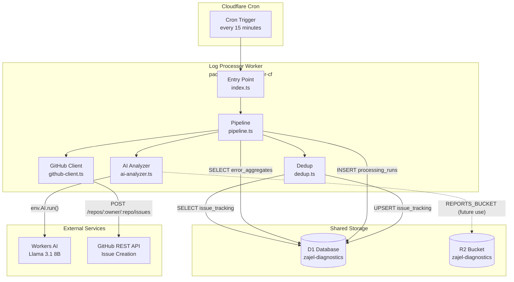
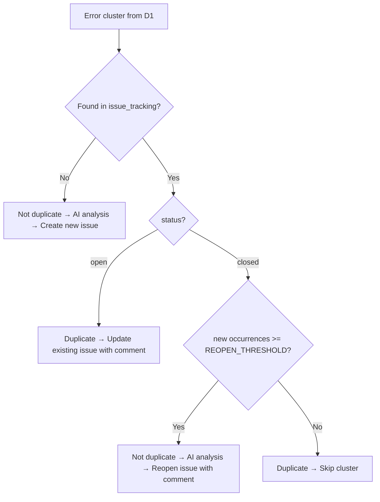

# Log Processor Architecture

The log processor (`packages/log-processor-cf/`) is a cron-triggered Cloudflare Worker that implements Epic 6 (AI-Powered Log Analysis). It runs every 15 minutes, reads error clusters from the shared diagnostics D1 database, analyzes them with Workers AI (Llama 3.1 8B), creates GitHub issues for significant patterns, and records its own run history for cost monitoring.

---

## System Overview



---

## Worker Bindings

| Binding | Type | Purpose |
|---------|------|---------|
| `DB` | D1 Database | Shared `zajel-diagnostics` database — reads `error_aggregates`, writes `issue_tracking` and `processing_runs` |
| `REPORTS_BUCKET` | R2 Bucket | Raw diagnostic reports bucket (`zajel-diagnostics`) — available for future report fetching |
| `AI` | Workers AI | Cloudflare built-in AI binding for Llama 3.1 8B inference |
| `GITHUB_TOKEN` | Secret | GitHub Personal Access Token with `repo` scope for issue creation |
| `GITHUB_REPO` | Variable | Target repository in `owner/repo` format (e.g., `anthropics/zajel`) |
| `ENVIRONMENT` | Variable | Deployment environment name (`production`, `qa`) |

The worker does **not** expose any HTTP routes. It is a pure scheduled worker — `fetch` is not implemented.

---

## Processing Pipeline

The pipeline is orchestrated by `runProcessingPipeline()` in `packages/log-processor-cf/src/pipeline.ts` and proceeds through five steps on each cron invocation.

### Step 1 — Determine the Time Window

The pipeline calls `getLastRunTimestamp()` which queries the `processing_runs` table for the most recent row with `status IN ('success', 'partial')`. If no prior successful run exists (e.g., first invocation), it falls back to `Date.now() - DEFAULT_LOOKBACK_MS` (15 minutes ago). This ensures the pipeline always processes a bounded window of new errors rather than the full history.

### Step 2 — Query Error Clusters

The pipeline queries the `error_aggregates` table (written by `diagnostics-cf`) to find distinct error signatures with significant occurrence counts since the last run:

```sql
SELECT
  error_signature,
  category,
  SUM(count) as total_count,
  GROUP_CONCAT(DISTINCT app_version) as versions,
  GROUP_CONCAT(DISTINCT platform) as platforms,
  GROUP_CONCAT(DISTINCT sample_message, '|||') as sample_messages,
  GROUP_CONCAT(DISTINCT sample_stack_trace, '|||') as sample_stack_traces,
  MIN(first_seen) as first_seen,
  MAX(last_seen) as last_seen
FROM error_aggregates
WHERE last_seen > ?
GROUP BY error_signature
HAVING SUM(count) >= ?
ORDER BY total_count DESC
LIMIT ?
```

The bound parameters are: `sinceTimestamp`, `ERROR_THRESHOLD` (5), and `MAX_CLUSTERS_PER_RUN` (20). Results are mapped into `ErrorCluster` objects with multi-value fields (versions, platforms, sample messages, stack traces) split on their respective delimiters.

### Step 3 — Deduplication Check

For each cluster, `checkDuplicate()` queries `issue_tracking` by `error_signature`. The decision logic is:

| Condition | Action |
|-----------|--------|
| Not found in `issue_tracking` | Not a duplicate — proceed to AI analysis and create a new issue |
| Found with `status = 'open'` | Duplicate — add a comment to the existing GitHub issue and update occurrence count |
| Found with `status = 'closed'` and new occurrences `>= REOPEN_THRESHOLD` (10) | Not a duplicate — AI analysis runs, existing issue is reopened with a comment |
| Found with `status = 'closed'` and new occurrences `< REOPEN_THRESHOLD` | Duplicate — skip entirely |

On any D1 error during the dedup check, the function fails open (treats the cluster as not a duplicate) to avoid missing significant new errors.

### Step 4 — AI Analysis

When a cluster is not a duplicate and the `MAX_NEW_ISSUES_PER_RUN` (10) cap has not been reached, `analyzeWithAi()` is called:

1. `buildPrompt()` constructs a structured prompt containing the error signature, category, occurrence count, time window, affected versions and platforms, up to 5 sample messages, and up to 3 stack traces.
2. `env.AI.run()` is called with model `@cf/meta/llama-3.1-8b-instruct` and `max_tokens: 512`.
3. `parseAiResponse()` extracts and validates the JSON from the model output, stripping markdown code-block wrappers if present.

If the AI call fails or returns malformed output, the function returns `{ analysis: null, tokensUsed: 0 }`. The pipeline continues with `analysis = null` — a GitHub issue is still created using a fallback title and body, ensuring no significant error cluster is silently dropped.

#### Prompt Structure

```
You are a software engineer analyzing crash reports for a P2P encrypted
messaging app called Zajel. The app uses Flutter, WebRTC,
X25519+ChaCha20-Poly1305 encryption, and connects to VPS relay servers.

Analyze these error reports and provide a structured analysis:

Error Signature: <sha256-hex>
Category: <category>
Total Occurrences: <count> in last <time window>
Affected Versions: <comma-separated>
Affected Platforms: <comma-separated>

Sample Error Messages:
1. <message>
2. <message>
...

Sample Stack Traces:
--- Stack Trace 1 ---
<stack trace>

Provide your analysis in this exact JSON format:
{
  "title": "Brief issue title (max 80 chars)",
  "severity": "critical|high|medium|low",
  "component": "crypto|network|ui|storage|protocol|signaling|relay|webrtc|other",
  "description": "2-3 paragraph description of the likely root cause",
  "reproduction_hints": "How a developer might reproduce this",
  "suggested_fix": "Brief suggestion for fixing",
  "is_regression": true|false,
  "affected_users_estimate": "few|some|many|most"
}
```

#### AI Response Validation

`parseAiResponse()` validates every field before accepting the response:

| Field | Validation rule |
|-------|----------------|
| `title` | Non-empty string; truncated to 80 characters with `...` suffix if longer |
| `severity` | Must be one of: `critical`, `high`, `medium`, `low` |
| `component` | Must be one of: `crypto`, `network`, `ui`, `storage`, `protocol`, `signaling`, `relay`, `webrtc`, `other` |
| `description` | Non-empty string |
| `reproduction_hints` | Non-empty string |
| `suggested_fix` | Non-empty string |
| `is_regression` | Boolean |
| `affected_users_estimate` | Must be one of: `few`, `some`, `many`, `most` |

Any validation failure returns `null` — the GitHub issue is still created using fallback content.

### Step 5 — GitHub Issue Creation or Update

`createGitHubIssue()` and `updateExistingIssue()` in `packages/log-processor-cf/src/github-client.ts` call the GitHub REST API v3 (`https://api.github.com`) using a Bearer token from `env.GITHUB_TOKEN`.

**New issue creation**:

- `POST /repos/{owner}/{repo}/issues` with `title`, `body`, and `labels`
- Labels are always `['ai-detected']` plus the `severity` and `component` from AI analysis (or the raw `category` if analysis is unavailable)
- The issue body is a structured markdown document containing severity, component, detection time, error signature, AI analysis paragraphs, affected scope (versions, platforms, estimated impact, occurrence count), reproduction hints, suggested fix, and a collapsed `<details>` block with sample error messages

**Existing issue update** (when a duplicate open issue is found, or a closed issue is being reopened):

- `POST /repos/{owner}/{repo}/issues/{number}/comments` adds a comment with the updated occurrence count, versions, and platforms
- If reopening, `PATCH /repos/{owner}/{repo}/issues/{number}` with `{ state: 'open' }` is called after the comment

All GitHub API failures are logged and treated as non-fatal — the pipeline continues processing the next cluster.

### Step 6 — Record the Run

After all clusters are processed, `recordProcessingRun()` inserts a row into `processing_runs` with:

- `run_start` and `run_end` timestamps
- `errors_processed` (number of clusters that exceeded `ERROR_THRESHOLD`)
- `issues_created`, `issues_updated`
- `ai_calls_made`, `ai_tokens_used`
- `status`: `success` if no clusters threw errors, `partial` if some clusters failed, `failed` if the whole pipeline threw an unhandled exception

If the pipeline itself fails with an unhandled exception (caught in `index.ts`), a separate `recordProcessingRun` call records the failure with all counts set to 0 and `status = 'failed'`.

---

## Constants

| Constant | Value | Location | Description |
|----------|-------|----------|-------------|
| `ERROR_THRESHOLD` | `5` | `types.ts` | Minimum total occurrences for a cluster to be processed |
| `MAX_CLUSTERS_PER_RUN` | `20` | `types.ts` | Maximum clusters queried per cron invocation (D1 `LIMIT`) |
| `MAX_NEW_ISSUES_PER_RUN` | `10` | `types.ts` | Maximum new GitHub issues created per cron invocation |
| `REOPEN_THRESHOLD` | `10` | `types.ts` | New occurrences needed (above stored `total_occurrences`) to reopen a closed issue |
| `DEFAULT_LOOKBACK_MS` | `900000` | `types.ts` | Fallback time window (15 minutes) used when no prior run exists |
| `AI_MODEL` | `@cf/meta/llama-3.1-8b-instruct` | `types.ts` | Workers AI model identifier |

---

## D1 Tables

The log processor reads from `error_aggregates` (written by `diagnostics-cf`) and owns two tables: `issue_tracking` and `processing_runs`. All three tables live in the shared `zajel-diagnostics` D1 database.

### issue_tracking

Tracks one row per unique `error_signature`. Used for deduplication, status management, and the admin dashboard issue list.

```sql
CREATE TABLE issue_tracking (
  id                  INTEGER PRIMARY KEY AUTOINCREMENT,
  error_signature     TEXT    NOT NULL UNIQUE,
  github_issue_number INTEGER,
  github_issue_url    TEXT,
  severity            TEXT    NOT NULL,
  component           TEXT    NOT NULL,
  status              TEXT    NOT NULL DEFAULT 'open',
  ai_analysis         TEXT,
  first_detected      INTEGER NOT NULL,
  last_detected       INTEGER NOT NULL,
  total_occurrences   INTEGER NOT NULL,
  created_at          INTEGER NOT NULL,
  updated_at          INTEGER NOT NULL
);
CREATE INDEX idx_issue_tracking_signature ON issue_tracking(error_signature);
CREATE INDEX idx_issue_tracking_status    ON issue_tracking(status);
```

**Column notes**:

| Column | Description |
|--------|-------------|
| `error_signature` | SHA-256 hex string identifying the error pattern; `UNIQUE` constraint prevents duplicate rows |
| `github_issue_number` | Integer GitHub issue number; `NULL` for `pending` records where GitHub creation failed |
| `github_issue_url` | Full `html_url` of the GitHub issue; `NULL` for `pending` records |
| `severity` | One of `critical`, `high`, `medium`, `low` — from AI analysis or defaulting to `medium` |
| `component` | One of the valid component labels or the raw error category when AI analysis is unavailable |
| `status` | One of `open`, `pending`, `acknowledged`, `closed` |
| `ai_analysis` | JSON-serialized `AiAnalysis` object; `NULL` when AI call failed or returned invalid output |
| `first_detected` | Unix ms timestamp of the earliest `first_seen` in `error_aggregates` for this signature |
| `last_detected` | Unix ms timestamp of the most recent `last_seen` in `error_aggregates` for this signature |
| `total_occurrences` | Cumulative occurrence count across all versions and platforms |
| `created_at` | Unix ms timestamp when this row was first inserted |
| `updated_at` | Unix ms timestamp of the most recent write — used for issue list ordering in the admin dashboard |

Writes use `INSERT ... ON CONFLICT(error_signature) DO UPDATE SET` (UPSERT) to safely handle concurrent runs or retries. The `github_issue_number` and `github_issue_url` columns use `COALESCE(excluded.value, existing.value)` so that a failed GitHub creation on one run cannot overwrite a successful number from a previous run.

### processing_runs

Records one row per cron invocation for cost monitoring and last-run timestamp tracking.

```sql
CREATE TABLE processing_runs (
  id                INTEGER PRIMARY KEY AUTOINCREMENT,
  run_start         INTEGER NOT NULL,
  run_end           INTEGER NOT NULL,
  errors_processed  INTEGER NOT NULL,
  issues_created    INTEGER NOT NULL,
  issues_updated    INTEGER NOT NULL,
  ai_calls_made     INTEGER NOT NULL,
  ai_tokens_used    INTEGER NOT NULL,
  status            TEXT    NOT NULL
);
CREATE INDEX idx_processing_runs_start ON processing_runs(run_start);
```

**Column notes**:

| Column | Description |
|--------|-------------|
| `run_start` | Unix ms timestamp captured at the start of `scheduled()` before any work begins |
| `run_end` | Unix ms timestamp captured at the moment `recordProcessingRun()` is called |
| `errors_processed` | Number of `ErrorCluster` objects returned from `queryErrorClusters()` |
| `issues_created` | Number of new GitHub issues successfully created in this run |
| `issues_updated` | Number of existing GitHub issues updated with new occurrence comments |
| `ai_calls_made` | Number of `env.AI.run()` calls made (whether they succeeded or failed) |
| `ai_tokens_used` | Sum of `prompt_tokens + completion_tokens` reported by the Workers AI usage metadata |
| `status` | `success`, `partial`, or `failed` |

The `idx_processing_runs_start` index supports the `getLastRunTimestamp()` query (`ORDER BY run_end DESC LIMIT 1`) and the admin dashboard cost queries that filter on `run_start > ?`.

---

## Deduplication Flow



The dedup check queries `issue_tracking` by `error_signature` and reads `github_issue_number`, `status`, and `total_occurrences`. The new occurrence count is computed as `cluster.totalCount - row.total_occurrences`. This delta-based approach means a closed issue with ongoing low-level errors (fewer than 10 new occurrences since closing) is not unnecessarily reopened.

---

## GitHub Issue Structure

Issues created by the log processor carry the following labels:

| Label | Always present | Description |
|-------|---------------|-------------|
| `ai-detected` | Yes | Identifies all AI-created issues |
| Severity label | When AI analysis succeeds | One of `critical`, `high`, `medium`, `low` |
| Component label | When AI analysis succeeds | One of `crypto`, `network`, `ui`, `storage`, `protocol`, `signaling`, `relay`, `webrtc`, `other` |
| Category label | When AI analysis fails | Raw `category` field from `error_aggregates` |

The issue title comes from `analysis.title` when AI succeeds, or falls back to `[<category>] <first 60 chars of errorSignature>`.

The issue body contains:

1. Severity, component, detection time, and error signature header
2. AI description (or a fallback message if AI unavailable)
3. Affected scope: versions, platforms, estimated impact, occurrence count and time window
4. Reproduction hints
5. Suggested fix
6. Collapsible `<details>` block with numbered sample error messages
7. Footer noting the issue was auto-created and the error signature for search

Update comments (posted when a duplicate open issue is found) include the current timestamp, new total occurrence count, affected versions, and platforms.

---

## Deployment

| Environment | Worker Name | Cron | D1 Database |
|-------------|------------|------|-------------|
| Production | `zajel-log-processor` | `*/15 * * * *` | `zajel-diagnostics` |

```bash
cd packages/log-processor-cf

# Deploy to production
npx wrangler deploy

# Run D1 migrations (applies to the shared zajel-diagnostics database)
npx wrangler d1 migrations apply zajel-diagnostics

# Set GitHub token secret
npx wrangler secret put GITHUB_TOKEN
```

### D1 Migrations

| Migration | File | Description |
|-----------|------|-------------|
| 0001 | `0001_issue_tracking.sql` | Creates `issue_tracking` table with unique constraint on `error_signature`, indexes on `error_signature` and `status` |
| 0002 | `0002_processing_runs.sql` | Creates `processing_runs` table with index on `run_start` |

> These migrations are applied to the same `zajel-diagnostics` database that `diagnostics-cf` uses. The shared D1 instance is the integration point between the two workers — `diagnostics-cf` writes `error_aggregates`, `log-processor-cf` reads them and writes `issue_tracking` and `processing_runs`.
