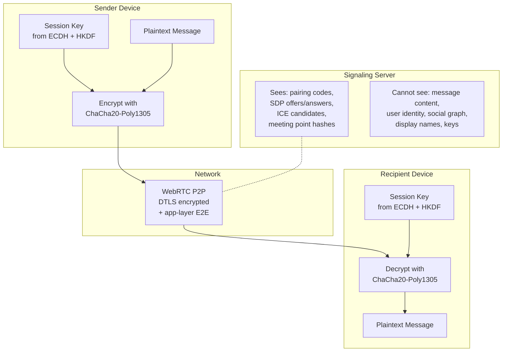

# Privacy Model

Zajel is designed around the principle that the infrastructure should know as little as possible about the users and their communications. This page details what data exists, where it is stored, and what each party can and cannot see.

---

## No Identity Infrastructure

Zajel requires no accounts, no phone numbers, and no email addresses:

- **Identity** is an X25519 keypair generated locally on the device
- **Peer discovery** uses one-time pairing codes (6 characters, cryptographically random)
- **Reconnection** uses deterministic meeting points derived from public key pairs
- **Display names** are stored locally by each peer and never sent to any server

There is no central user registry, no identity provider, and no way to look up a user.

---

## Data Flow: What Each Party Sees

---

## Data Storage Location

### Stored Locally on Device

| Data | Storage | Encryption |
|------|---------|-----------|
| X25519 identity private key | FlutterSecureStorage (Keychain/Keystore) | Platform-encrypted |
| Session keys per peer | FlutterSecureStorage | Platform-encrypted + ChaCha20-Poly1305 wrapping |
| Trusted peer public keys | FlutterSecureStorage | Platform-encrypted |
| Channel signing private keys | FlutterSecureStorage | Platform-encrypted |
| Channel encryption private keys | FlutterSecureStorage | Platform-encrypted |
| Group sender keys | FlutterSecureStorage | Platform-encrypted; zeroized from memory on leave |
| Message history | SQLite database | Not encrypted at rest (device-level protection) |
| Channel chunks | SQLite database | Payload is ChaCha20-Poly1305 encrypted |
| Group messages | SQLite database | Stored encrypted with sender keys |
| Display name, aliases | SharedPreferences | Not encrypted (non-sensitive) |
| Media/notification settings | SharedPreferences | Not encrypted (non-sensitive) |
| Log files | File system | Rotated daily, 7-day retention, 5MB limit; message content redacted |

### Stored on Signaling Server (Ephemeral)

| Data | Lifetime | Purpose |
|------|----------|---------|
| WebSocket connection state | Duration of connection | Route signaling messages |
| Pairing code registration | Duration of connection | Match peers for SDP exchange |
| Meeting point hashes | Daily: 48h, Hourly: 3h | Peer rediscovery |
| Encrypted dead drops | 48 hours | Offline peer reconnection |
| Relay peer registrations | Duration of connection | Load-balanced relay selection |
| Chunk source tracking | 1 hour | Channel content distribution |
| Chunk cache | 30 minutes (max 1000) | Serve popular content faster |
| Attestation sessions | 1 hour | Device verification tokens |

**No persistent user database exists on the server.** All server state is ephemeral and tied to connection lifetime or short TTLs.

### Server-Side Resource Bounds

All server-side storage is bounded to prevent accumulation of metadata:

| Resource | Limit | Eviction |
|----------|-------|----------|
| Nonce storage (CF Worker) | Bounded entries | TTL-based expiry |
| Device registrations (CF Worker) | Bounded entries | TTL-based expiry |
| Server registrations (CF Worker) | Bounded entries | Stale batch cleanup |
| Chunk cache (VPS) | 1,000 per channel | LRU eviction |
| Rendezvous registrations (VPS) | Bounded per meeting point | TTL-based expiry |
| WebSocket connections (VPS) | 10,000 total, 50 per IP | Connection rejected at limit |

---

## Pairing Code Privacy

Pairing codes are designed to be secure even if observed:

- Generated using `Random.secure()` with rejection sampling (no modulo bias)
- 32-character alphabet excludes ambiguous characters (0/O, 1/I)
- Codes are ephemeral: valid only while the user is connected to the signaling server
- A code alone is not sufficient to establish a connection (mutual approval required)
- The pairing code never leaves the signaling server; it is used only for routing

---

## Meeting Point Unlinkability

The rendezvous system is designed so the server cannot link meeting points to peer relationships:

1. **Daily meeting points** are SHA-256 hashes of `sorted_keys || "zajel:daily:" || date`. The server sees only the hash, not the input keys.
2. **Hourly tokens** are HMAC-SHA256 with the shared secret as key. The server cannot derive the shared secret from the token.
3. Keys are sorted before hashing, so both peers produce identical meeting points. The server cannot tell which peer registered first.
4. Daily points use a 3-day window (yesterday/today/tomorrow). Hourly tokens use a 3-hour window. This limits the metadata exposure window.
5. Dead drop contents are encrypted with the peer's shared session key. The server stores opaque ciphertext.

### What the server learns from rendezvous

- Two connections registered the same meeting point hash (but cannot identify who)
- Timing of when meeting points were registered
- Whether a dead drop was left or a live match occurred

### What the server cannot learn

- Which peers are trying to find each other
- The identity of any peer
- The content of dead drops
- The relationship between different meeting points

---

## Channel Privacy

Channel content is encrypted, but the distribution metadata reveals some information:

| Visible to relay | Not visible to relay |
|-----------------|---------------------|
| Routing hashes (rotate hourly/daily) | Channel name or description |
| Chunk sizes | Message content |
| Number of subscribers requesting chunks | Author identity (encrypted in payload) |
| Announcement timing | Subscriber identities |

Routing hashes rotate periodically using HMAC to prevent long-term tracking of channels by network observers. The routing hash service also includes censorship detection: if fetches consistently fail for certain routing hashes, the system can detect blocking patterns.

---

## Group Privacy

Group messages are relayed over existing 1:1 encrypted channels:

- Invitations are sent as encrypted messages over 1:1 connections
- Sender keys are distributed over 1:1 encrypted channels
- The server never sees group membership or group identifiers
- Group messages are encrypted with sender keys before transmission
- Key rotation on member departure ensures forward secrecy
- Sender keys are explicitly zeroized from memory when a member leaves, reducing the window for key extraction from memory dumps
- Group message storage is bounded at 5,000 messages per group, limiting the volume of metadata that accumulates locally

---

## Daemon and Local IPC Security

The headless client communicates with local CLI tools over a UNIX domain socket. This channel is hardened to prevent local privilege escalation and unauthorized access:

- **Socket permissions**: The socket file is created with mode `0o600` (owner read/write only)
- **UID verification**: On Linux, `SO_PEERCRED` verifies that the connecting process runs as the same user as the daemon
- **Message size limits**: Incoming messages on the daemon socket are bounded to prevent memory exhaustion
- **Tiered error handling**: Socket errors are classified and handled at appropriate severity levels; internal errors are never leaked to the caller
- **Path sanitization**: The socket path is validated to prevent symlink attacks

---

## Server Access Controls

### CORS Policy

The CF Worker uses an explicit origin allowlist instead of wildcard `*` CORS headers. Only approved web client origins can make cross-origin requests to the server API. CORS headers are consistently applied across all response paths, including Durable Object responses and error responses.

### Authentication

| Operation | Authentication Required |
|-----------|----------------------|
| Server registration | Bearer token (tied to build attestation) |
| Server deletion | Bearer token + ownership verification (only the registrant can delete) |
| Stats/metrics endpoint | Bearer token |
| Attestation verification | Rate-limited, generic error responses |

### Rate Limiting

The CF Worker enforces rate limits of 100 requests per minute per IP address. This prevents brute-force attacks against attestation endpoints and denial-of-service against registration APIs.

---

## Error and Log Privacy

Error messages and log output are sanitized to prevent information leakage:

| Control | Description |
|---------|-------------|
| Generic error responses | HTTP error responses contain generic messages; internal error details, stack traces, and file paths are never returned to clients |
| Log content redaction | Plaintext message content is never logged at any log level (DEBUG, INFO, WARN, ERROR) |
| Attestation error sanitization | Failed verification attempts return a generic "verification failed" response; detailed reasons are logged server-side only |
| Structured audit logging | Security-relevant events (registrations, deletions, auth failures) are logged in a structured format in Durable Objects for post-incident analysis |
| Wiki error sanitization | User-supplied parameters (e.g., wiki slugs) are sanitized before being included in error pages to prevent reflected injection |

---

## Website Privacy

The public website is hardened to minimize tracking exposure and prevent client-side attacks:

| Control | Privacy Benefit |
|---------|----------------|
| Self-hosted fonts | Fonts are served from the application origin; no requests to Google Fonts CDN, eliminating third-party tracking via font loading |
| Content Security Policy | CSP headers restrict which origins can serve scripts, styles, and frames, preventing injection of third-party tracking code |
| Security headers | `X-Frame-Options: DENY` prevents clickjacking; `X-Content-Type-Options: nosniff` prevents MIME type sniffing; `Cache-Control: no-store` on sensitive responses prevents caching of user data |
| HSTS | `Strict-Transport-Security` with `includeSubDomains` ensures all communication uses TLS |
| Download URL allowlist | Download links are restricted to approved domains, preventing redirection to malicious or tracking-enabled hosts |
| DOMPurify SVG sanitization | All Mermaid-generated SVG is sanitized through DOMPurify before DOM insertion, preventing stored XSS through diagram content |
| No external dependencies at runtime | The website does not load scripts, fonts, or analytics from external CDNs after the initial build |

---

## Network Privacy Hardening

| Measure | Description |
|---------|-------------|
| WebSocket URL scheme validation | Only `wss://` connections are accepted in production, preventing accidental plaintext signaling |
| Exponential backoff with jitter | Reconnection attempts use exponential backoff (1s to 60s) with jitter, preventing thundering herd patterns that could be used for traffic analysis |
| Peer identity binding | PeerIds are server-assigned and bound to the WebRTC connection, preventing identity spoofing |
| PeerId takeover prevention | A new connection cannot claim an existing PeerId while the original connection is active |
| ICE server validation | ICE server URLs are validated before use, preventing redirection to malicious TURN/STUN servers |
| File transfer integrity | SHA-256 hashes are computed for all file transfers; the recipient verifies the hash before accepting the file |
| Private IP rejection | Server endpoint URLs are validated to reject private IP ranges, preventing SSRF-style attacks |

---

## What Zajel Does Not Protect Against

- **Device compromise**: If an attacker gains access to the unlocked device, they can read messages from SQLite and extract keys from secure storage
- **Metadata at the network layer**: ISPs can see that a device is connecting to the Zajel signaling server, and WebRTC connections reveal peer IP addresses
- **Screenshots and screen recording**: Displayed messages can be captured by the OS
- **Shoulder surfing**: Messages displayed on screen are visible to observers
- **Compromised builds**: If the app binary is tampered with, the attestation system may detect it, but a sophisticated attacker could bypass detection
