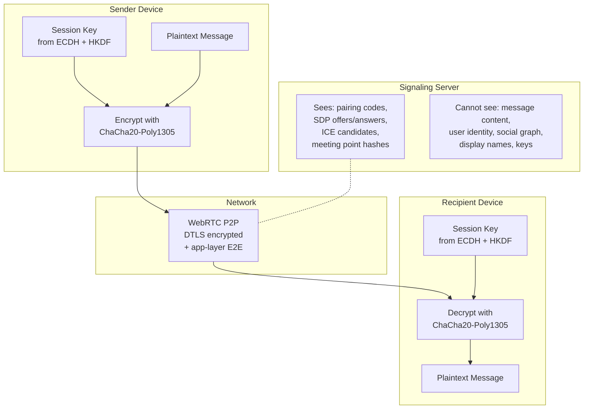

# Privacy Model

Zajel is designed around the principle that the infrastructure should know as little as possible about the users and their communications. This page details what data exists, where it is stored, and what each party can and cannot see.

---

## No Identity Infrastructure

Zajel requires no accounts, no phone numbers, and no email addresses:

- **Identity** is an X25519 keypair generated locally on the device
- **Peer discovery** uses one-time pairing codes (6 characters, cryptographically random)
- **Reconnection** uses deterministic meeting points derived from public key pairs
- **Display names** are stored locally by each peer and never sent to any server

There is no central user registry, no identity provider, and no way to look up a user.

---

## Data Flow: What Each Party Sees

---

## Data Storage Location

### Stored Locally on Device

| Data | Storage | Encryption |
|------|---------|-----------|
| X25519 identity private key | FlutterSecureStorage (Keychain/Keystore) | Platform-encrypted |
| Session keys per peer | FlutterSecureStorage | Platform-encrypted |
| Trusted peer public keys | FlutterSecureStorage | Platform-encrypted |
| Channel signing private keys | FlutterSecureStorage | Platform-encrypted |
| Channel encryption private keys | FlutterSecureStorage | Platform-encrypted |
| Group sender keys | FlutterSecureStorage | Platform-encrypted |
| Message history | SQLite database | Not encrypted at rest (device-level protection) |
| Channel chunks | SQLite database | Payload is ChaCha20-Poly1305 encrypted |
| Group messages | SQLite database | Stored encrypted with sender keys |
| Display name, aliases | SharedPreferences | Not encrypted (non-sensitive) |
| Media/notification settings | SharedPreferences | Not encrypted (non-sensitive) |
| Log files | File system | Rotated daily, 7-day retention, 5MB limit |

### Stored on Signaling Server (Ephemeral)

| Data | Lifetime | Purpose |
|------|----------|---------|
| WebSocket connection state | Duration of connection | Route signaling messages |
| Pairing code registration | Duration of connection | Match peers for SDP exchange |
| Meeting point hashes | Daily: 48h, Hourly: 3h | Peer rediscovery |
| Encrypted dead drops | 48 hours | Offline peer reconnection |
| Relay peer registrations | Duration of connection | Load-balanced relay selection |
| Chunk source tracking | 1 hour | Channel content distribution |
| Chunk cache | 30 minutes (max 1000) | Serve popular content faster |
| Attestation sessions | 1 hour | Device verification tokens |

**No persistent user database exists on the server.** All server state is ephemeral and tied to connection lifetime or short TTLs.

---

## Pairing Code Privacy

Pairing codes are designed to be secure even if observed:

- Generated using `Random.secure()` with rejection sampling (no modulo bias)
- 32-character alphabet excludes ambiguous characters (0/O, 1/I)
- Codes are ephemeral: valid only while the user is connected to the signaling server
- A code alone is not sufficient to establish a connection (mutual approval required)
- The pairing code never leaves the signaling server; it is used only for routing

---

## Meeting Point Unlinkability

The rendezvous system is designed so the server cannot link meeting points to peer relationships:

1. **Daily meeting points** are SHA-256 hashes of `sorted_keys || "zajel:daily:" || date`. The server sees only the hash, not the input keys.
2. **Hourly tokens** are HMAC-SHA256 with the shared secret as key. The server cannot derive the shared secret from the token.
3. Keys are sorted before hashing, so both peers produce identical meeting points. The server cannot tell which peer registered first.
4. Daily points use a 3-day window (yesterday/today/tomorrow). Hourly tokens use a 3-hour window. This limits the metadata exposure window.
5. Dead drop contents are encrypted with the peer's shared session key. The server stores opaque ciphertext.

### What the server learns from rendezvous

- Two connections registered the same meeting point hash (but cannot identify who)
- Timing of when meeting points were registered
- Whether a dead drop was left or a live match occurred

### What the server cannot learn

- Which peers are trying to find each other
- The identity of any peer
- The content of dead drops
- The relationship between different meeting points

---

## Channel Privacy

Channel content is encrypted, but the distribution metadata reveals some information:

| Visible to relay | Not visible to relay |
|-----------------|---------------------|
| Routing hashes (rotate hourly/daily) | Channel name or description |
| Chunk sizes | Message content |
| Number of subscribers requesting chunks | Author identity (encrypted in payload) |
| Announcement timing | Subscriber identities |

Routing hashes rotate periodically using HMAC to prevent long-term tracking of channels by network observers. The routing hash service also includes censorship detection: if fetches consistently fail for certain routing hashes, the system can detect blocking patterns.

---

## Group Privacy

Group messages are relayed over existing 1:1 encrypted channels:

- Invitations are sent as encrypted messages over 1:1 connections
- Sender keys are distributed over 1:1 encrypted channels
- The server never sees group membership or group identifiers
- Group messages are encrypted with sender keys before transmission
- Key rotation on member departure ensures forward secrecy

---

## What Zajel Does Not Protect Against

- **Device compromise**: If an attacker gains access to the unlocked device, they can read messages from SQLite and extract keys from secure storage
- **Metadata at the network layer**: ISPs can see that a device is connecting to the Zajel signaling server, and WebRTC connections reveal peer IP addresses
- **Screenshots and screen recording**: Displayed messages can be captured by the OS
- **Shoulder surfing**: Messages displayed on screen are visible to observers
- **Compromised builds**: If the app binary is tampered with, the attestation system may detect it, but a sophisticated attacker could bypass detection
