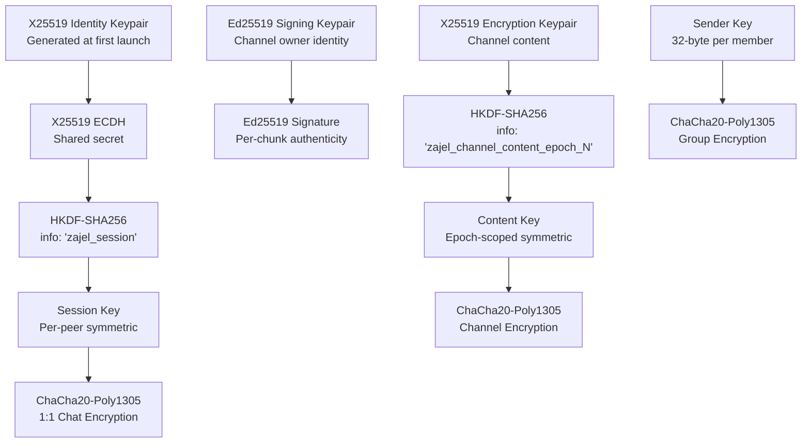

# Security Architecture

Zajel uses modern, well-vetted cryptographic primitives for all security operations. No custom cryptographic algorithms are used. All algorithms are public domain or royalty-free.

---

## Encryption Layers and Key Hierarchy

---

## 1:1 Chat Encryption

### Key Exchange (X25519 ECDH)

1. Each peer generates an X25519 keypair at app launch
2. Public keys are exchanged over the WebRTC data channel after SDP establishment
3. Both peers compute the same shared secret: `ECDH(my_private, their_public)`
4. A session key is derived using HKDF: `HKDF-SHA256(shared_secret, info="zajel_session", salt=sorted(pk_a || pk_b), output=32 bytes)`

> **Security hardening (v0.5)**: The HKDF salt now includes both peers' public keys in sorted order. This binds the derived session key to the specific peer pair, preventing man-in-the-middle key substitution attacks where an attacker relays different public keys to each peer.

### Message Encryption (ChaCha20-Poly1305 AEAD)

Each message is encrypted with:
- **Algorithm**: ChaCha20-Poly1305
- **Key**: The HKDF-derived session key (32 bytes)
- **Nonce**: Cryptographically random, 12 bytes, unique per message
- **Output**: `nonce (12 bytes) || ciphertext || MAC (16 bytes)`

The Poly1305 MAC provides authenticated encryption -- any tampering with the ciphertext or nonce is detected during decryption.

### Replay Protection

Each peer maintains a monotonically increasing nonce counter per session. Incoming messages are checked against a sliding nonce window:

1. Messages with a nonce at or below the current high-water mark are rejected as replays
2. The nonce window tracks the most recent seen values to handle out-of-order delivery
3. This prevents an attacker from replaying captured ciphertext, even if the nonces are valid

### Session Key Storage

Session keys are encrypted at rest using ChaCha20-Poly1305 before being persisted to secure storage. This provides a defense-in-depth layer: even if the platform secure storage is compromised, an attacker must also recover the key-encryption key to obtain session keys.

### Forward Secrecy

Identity keys can be regenerated each app session. When keys are regenerated:
- New keypairs are stored in secure storage
- Old session keys are invalidated
- New ECDH exchange occurs on next connection
- Compromising current keys does not expose past sessions

---

## Channel Encryption

Channels use a dual-key architecture:

| Key Type | Algorithm | Purpose |
|----------|-----------|---------|
| Signing keypair | Ed25519 | Manifest signing, chunk authentication |
| Encryption keypair | X25519 | Content encryption via HKDF-derived key |

### Content Encryption

1. The channel owner generates an X25519 keypair for encryption
2. The private key is shared with subscribers via the invite link
3. A content key is derived: `HKDF-SHA256(private_key, info="zajel_channel_content_epoch_N")`
4. Content is encrypted with ChaCha20-Poly1305 using this derived key
5. Each chunk is signed with the author's Ed25519 key

### 5-Step Subscriber Verification

When a subscriber receives a chunk, they verify:

1. **Authentic**: Chunk signature is valid against `author_pubkey`
2. **Authorized**: `author_pubkey` is in the channel manifest (owner or admin)
3. **Manifest legit**: Manifest is signed by the `owner_key`
4. **Trusted**: `owner_key` matches the locally stored key from subscription time
5. **Readable**: Payload decrypts successfully with the channel encryption key

### Key Rotation

When an admin is removed, the owner:
1. Generates a new X25519 encryption keypair
2. Increments the key epoch counter
3. Re-signs the manifest
4. Distributes the updated manifest with new decryption key

Old content remains readable with the old epoch key. New content is unreadable to removed admins.

---

## Group Encryption (Sender Keys)

Groups use sender key encryption for O(1) performance:

1. Each member generates a random 32-byte symmetric sender key
2. Sender keys are distributed to all members via existing 1:1 encrypted channels
3. When sending a message, the author encrypts once with their sender key (ChaCha20-Poly1305)
4. All members holding that sender key can decrypt

**Key rotation**: When a member leaves, all remaining members generate new sender keys and redistribute them. This ensures the departed member cannot read future messages.

### Sender Key Zeroization

When a member leaves a group or the group is dissolved, their sender key material is explicitly zeroized from memory before being removed from storage. This reduces the window during which key material could be extracted from a memory dump.

### Group Message Validation

Group messages are validated against a strict schema before processing:

1. **Schema validation**: Messages must conform to the expected group message structure (type, sender, content fields)
2. **Sequence numbers**: Each sender maintains a monotonic sequence counter. Messages with out-of-order or duplicate sequence numbers are rejected
3. **Bounded storage**: Group message history is capped at 5,000 messages per group, with oldest messages evicted when the limit is reached

---

## Fingerprint Verification

Users can verify each other's identity out-of-band to detect MITM attacks:

1. Each peer's X25519 public key is hashed: `SHA-256(public_key_bytes)`
2. The hash is formatted as uppercase hex groups: `ABCD 1234 EF56 7890 ...`
3. Users compare fingerprints via a trusted channel (in person, phone call)
4. The UI provides copy-to-clipboard and visual comparison features

The full 256-bit SHA-256 hash provides collision resistance with a birthday bound at 2^128.

---

## Bootstrap Server Verification

The bootstrap server (Cloudflare Worker) signs its responses with Ed25519:

1. The server signs the JSON response body with its Ed25519 private key
2. The app verifies the signature using a hardcoded public key
3. The response includes a timestamp; responses older than 5 minutes are rejected
4. This provides transport-agnostic trust that survives TLS CA rotations

---

## Certificate Pinning

On native platforms (Android, iOS, macOS, Linux, Windows), WebSocket connections to the signaling server use certificate pinning via platform-specific implementations. This prevents TLS interception by compromised certificate authorities.

On the web platform, certificate pinning is not possible due to browser API limitations. The security model on web relies on standard TLS plus the end-to-end encryption layer.

---

## Threat Model

### What the server cannot do

- Read message content (end-to-end encrypted)
- Identify users (no accounts, no phone numbers, no IP logging)
- Reconstruct the social graph (meeting points are opaque hashes)
- Forge messages (cryptographic signing and authentication)
- Replay old messages (nonce-based encryption, timestamp freshness)

### What the server can observe

- Timing of WebSocket connections (IP addresses at connection time)
- Pairing code registrations (codes are ephemeral and random)
- Meeting point hashes (cannot link to identities or relationships)
- Message sizes and frequencies (metadata, not content)

### Mitigations

| Threat | Mitigation |
|--------|-----------|
| MITM on signaling | Certificate pinning on native platforms |
| MITM on key exchange | Fingerprint verification (out-of-band); HKDF salt includes both public keys |
| Server compromise | E2E encryption; server never holds keys |
| Device compromise | Keys in platform secure storage (Keychain/Keystore); session keys encrypted at rest |
| Traffic analysis | Meeting point unlinkability; rotating hourly tokens |
| Replay attacks | Nonce-based replay window per session; timestamp freshness on bootstrap |
| App tampering | Binary attestation with HMAC-SHA256 challenges |
| Timing attacks | Constant-time HMAC comparison for all secret comparisons |
| Path traversal | Basename sanitization + containment check on all file operations |
| PeerId spoofing | Server-assigned PeerId bound to WebRTC connection; takeover prevention |
| Resource exhaustion | Connection limits, bounded storage, rate limiting, TTL-based eviction |
| XSS injection | DOMPurify sanitization; Content Security Policy; strict input validation |
| Unauthorized access | UNIX socket permissions (0o600) + SO_PEERCRED UID verification |

---

## Cryptographic Constants

| Constant | Value | Usage |
|----------|-------|-------|
| ChaCha20-Poly1305 nonce | 12 bytes | Random per message |
| Poly1305 MAC | 16 bytes | Appended to ciphertext |
| X25519 key size | 32 bytes | Public and private keys |
| HKDF output | 32 bytes | Session key derivation |
| Ed25519 signature | 64 bytes | Manifest and chunk signing |
| Channel ID | 16 bytes (128-bit) | SHA-256 truncated, hex-encoded |

---

## Security Hardening (94-Issue Audit)

The following sections document the comprehensive security hardening applied across three waves, covering all four packages: headless client, CF Worker server, VPS server, and website. A total of 94 issues were identified and resolved across CRITICAL, HIGH, MEDIUM, and LOW severity tiers.

### Input Validation

All external inputs are validated before processing across every package:

| Input | Validation | Package |
|-------|-----------|---------|
| PeerId | Hex format, 16-128 character length | VPS server |
| File paths | `basename()` sanitization + directory containment check | Headless client |
| JSON bodies | Size limits enforced (256KB on WebSocket, configurable on HTTP) | CF Worker, VPS |
| Storage keys | Injection prevention via strict key format validation | CF Worker |
| Endpoint URLs | Scheme restriction (https only), private IP rejection | CF Worker |
| Semver strings | Strict semver regex validation | CF Worker |
| `hexToBytes` input | Length parity check, hex character validation | CF Worker |
| Channel invite links | Strict `zajel://channel/` prefix requirement | Headless client |
| Signaling messages | Field validation on all signaling message types | Headless client, VPS |
| Group messages | Schema validation + sequence number enforcement | Headless client |
| Channel chunks | Sequence validation to detect missing or reordered chunks | Headless client |
| Wiki slug parameters | Sanitized before inclusion in error responses | Website |
| Download URLs | Domain allowlist restricts download link targets | Website |

### Authentication and Authorization

| Endpoint / Resource | Protection |
|---------------------|-----------|
| UNIX daemon socket | File permissions `0o600` + `SO_PEERCRED` UID verification |
| Server registration (CF Worker) | Requires bearer token authentication |
| Server deletion (CF Worker) | Requires ownership verification (registrant token match) |
| Stats/metrics endpoint (VPS) | Requires bearer token |
| Attestation verification | Error details sanitized; generic failure messages returned |
| Build tokens | Validity reduced from 365 days to 30 days |
| Session tokens vs build tokens | Separate Ed25519 signing keys for each token type |

### Rate Limiting and Resource Bounds

| Resource | Limit | Package |
|----------|-------|---------|
| HTTP requests | 100 req/min/IP | CF Worker |
| WebSocket connections (total) | 10,000 | VPS server |
| WebSocket connections (per IP) | 50 | VPS server |
| File transfer size | 100 MB max | Headless client |
| Concurrent file transfers | 10 max | Headless client |
| Channel chunk storage | 1,000 chunks/channel | VPS server |
| Group message storage | 5,000 messages/group | Headless client |
| Nonce storage | Bounded with TTL-based eviction | CF Worker |
| Device/server registrations | Bounded with TTL-based eviction | CF Worker |
| Rendezvous registrations | Bounded per meeting point | VPS server |
| Chunk announce arrays | Bounded per channel | VPS server |
| Daemon socket messages | Size-limited to prevent memory exhaustion | Headless client |

### Network Security

| Mechanism | Description |
|-----------|-------------|
| WebSocket URL scheme validation | Only `wss://` accepted; `ws://` rejected in production |
| Exponential backoff reconnection | Reconnect delay: 1s initial, 60s max, with jitter |
| Peer identity binding | PeerId is server-assigned and bound to the WebRTC connection |
| PeerId takeover prevention | Re-registration of an existing PeerId is rejected unless the original connection is closed |
| Reliable SCTP delivery | WebRTC data channels use `maxRetransmits=null` (reliable ordered) for critical messages |
| ICE server configuration validation | ICE server URLs are validated before being passed to the WebRTC stack |
| SHA-256 file transfer verification | Transferred files are hashed with SHA-256; recipient verifies the hash before accepting |
| CORS origin allowlist | Wildcard `*` replaced with explicit origin allowlist on CF Worker |

### Error Handling and Logging

| Measure | Description |
|---------|-------------|
| Generic error messages | Internal stack traces and error details are never returned to clients |
| Structured audit logging | Durable Objects log security-relevant events (registration, deletion, auth failures) |
| Message content redaction | Plaintext message content is never written to log files at any log level |
| Tiered error handling | Daemon socket errors are categorized and handled at appropriate severity levels |
| Event emitter exception surfacing | Hook/event exceptions are propagated rather than silently swallowed |
| Attestation error sanitization | Verification failures return generic messages; details logged server-side only |

### Website Security

| Control | Implementation |
|---------|---------------|
| SVG sanitization | DOMPurify applied to all Mermaid-generated SVG before DOM insertion |
| Content Security Policy | CSP headers restrict script sources, style sources, and frame ancestors |
| Security headers | HSTS (`max-age=31536000; includeSubDomains`), `X-Frame-Options: DENY`, `X-Content-Type-Options: nosniff`, `Cache-Control: no-store` on sensitive responses |
| Self-hosted fonts | Fonts served from the application origin; no external CDN (Google Fonts) tracking |
| Download URL allowlist | Download links restricted to approved domains |
| ARIA accessibility | Keyboard navigation and screen reader support for interactive wiki components |
| Error boundaries | Wiki rendering failures are caught and display a user-friendly fallback |

### Cryptographic Hardening

| Improvement | Details |
|-------------|---------|
| HKDF salt binding | Both peers' public keys included as salt in HKDF derivation, preventing key substitution attacks |
| Constant-time comparison | All HMAC and token comparisons use constant-time algorithms to prevent timing side-channels |
| Sender key zeroization | Sender key bytes are overwritten with zeros before removal from memory on group leave |
| Session key encryption at rest | Session keys wrapped with ChaCha20-Poly1305 before persisting to secure storage |
| Nonce replay window | Per-session nonce tracking rejects duplicate or replayed messages |
| Separate signing keys | Build token signing and session token signing use distinct Ed25519 key pairs |
| Build token expiry | Token validity window reduced from 365 days to 30 days |
| Pairing code CSPRNG | Pairing codes generated using cryptographically secure PRNG (`Random.secure()` / `secrets` module) |
