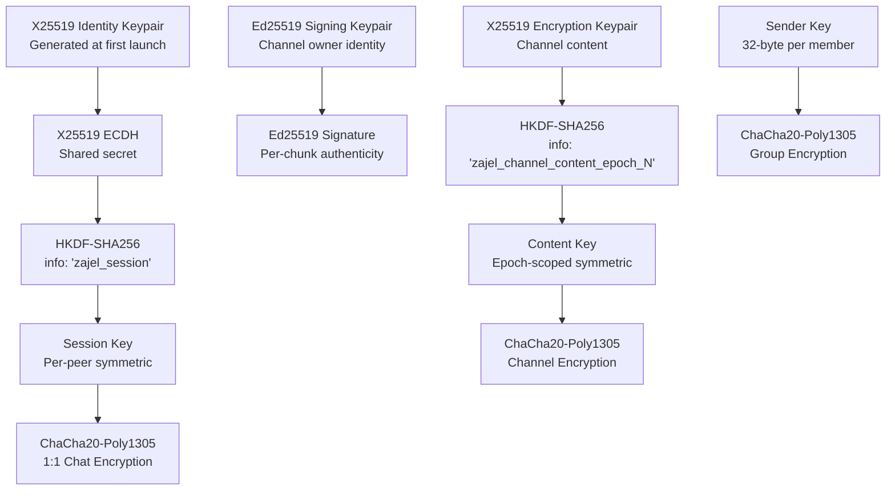

# Security Architecture

Zajel uses modern, well-vetted cryptographic primitives for all security operations. No custom cryptographic algorithms are used. All algorithms are public domain or royalty-free.

---

## Encryption Layers and Key Hierarchy

---

## 1:1 Chat Encryption

### Key Exchange (X25519 ECDH)

1. Each peer generates an X25519 keypair at app launch
2. Public keys are exchanged over the WebRTC data channel after SDP establishment
3. Both peers compute the same shared secret: `ECDH(my_private, their_public)`
4. A session key is derived using HKDF: `HKDF-SHA256(shared_secret, info="zajel_session", salt=[], output=32 bytes)`

### Message Encryption (ChaCha20-Poly1305 AEAD)

Each message is encrypted with:
- **Algorithm**: ChaCha20-Poly1305
- **Key**: The HKDF-derived session key (32 bytes)
- **Nonce**: Cryptographically random, 12 bytes, unique per message
- **Output**: `nonce (12 bytes) || ciphertext || MAC (16 bytes)`

The Poly1305 MAC provides authenticated encryption -- any tampering with the ciphertext or nonce is detected during decryption.

### Forward Secrecy

Identity keys can be regenerated each app session. When keys are regenerated:
- New keypairs are stored in secure storage
- Old session keys are invalidated
- New ECDH exchange occurs on next connection
- Compromising current keys does not expose past sessions

---

## Channel Encryption

Channels use a dual-key architecture:

| Key Type | Algorithm | Purpose |
|----------|-----------|---------|
| Signing keypair | Ed25519 | Manifest signing, chunk authentication |
| Encryption keypair | X25519 | Content encryption via HKDF-derived key |

### Content Encryption

1. The channel owner generates an X25519 keypair for encryption
2. The private key is shared with subscribers via the invite link
3. A content key is derived: `HKDF-SHA256(private_key, info="zajel_channel_content_epoch_N")`
4. Content is encrypted with ChaCha20-Poly1305 using this derived key
5. Each chunk is signed with the author's Ed25519 key

### 5-Step Subscriber Verification

When a subscriber receives a chunk, they verify:

1. **Authentic**: Chunk signature is valid against `author_pubkey`
2. **Authorized**: `author_pubkey` is in the channel manifest (owner or admin)
3. **Manifest legit**: Manifest is signed by the `owner_key`
4. **Trusted**: `owner_key` matches the locally stored key from subscription time
5. **Readable**: Payload decrypts successfully with the channel encryption key

### Key Rotation

When an admin is removed, the owner:
1. Generates a new X25519 encryption keypair
2. Increments the key epoch counter
3. Re-signs the manifest
4. Distributes the updated manifest with new decryption key

Old content remains readable with the old epoch key. New content is unreadable to removed admins.

---

## Group Encryption (Sender Keys)

Groups use sender key encryption for O(1) performance:

1. Each member generates a random 32-byte symmetric sender key
2. Sender keys are distributed to all members via existing 1:1 encrypted channels
3. When sending a message, the author encrypts once with their sender key (ChaCha20-Poly1305)
4. All members holding that sender key can decrypt

**Key rotation**: When a member leaves, all remaining members generate new sender keys and redistribute them. This ensures the departed member cannot read future messages.

---

## Fingerprint Verification

Users can verify each other's identity out-of-band to detect MITM attacks:

1. Each peer's X25519 public key is hashed: `SHA-256(public_key_bytes)`
2. The hash is formatted as uppercase hex groups: `ABCD 1234 EF56 7890 ...`
3. Users compare fingerprints via a trusted channel (in person, phone call)
4. The UI provides copy-to-clipboard and visual comparison features

The full 256-bit SHA-256 hash provides collision resistance with a birthday bound at 2^128.

---

## Bootstrap Server Verification

The bootstrap server (Cloudflare Worker) signs its responses with Ed25519:

1. The server signs the JSON response body with its Ed25519 private key
2. The app verifies the signature using a hardcoded public key
3. The response includes a timestamp; responses older than 5 minutes are rejected
4. This provides transport-agnostic trust that survives TLS CA rotations

---

## Certificate Pinning

On native platforms (Android, iOS, macOS, Linux, Windows), WebSocket connections to the signaling server use certificate pinning via platform-specific implementations. This prevents TLS interception by compromised certificate authorities.

On the web platform, certificate pinning is not possible due to browser API limitations. The security model on web relies on standard TLS plus the end-to-end encryption layer.

---

## Threat Model

### What the server cannot do

- Read message content (end-to-end encrypted)
- Identify users (no accounts, no phone numbers, no IP logging)
- Reconstruct the social graph (meeting points are opaque hashes)
- Forge messages (cryptographic signing and authentication)
- Replay old messages (nonce-based encryption, timestamp freshness)

### What the server can observe

- Timing of WebSocket connections (IP addresses at connection time)
- Pairing code registrations (codes are ephemeral and random)
- Meeting point hashes (cannot link to identities or relationships)
- Message sizes and frequencies (metadata, not content)

### Mitigations

| Threat | Mitigation |
|--------|-----------|
| MITM on signaling | Certificate pinning on native platforms |
| MITM on key exchange | Fingerprint verification (out-of-band) |
| Server compromise | E2E encryption; server never holds keys |
| Device compromise | Keys in platform secure storage (Keychain/Keystore) |
| Traffic analysis | Meeting point unlinkability; rotating hourly tokens |
| Replay attacks | Random nonces; timestamp freshness on bootstrap |
| App tampering | Binary attestation with HMAC-SHA256 challenges |

---

## Cryptographic Constants

| Constant | Value | Usage |
|----------|-------|-------|
| ChaCha20-Poly1305 nonce | 12 bytes | Random per message |
| Poly1305 MAC | 16 bytes | Appended to ciphertext |
| X25519 key size | 32 bytes | Public and private keys |
| HKDF output | 32 bytes | Session key derivation |
| Ed25519 signature | 64 bytes | Manifest and chunk signing |
| Channel ID | 16 bytes (128-bit) | SHA-256 truncated, hex-encoded |
