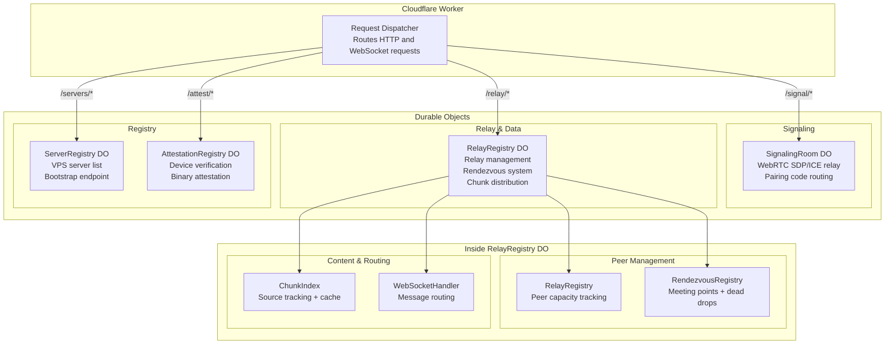

# Server Architecture

The Zajel server runs on Cloudflare Workers with Durable Objects for stateful coordination. It handles signaling, relay management, peer rendezvous, channel chunk distribution, server bootstrapping, and device attestation.

---

## Durable Object Hierarchy



---

## Signaling Room

The `SignalingRoom` Durable Object manages WebSocket connections for WebRTC signaling between pairs of peers.

### Lifecycle

1. Client connects via WebSocket upgrade
2. Sends `register` message with pairing code and optional public key
3. Server maps pairing code to WebSocket connection
4. When peer sends `pair_request` targeting a code, messages are forwarded
5. SDP `offer`, `answer`, and `ice_candidate` messages are relayed between paired peers
6. On disconnect, `peer_left` is broadcast and cleanup occurs

### Message Types

| Message | Direction | Purpose |
|---------|-----------|---------|
| `register` | Client -> Server | Register pairing code |
| `pair_request` | Client -> Server -> Client | Request to connect with a code |
| `pair_accept` / `pair_reject` | Client -> Server -> Client | Approve or reject pairing |
| `offer` / `answer` | Client -> Server -> Client | SDP exchange |
| `ice_candidate` | Client -> Server -> Client | ICE candidate relay |
| `peer_joined` / `peer_left` | Server -> Client | Connection notifications |

---

## Relay Registry

The `RelayRegistry` tracks peers that are available as relays for other peers who cannot establish direct P2P connections.

### Registration

Peers register with:
- Peer ID
- Capacity (max connections)
- Optional public key

### Load Balancing

When a client requests relays:
1. Filter peers with less than 50% capacity utilization
2. Shuffle using Fisher-Yates for randomized load distribution
3. Return the shuffled list

### Statistics

The registry tracks:
- Total registered peers
- Total capacity across all peers
- Currently connected count
- Number of available (under-capacity) relays

---

## Rendezvous System

The rendezvous system enables trusted peer rediscovery without exchanging new pairing codes.

### Daily Meeting Points (48-hour TTL)

1. Client registers meeting point hashes derived from public key pairs
2. Each registration includes an encrypted dead drop (connection info)
3. When another peer registers the same hash, dead drops are exchanged
4. Dead drops are encrypted with the peer's shared session key

### Hourly Token Live Matching (3-hour TTL)

1. Client registers hourly tokens derived from shared secrets
2. If another peer has already registered the same token, both are notified immediately
3. Live matches trigger direct reconnection via relay introduction

### Cleanup

A periodic alarm runs every 5 minutes to:
- Remove daily points older than 48 hours
- Remove hourly tokens older than 3 hours

---

## Chunk Distribution System

The `ChunkIndex` manages channel content distribution with source tracking, caching, and multicast optimization.

### Source Tracking

Peers announce chunks they hold. The server maintains a map of `chunkId -> Set<sourceWebSocket>` with 1-hour TTL per source entry.

### Server-Side Cache

Popular chunks are cached on the server:
- 30-minute TTL per cache entry
- Max 1000 entries with LRU eviction
- Access counting for cache analytics
- Server becomes a source when caching a chunk

### Request Flow

```
Client requests chunk:
  1. Check server cache -> return if cached
  2. Find online source peers -> ask one to push
  3. No sources available -> queue as pending request
  4. When chunk is announced/pushed later -> multicast to all pending requesters
```

### Multicast Optimization

When multiple subscribers request the same chunk:
- Only one pull request is sent to the source
- All pending requesters receive the data when it arrives
- This reduces bandwidth usage on source peers

---

## Server Bootstrap Registry

The `ServerRegistry` Durable Object manages the list of VPS relay servers.

### Registration

VPS servers register with:
- Server ID
- Endpoint URL
- Public key
- Region

Registrations have a 5-minute TTL and require periodic heartbeats.

### Signed Bootstrap Response

The `GET /servers` endpoint returns the server list with:
1. A timestamp (milliseconds since epoch)
2. An Ed25519 signature over the response body
3. Clients verify the signature against a hardcoded public key
4. Responses older than 5 minutes are rejected (replay protection)

---

## WebSocket Message Handler

The `WebSocketHandler` in the RelayRegistry DO routes all WebSocket messages to the appropriate subsystem:

| Message Type | Handler | Subsystem |
|-------------|---------|-----------|
| `register` | Peer registration | RelayRegistry |
| `update_load` | Load update | RelayRegistry |
| `get_relays` | Relay query | RelayRegistry |
| `register_rendezvous` | Meeting point registration | RendezvousRegistry |
| `chunk_announce` | Chunk source announcement | ChunkIndex |
| `chunk_request` | Chunk data request | ChunkIndex |
| `chunk_push` | Chunk data upload (max 64KB) | ChunkIndex |
| `ping` | Keep-alive | Direct pong response |
| `heartbeat` | Last-seen update | Connection tracking |

### Peer Disconnect

When a peer disconnects, the handler cleans up across all subsystems:
1. Remove from relay registry
2. Remove from all rendezvous meeting points and hourly tokens
3. Remove from all chunk source registrations
4. Clear pending chunk requests
5. Remove WebSocket mapping

---

## API Endpoints

### HTTP Endpoints

| Method | Path | Handler |
|--------|------|---------|
| `GET` | `/` | API info with available endpoints |
| `GET` | `/health` | Health check with timestamp |
| `GET` | `/api/info` | Detailed API information |
| `GET` | `/servers` | Signed server list (bootstrap) |
| `POST` | `/servers` | Register VPS server |
| `DELETE` | `/servers/:id` | Unregister VPS server |
| `POST` | `/servers/heartbeat` | VPS heartbeat |
| `POST` | `/attest/register` | Register device with build token |
| `POST` | `/attest/upload-reference` | Upload reference binary (CI only) |
| `POST` | `/attest/challenge` | Generate attestation challenge |
| `POST` | `/attest/verify` | Verify attestation response |
| `GET/POST` | `/attest/versions` | Version policy management |

### WebSocket Endpoints

| Path | Durable Object | Purpose |
|------|---------------|---------|
| `/signal/*` | SignalingRoom | WebRTC signaling |
| `/relay/*` | RelayRegistry | Relay, rendezvous, chunks |

---

## Deployment

### Environments

| Environment | Domain | Purpose |
|-------------|--------|---------|
| Production | `signal.zajel.hamzalabs.dev` | Live deployment |
| QA | `signal-qa.zajel.hamzalabs.dev` | Testing |

### Durable Object Migrations

| Version | Object | Description |
|---------|--------|-------------|
| v1 | SignalingRoom | WebRTC signaling rooms |
| v2 | RelayRegistryDO | Relay management + rendezvous + chunks |
| v3 | ServerRegistryDO | VPS server bootstrap registry |
| v4 | AttestationRegistryDO | Device attestation and version policy |

### Logging

The server uses an environment-aware logger:
- **Production**: Pairing codes are redacted (only first and last characters shown)
- **Development**: Full logging with debug-level detail
- Configurable log levels: debug, info, warning, error
