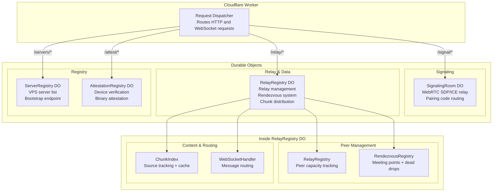

# Server Architecture

The Zajel server runs on Cloudflare Workers with Durable Objects for stateful coordination. It handles signaling, relay management, peer rendezvous, channel chunk distribution, server bootstrapping, and device attestation.

---

## Durable Object Hierarchy


```mermaid
graph TD
    subgraph "Cloudflare Worker"
        FH[Request Dispatcher<br/>Routes HTTP and WebSocket requests]
    end

    subgraph "Durable Objects"
        subgraph "Signaling"
            DO1[SignalingRoom DO<br/>WebRTC SDP/ICE relay<br/>Pairing code routing]
        end
        subgraph "Relay & Data"
            DO2[RelayRegistry DO<br/>Relay management<br/>Rendezvous system<br/>Chunk distribution]
        end
        subgraph "Registry"
            DO3[ServerRegistry DO<br/>VPS server list<br/>Bootstrap endpoint]
            DO4[AttestationRegistry DO<br/>Device verification<br/>Binary attestation]
        end
    end

    FH -->|"/signal/*"| DO1
    FH -->|"/relay/*"| DO2
    FH -->|"/servers/*"| DO3
    FH -->|"/attest/*"| DO4

    subgraph "Inside RelayRegistry DO"
        subgraph "Peer Management"
            RR[RelayRegistry<br/>Peer capacity tracking]
            RV[RendezvousRegistry<br/>Meeting points + dead drops]
        end
        subgraph "Content & Routing"
            CI[ChunkIndex<br/>Source tracking + cache]
            WH[WebSocketHandler<br/>Message routing]
        end
    end

    DO2 --> RR
    DO2 --> RV
    DO2 --> CI
    DO2 --> WH
```

---

## Signaling Room

The `SignalingRoom` Durable Object manages WebSocket connections for WebRTC signaling between pairs of peers.

### Lifecycle

1. Client connects via WebSocket upgrade
2. Sends `register` message with pairing code and optional public key
3. Server maps pairing code to WebSocket connection
4. When peer sends `pair_request` targeting a code, messages are forwarded
5. SDP `offer`, `answer`, and `ice_candidate` messages are relayed between paired peers
6. On disconnect, `peer_left` is broadcast and cleanup occurs

### Message Types

| Message | Direction | Purpose |
|---------|-----------|---------|
| `register` | Client -> Server | Register pairing code |
| `pair_request` | Client -> Server -> Client | Request to connect with a code |
| `pair_accept` / `pair_reject` | Client -> Server -> Client | Approve or reject pairing |
| `offer` / `answer` | Client -> Server -> Client | SDP exchange |
| `ice_candidate` | Client -> Server -> Client | ICE candidate relay |
| `peer_joined` / `peer_left` | Server -> Client | Connection notifications |

---

## Relay Registry

The `RelayRegistry` tracks peers that are available as relays for other peers who cannot establish direct P2P connections.

### Registration

Peers register with:
- Peer ID
- Capacity (max connections)
- Optional public key

### Load Balancing

When a client requests relays:
1. Filter peers with less than 50% capacity utilization
2. Shuffle using Fisher-Yates for randomized load distribution
3. Return the shuffled list

### Statistics

The registry tracks:
- Total registered peers
- Total capacity across all peers
- Currently connected count
- Number of available (under-capacity) relays

---

## Rendezvous System

The rendezvous system enables trusted peer rediscovery without exchanging new pairing codes.

### Daily Meeting Points (48-hour TTL)

1. Client registers meeting point hashes derived from public key pairs
2. Each registration includes an encrypted dead drop (connection info)
3. When another peer registers the same hash, dead drops are exchanged
4. Dead drops are encrypted with the peer's shared session key

### Hourly Token Live Matching (3-hour TTL)

1. Client registers hourly tokens derived from shared secrets
2. If another peer has already registered the same token, both are notified immediately
3. Live matches trigger direct reconnection via relay introduction

### Cleanup

A periodic alarm runs every 5 minutes to:
- Remove daily points older than 48 hours
- Remove hourly tokens older than 3 hours

---

## Chunk Distribution System

The `ChunkIndex` manages channel content distribution with source tracking, caching, and multicast optimization.

### Source Tracking

Peers announce chunks they hold. The server maintains a map of `chunkId -> Set<sourceWebSocket>` with 1-hour TTL per source entry.

### Server-Side Cache

Popular chunks are cached on the server:
- 30-minute TTL per cache entry
- Max 1000 entries with LRU eviction
- Access counting for cache analytics
- Server becomes a source when caching a chunk

### Request Flow

```
Client requests chunk:
  1. Check server cache -> return if cached
  2. Find online source peers -> ask one to push
  3. No sources available -> queue as pending request
  4. When chunk is announced/pushed later -> multicast to all pending requesters
```

### Multicast Optimization

When multiple subscribers request the same chunk:
- Only one pull request is sent to the source
- All pending requesters receive the data when it arrives
- This reduces bandwidth usage on source peers

---

## Server Bootstrap Registry

The `ServerRegistry` Durable Object manages the list of VPS relay servers.

### Registration

VPS servers register with:
- Server ID
- Endpoint URL
- Public key
- Region

Registrations have a 5-minute TTL and require periodic heartbeats.

### Signed Bootstrap Response

The `GET /servers` endpoint returns the server list with:
1. A timestamp (milliseconds since epoch)
2. An Ed25519 signature over the response body
3. Clients verify the signature against a hardcoded public key
4. Responses older than 5 minutes are rejected (replay protection)

---

## WebSocket Message Handler

The `WebSocketHandler` in the RelayRegistry DO routes all WebSocket messages to the appropriate subsystem:

| Message Type | Handler | Subsystem |
|-------------|---------|-----------|
| `register` | Peer registration | RelayRegistry |
| `update_load` | Load update | RelayRegistry |
| `get_relays` | Relay query | RelayRegistry |
| `register_rendezvous` | Meeting point registration | RendezvousRegistry |
| `chunk_announce` | Chunk source announcement | ChunkIndex |
| `chunk_request` | Chunk data request | ChunkIndex |
| `chunk_push` | Chunk data upload (max 64KB) | ChunkIndex |
| `ping` | Keep-alive | Direct pong response |
| `heartbeat` | Last-seen update | Connection tracking |

### Peer Disconnect

When a peer disconnects, the handler cleans up across all subsystems:
1. Remove from relay registry
2. Remove from all rendezvous meeting points and hourly tokens
3. Remove from all chunk source registrations
4. Clear pending chunk requests
5. Remove WebSocket mapping

---

## API Endpoints

### HTTP Endpoints

| Method | Path | Handler |
|--------|------|---------|
| `GET` | `/` | API info with available endpoints |
| `GET` | `/health` | Health check with timestamp |
| `GET` | `/api/info` | Detailed API information |
| `GET` | `/servers` | Signed server list (bootstrap) |
| `POST` | `/servers` | Register VPS server |
| `DELETE` | `/servers/:id` | Unregister VPS server |
| `POST` | `/servers/heartbeat` | VPS heartbeat |
| `POST` | `/attest/register` | Register device with build token |
| `POST` | `/attest/upload-reference` | Upload reference binary (CI only) |
| `POST` | `/attest/challenge` | Generate attestation challenge |
| `POST` | `/attest/verify` | Verify attestation response |
| `GET/POST` | `/attest/versions` | Version policy management |

### WebSocket Endpoints

| Path | Durable Object | Purpose |
|------|---------------|---------|
| `/signal/*` | SignalingRoom | WebRTC signaling |
| `/relay/*` | RelayRegistry | Relay, rendezvous, chunks |

---

## Deployment

### Environments

| Environment | Domain | Purpose |
|-------------|--------|---------|
| Production | `signal.zajel.hamzalabs.dev` | Live deployment |
| QA | `signal.zajel.qa.hamzalabs.dev` | Testing |

### Durable Object Migrations

| Version | Object | Description |
|---------|--------|-------------|
| v1 | SignalingRoom | WebRTC signaling rooms |
| v2 | RelayRegistryDO | Relay management + rendezvous + chunks |
| v3 | ServerRegistryDO | VPS server bootstrap registry |
| v4 | AttestationRegistryDO | Device attestation and version policy |

### Logging

The server uses an environment-aware logger:
- **Production**: Pairing codes are redacted (only first and last characters shown)
- **Development**: Full logging with debug-level detail
- Configurable log levels: debug, info, warning, error

---

## Security Hardening

The server tier is split across two packages -- the CF Worker (`packages/server/`) handles the server registry and attestation, while the VPS (`packages/server-vps/`) handles all client-facing functionality (signaling, relay, rendezvous, channels, chunks). Security measures are applied to both.

### CF Worker Security

#### CORS Policy

The CF Worker enforces an origin allowlist rather than a wildcard `*` CORS policy. Only explicitly configured origins are permitted in `Access-Control-Allow-Origin` responses. This prevents unauthorized web origins from making cross-origin requests to the API.

#### Rate Limiting

All endpoints are rate-limited to **100 requests per minute per IP address** (`MAX_MESSAGES` within a 60-second `WINDOW_MS`). Additionally, pair requests have a stricter separate limit of **10 pair requests per minute per IP** (`MAX_PAIR_REQUESTS`) to protect against abuse of the expensive pairing operation. Rate limit state is tracked per Durable Object. Requests exceeding the limit receive a `429 Too Many Requests` response with a `Retry-After` header.

#### Server Registration and Deletion Authentication

- **Registration**: VPS servers must present a valid authentication token to register. Unauthenticated registration requests are rejected.
- **Deletion**: Server deletion requires proof of ownership. Only the server that registered an entry can delete it. This prevents a malicious actor from unregistering legitimate servers.

#### Error Response Sanitization

All error responses return generic messages (e.g., "Bad request", "Internal error") without leaking internal stack traces, variable names, or implementation details. This prevents information disclosure to attackers probing the API.

#### Security Headers

All responses include hardened security headers:

| Header | Value | Purpose |
|--------|-------|---------|
| `Strict-Transport-Security` | `max-age=31536000; includeSubDomains` | Force HTTPS |
| `X-Frame-Options` | `DENY` | Prevent clickjacking |
| `X-Content-Type-Options` | `nosniff` | Prevent MIME sniffing |
| `Referrer-Policy` | `strict-origin-when-cross-origin` | Limit referrer leakage |
| `Permissions-Policy` | (restrictive) | Disable unnecessary browser features |

#### Bounded Storage with TTL

Nonce, device, and server storage within Durable Objects is bounded with maximum entry counts and time-to-live enforcement:

- **Nonce storage**: Bounded capacity with automatic eviction of expired entries
- **Device storage**: TTL-based expiration prevents unbounded growth from abandoned devices
- **Server storage**: Registrations require periodic heartbeats; stale entries are pruned

#### Input Validation

All inputs are validated before processing:

- **`hexToBytes`**: Validates hex string format (even length, valid hex characters)
- **Storage keys**: Sanitized to prevent key injection or traversal
- **Endpoint URLs**: Validated as well-formed HTTPS URLs
- **Semver strings**: Validated against semver format in `compareVersions`
- **HTTP body size**: Capped to prevent oversized payloads

#### Timing-Safe Comparisons

All secret comparisons (HMAC verification, token validation) use constant-time comparison functions to prevent timing side-channel attacks. This applies to build token verification, session token validation, and attestation challenge responses.

#### Token Format and Validity

- **Base64url encoding**: Session tokens use RFC 4648 base64url encoding (URL-safe, no padding) instead of standard base64
- **Build token validity**: Reduced from 365 days to **30 days** to limit the window of exposure if a token is compromised
- **Separate signing keys**: Build token signing and session token signing use distinct keys. Compromising one key does not affect the other

#### Structured Audit Logging

All security-relevant operations are logged with structured fields:

- Server registration and deletion events
- Authentication successes and failures
- Rate limit triggers
- Attestation verification outcomes

Logs include timestamps, request metadata (IP, user agent), and operation results but never include secrets or credentials.

### VPS Server Security

#### Peer Identity Verification

- **PeerId consistency**: The VPS verifies that the PeerId a client claims matches the identity established during the WebSocket handshake. Inconsistent PeerIds are rejected.
- **PeerId format validation**: PeerIds are validated for expected format and length before being accepted into any registry.
- **PeerId takeover prevention**: Once a PeerId is registered to a WebSocket connection, subsequent registration attempts with the same PeerId from a different connection are rejected. This prevents an attacker from hijacking another peer's identity.

#### Connection Limits

The VPS enforces connection limits to prevent resource exhaustion:

| Limit | Value | Purpose |
|-------|-------|---------|
| Total connections | 10,000 | Prevent server overload |
| Per-IP connections | 50 | Mitigate single-source abuse |

Connections exceeding these limits are rejected with a descriptive close code.

#### Rendezvous and Chunk Announce Limits

- **Rendezvous registrations**: Each peer is limited in the number of daily meeting points and hourly tokens it can register. Excess registrations are rejected.
- **Chunk announcements**: The number of chunks a single peer can announce is bounded. This prevents a malicious peer from flooding the chunk index.

#### Cryptographic PRNG

All security-sensitive random values (e.g., session identifiers, nonces) use `crypto.randomInt()` instead of `Math.random()`. This provides cryptographically secure randomness suitable for security contexts.

#### maxConnections Clamping

The `maxConnections` (capacity) value reported by relay peers is clamped to the range **[1, 1000]**. Values outside this range are rejected or clamped, preventing a peer from advertising unrealistic capacity (e.g., `Infinity` or negative values) that could disrupt load balancing.

#### Authenticated Metrics Endpoints

The `/stats` and `/metrics` endpoints require authentication. Unauthenticated requests receive a `401 Unauthorized` response. This prevents public enumeration of server state, connected peer counts, and capacity information.

---

## Federation

VPS relay servers form a federated cluster for distributing rendezvous data and meeting points. Federation is built on two core subsystems: a SWIM gossip protocol for membership management and a DHT hash ring for consistent data routing.

### SWIM Gossip Protocol

The SWIM (Scalable Weakly-consistent Infection-style Membership) protocol handles server discovery, membership tracking, and failure detection across the federation.

#### Message Types

| Message Subtype | Purpose |
|----------------|---------|
| `ping` | Direct liveness probe |
| `ping_ack` | Acknowledgment of a ping |
| `ping_req` | Indirect ping request (via proxy peer) |
| `join` | New server announcement (includes serverId, nodeId, endpoint, publicKey) |
| `leave` | Graceful departure announcement |
| `suspect` | Suspicion that a server may be down |
| `confirm` | Confirmation that a suspected server has failed |
| `state_sync` | Full membership state exchange between servers |

All gossip messages are Ed25519-signed and verified by the receiver. Messages carry **piggybacked membership updates** -- recent state changes that are disseminated alongside regular protocol messages to speed convergence.

#### Failure Detection

The failure detector follows the SWIM protocol's three-phase approach:

1. **Direct Ping**: A random alive peer is pinged each interval. If it responds with `ping_ack`, it is confirmed alive.
2. **Indirect Ping**: If the direct ping times out, `ping_req` messages are sent to K random proxy peers (configurable `indirectPingCount`), asking them to ping the target on our behalf.
3. **Suspicion**: If neither direct nor indirect pings succeed, the target is marked `suspect`. A suspicion timer begins.
4. **Failure Confirmation**: If the suspicion timer expires without the target refuting (by broadcasting a higher incarnation number), the target is marked `failed` and a `confirm` message is broadcast.

Servers can **refute suspicion** by incrementing their incarnation number. Higher incarnation numbers always override lower ones, and `alive` status takes priority over `suspect` at the same incarnation.

#### State Synchronization

Periodic state exchanges occur at a configurable interval. A random alive peer is selected and both sides exchange their full membership tables. Entries are merged using incarnation numbers for conflict resolution, ensuring eventual consistency across the federation.

### DHT Hash Ring

A consistent hashing ring distributes meeting points and rendezvous data across federated servers. This ensures that clients can find the correct server responsible for a given meeting point hash without centralized coordination.

#### Design

| Property | Value |
|----------|-------|
| Hash space | 160-bit (same as Kademlia) |
| Hash function | SHA-256 (truncated to 160 bits) |
| Virtual nodes per server | 150 (default) |
| Replication factor | 3 (default, configurable) |

Each server is represented on the ring by its primary position (derived from its `nodeId`) plus 150 virtual node positions (derived from `serverId:i` for i in 0..149). Virtual nodes ensure even distribution of hash space ownership even with a small number of physical servers.

#### Routing

The `RoutingTable` class provides three key operations:

- **`shouldHandleLocally(hash)`**: Checks if the local server is among the N responsible nodes for a given hash.
- **`routeHashes(hashes)`**: Given a batch of meeting point hashes, returns a map of `serverId -> hashes[]` indicating which server should handle each hash.
- **`getRedirectTargets(hashes)`**: Returns the subset of routing destinations that are NOT the local server, with their endpoints, for generating redirect responses.

When a client registers meeting points, the server checks which hashes it owns and redirects the rest to the appropriate federated peers. The replication factor ensures that each hash is stored on multiple servers for redundancy.
