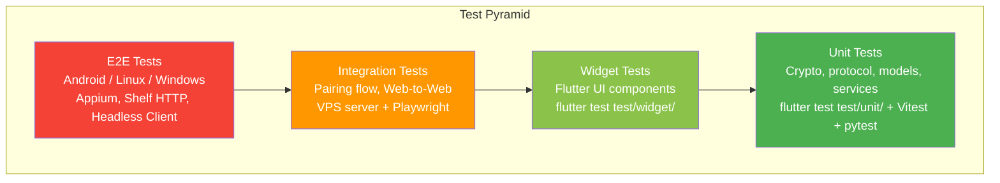
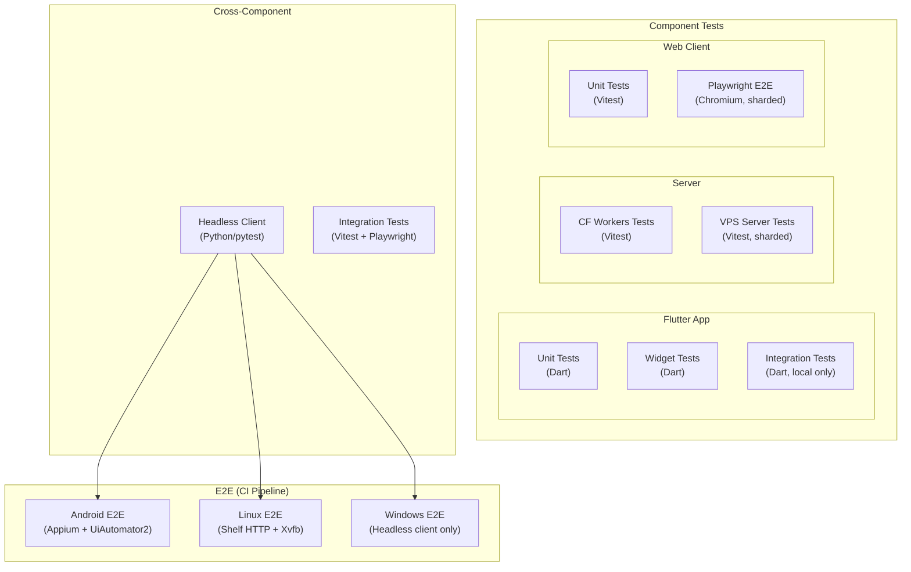

# Testing Overview

Zajel follows a layered testing strategy that spans unit tests, widget tests, integration tests, and end-to-end (E2E) tests across all platforms. This page provides a high-level map of the testing infrastructure and how the layers fit together.

## Test Pyramid



## Test Infrastructure Overview



## Test Categories

### Flutter App Tests

| Category | Path | Runner | CI Workflow |
|----------|------|--------|-------------|
| Unit tests | `packages/app/test/unit/` | `flutter test` | `ci.yml`, `flutter-tests.yml`, `pr-pipeline.yml` |
| Widget tests | `packages/app/test/widget/` | `flutter test` | Same as unit |
| Integration tests | `packages/app/test/integration/` | `flutter test -d <device>` | Skipped in CI (see [CI Limitations](https://github.com/user/zajel/blob/main/docs/testing/CI_LIMITATIONS.md)) |
| E2E tests (Android) | `e2e-tests/tests/` | `pytest` + Appium | `pr-pipeline.yml` (Phase 5) |
| E2E tests (Linux) | `e2e-tests/tests/` | `pytest` + Shelf HTTP | `pr-pipeline.yml` (Phase 5b) |
| E2E tests (Windows) | `e2e-tests/tests/` | `pytest` + headless | `pr-pipeline.yml` (Phase 5c) |

### Server Tests

| Category | Path | Runner | CI Workflow |
|----------|------|--------|-------------|
| CF Workers unit | `packages/server/src/__tests__/` | Vitest | `server-tests.yml` |
| CF Workers E2E | `packages/server/` | Vitest (test:e2e script) | `server-tests.yml` |
| VPS unit (sharded) | `packages/server-vps/` | Vitest (2 shards) | `server-vps-tests.yml` |
| VPS integration | `packages/server-vps/tests/integration/` | Vitest | `server-vps-tests.yml` |

### Web Client Tests

| Category | Path | Runner | CI Workflow |
|----------|------|--------|-------------|
| Unit tests | `packages/web-client/` | Vitest | `web-client-tests.yml` |
| E2E (Chromium) | `packages/web-client/` | Playwright (2 shards) | `web-client-tests.yml` |

### Cross-Component Tests

| Category | Path | Runner | CI Workflow |
|----------|------|--------|-------------|
| Headless client unit | `packages/headless-client/tests/` | pytest | `pr-pipeline.yml` (Phase 1) |
| Pairing flow | `packages/integration-tests/src/scenarios/pairing-flow.test.ts` | Vitest | `integration-tests.yml` |
| Web-to-Web | `packages/integration-tests/src/scenarios/web-to-web.test.ts` | Playwright | `integration-tests.yml` |

## Running Tests Locally

### Flutter App

```bash
# All unit and widget tests
cd packages/app && flutter test

# Specific test directory
cd packages/app && flutter test test/unit/crypto/

# Integration tests (requires a device/desktop)
cd packages/app && flutter test integration_test/ -d linux
cd packages/app && flutter test integration_test/ -d macos

# Or use the helper script
cd packages/app && ./run_integration_tests.sh
cd packages/app && ./run_integration_tests.sh --with-server
```

### Server

```bash
# CF Workers tests
npm test --workspace=zajel-signaling

# VPS server tests
npm test --workspace=@zajel/server-vps

# VPS integration tests
npm test --workspace=@zajel/server-vps -- tests/integration/
```

### Web Client

```bash
# Unit tests
npm run test:run --workspace=@zajel/web-client

# Playwright E2E (requires Chromium installed)
cd packages/web-client
npx playwright install --with-deps chromium
npx playwright test --project=chromium
```

### E2E Tests

```bash
# Android E2E (requires emulator + Appium)
cd e2e-tests
ZAJEL_TEST_PLATFORM=android pytest tests/ -v

# Linux E2E (requires Flutter integration test running)
cd e2e-tests
ZAJEL_TEST_PLATFORM=linux pytest tests/test_smoke.py -v

# Headless-only tests (no app needed, just signaling server)
cd e2e-tests
SIGNALING_URL=ws://localhost:8080 pytest tests/test_signaling_headless.py -v
```

### Headless Client

```bash
pip install -e packages/headless-client[dev]
pytest packages/headless-client/tests/ -v --timeout=30
```

## Test Markers (E2E)

The E2E test suite uses pytest markers defined in `e2e-tests/pytest.ini`:

| Marker | Description |
|--------|-------------|
| `smoke` | Quick smoke tests (app launches successfully) |
| `pairing` | Pairing/connection tests |
| `messaging` | Message sending tests |
| `channels` | Channel creation and management |
| `groups` | Group creation and messaging |
| `headless` | Tests using the headless client as the peer |
| `protocol` | Protocol-level tests (headless-to-headless, no emulator) |
| `single_device` | Tests that only need one device (no P2P pairing) |
| `calls` | Voice and video call tests |
| `file_transfer` | File sharing tests |
| `reconnection` | Meeting point reconnection tests |
| `settings` | Settings screen tests |
| `contacts` | Contact management tests |
| `android` | Tests requiring Android-specific features |
| `linux` | Tests requiring Linux-specific features |
| `windows` | Tests requiring Windows-specific features |
| `ios` | Tests requiring iOS Simulator |
| `slow` | Tests that take longer to run |

## Key Design Decisions

1. **Flutter integration tests are skipped in CI** due to `VmServiceDisappearedException` on Linux and cost/complexity on other platforms. E2E coverage is handled by the Appium and Shelf HTTP based tests instead.

2. **Headless client bridges the cross-platform gap.** The Python headless client (`HeadlessBob`) implements the same protocol as the Flutter app. In E2E tests, it acts as a peer that can pair with the app via signaling and WebRTC, enabling automated testing without needing two emulators.

3. **Shelf HTTP replaces AT-SPI for Linux E2E.** The Flutter app is built with `integration_test/appium_test.dart` as the entry point, which starts an embedded HTTP server on port 9000. The `LinuxAppHelper` communicates with this server to interact with widgets, bypassing the AT-SPI accessibility bridge entirely.

4. **VPS server tests use 2-shard parallelism** to reduce CI wall-clock time.

5. **Web client E2E uses Chromium only.** Firefox and WebKit do not support the Web Crypto API in localhost/insecure contexts, which is required for Zajel's end-to-end encryption.
