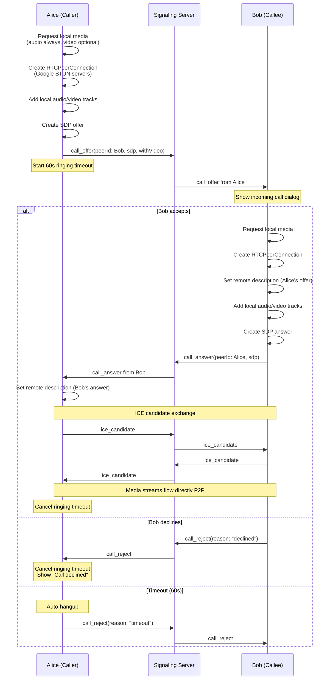
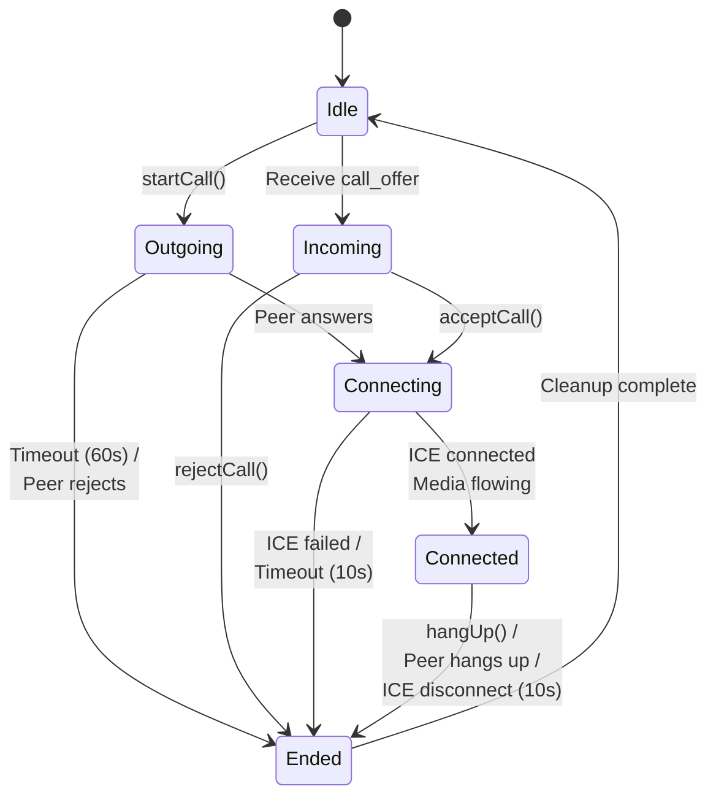

# VoIP Architecture

Zajel supports voice and video calls using WebRTC media streams. Calls are established over the signaling server and then transition to direct peer-to-peer media transport.

---

## Call Setup Sequence



---

## Call States



### State Descriptions

| State | Description |
|-------|-------------|
| **Idle** | No call in progress |
| **Outgoing** | SDP offer sent, waiting for answer. 60s ringing timeout. |
| **Incoming** | SDP offer received, showing incoming call dialog |
| **Connecting** | SDP answer exchanged, ICE negotiation in progress |
| **Connected** | Media streams flowing. Call duration timer running. |
| **Ended** | Call terminated. Resources being cleaned up. |

---

## Media Service

### Audio Processing

The media service provides configurable audio processing:

| Feature | Description | Default |
|---------|-------------|---------|
| Noise suppression | Reduce background noise | Enabled |
| Echo cancellation | Prevent echo feedback | Enabled |
| Auto gain control | Normalize volume levels | Enabled |

Audio constraints are applied via `getUserMedia`:
```
audio: {
  noiseSuppression: true/false,
  echoCancellation: true/false,
  autoGainControl: true/false
}
```

### Video Configuration

| Parameter | Value |
|-----------|-------|
| Resolution | 720p ideal |
| Frame rate | 30fps |
| Mirror mode | Enabled for local preview (front camera) |
| Camera switch | Front/back toggle on mobile |

### Device Management

The media service enumerates available devices:
- Audio input devices (microphones)
- Audio output devices (speakers/headphones)
- Video input devices (cameras)

Users can select specific devices from the in-call settings sheet.

### Background Blur

Video calls support background blur for privacy:
- Configurable blur strength (0.0 to 1.0)
- Can be enabled/disabled during a call
- Processed on-device before sending

---

## ICE Candidate Handling

ICE (Interactive Connectivity Establishment) candidates are used for NAT traversal:

1. **STUN servers**: Google's public STUN servers (`stun.l.google.com:19302`, `stun1.l.google.com:19302`)
2. **Candidate queuing**: If ICE candidates arrive before the remote description is set, they are queued (max 100 candidates)
3. **Queue flush**: Once the remote description is set, all queued candidates are added
4. **Reconnection**: If ICE disconnects during a call, the system waits 10 seconds for reconnection before ending the call

---

## Timeout Configuration

| Timeout | Duration | Purpose |
|---------|----------|---------|
| Ringing | 60 seconds | Auto-hangup if callee does not answer |
| ICE reconnection | 10 seconds | Grace period for ICE recovery |
| ICE gathering | 30 seconds | Maximum time for ICE candidate gathering |
| Cleanup delay | 500 milliseconds | Allow final packets before resource cleanup |
| Max pending ICE | 100 candidates | Prevent memory exhaustion from ICE floods |

---

## Android Foreground Service

On Android, active calls run as a foreground service with a persistent notification. This prevents the OS from killing the app while a call is in progress. The foreground service is started when a call connects and stopped when it ends. On other platforms, this is a no-op.

---

## Resource Cleanup

When a call ends, the following resources are cleaned up:

1. Ringing timeout timer cancelled
2. Reconnection timeout timer cancelled
3. RTCPeerConnection closed
4. Local media tracks stopped
5. Pending ICE candidate queue cleared
6. Call state reset to Idle
7. Android foreground notification removed

---

## Signaling Messages

| Message | Direction | Fields |
|---------|-----------|--------|
| `call_offer` | Caller -> Server -> Callee | peerId, sdp, withVideo |
| `call_answer` | Callee -> Server -> Caller | peerId, sdp |
| `call_reject` | Either -> Server -> Other | peerId, reason (busy/declined/timeout) |
| `call_hangup` | Either -> Server -> Other | peerId |
| `ice_candidate` | Either -> Server -> Other | peerId, candidate (JSON) |
